+++
path = "2026/03/02/2025-State-Of-Rust-Survey-results"
title = "2025 State of Rust Survey Results"
authors = ["The Rust Survey Team"]
+++

Hello, Rust community!

Once again, the survey team is happy to share the results of the State of Rust survey, this year celebrating a round number - the 10th edition!

The survey ran for 30 days (from November 17th to December, 17th 2025) and collected 7156 responses, a slight decrease in responses compared to last year. In this blog post we will shine a light on some specific key findings. As usual, the full [report] is available for download.

| **Survey** | **Started** | **Completed** | **Completion rate** | **Views** |
|:----------:|------------:|--------------:|--------------------:|----------:|
|    2024    |       9 450 |         7 310 |               77.4% |    13 564 |
|    2025    |       9 389 |         7 156 |               76.2% |    20 397 |

Overall, the answers we received this year pretty closely match the results of last year, differences are often under a single percentage point. The number of respondents decreases slightly year over year. In 2025, we published multiple surveys (such as the [Compiler Performance][compiler-performance-survey] or [Variadic Generics survey][variadic-generics-survey]), which might have also contributed to less people answering this (longer) survey. We plan to discuss how (and whether) to combine the State of Rust survey with the ongoing work on the [Rust Vision Doc](https://blog.rust-lang.org/2025/12/03/lessons-learned-from-the-rust-vision-doc-process/).

Also to be noted that these numbers should be taken in context: we cannot extrapolate too much from a mere 7 000 answers and some optional questions have even less replies.

Let's point out some interesting pieces of data:
- [Screenshotting Rust use](#screenshotting-rust-use)
- [Challenges and wishes about Rust](#challenges-and-wishes-about-rust)
- [Learning about Rust](#learning-about-rust)
- [Industry and community](#industry-and-community)

[variadic-generics-survey]: https://blog.rust-lang.org/inside-rust/2025/09/22/variadic-generics-micro-survey/
[compiler-performance-survey]: https://blog.rust-lang.org/2025/09/10/rust-compiler-performance-survey-2025-results/

## Screenshotting Rust use

Confirmed that people develop using the stable compiler and keep up with releases, trusting our stability and compatibility guarantees. On the other hand, people use nightly out of "necessity" (for example, something not yet stabilized). Compared to last year ([link][report-2024]) we seem to have way less nightly users. This may not be a significant data point because we are looking at a sliding window of releases and differences could depend on many factors (for example, at a specific point in time we might have more downloads of the nightly compiler because of a highly anticipated feature).

One example might be the very popular let chains and async closures features, which were stabilized last year.

<!-- Chart which-version-of-rust-do-you-use start -->

    
<noscript>
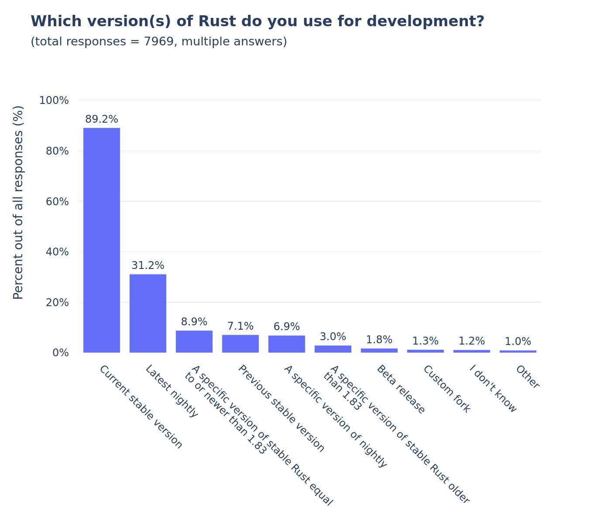
</noscript>

    

        [<a href="which-version-of-rust-do-you-use.png" target="_href_" title="Download chart as PNG">PNG</a>]&nbsp;[<a href="which-version-of-rust-do-you-use.svg" target="_href_" title="Download chart as SVG">SVG</a>]&nbsp;[<a href="which-version-of-rust-do-you-use-wordcloud.png" target="_href_" title="Download open answers as wordcloud PNG">Wordcloud of open answers</a>]
    

<!-- Chart which-version-of-rust-do-you-use end -->

<!-- Chart what-is-the-oldest-version-of-rust-you-use start -->

    
<noscript>
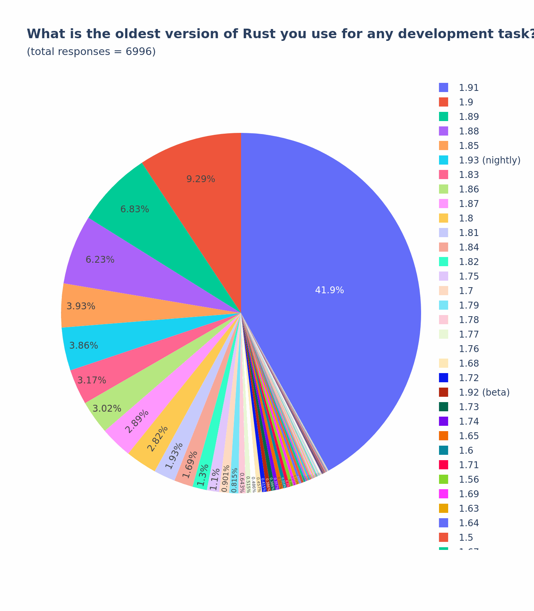
</noscript>

    

        [<a href="what-is-the-oldest-version-of-rust-you-use.png" target="_href_" title="Download chart as PNG">PNG</a>]&nbsp;[<a href="what-is-the-oldest-version-of-rust-you-use.svg" target="_href_" title="Download chart as SVG">SVG</a>]
    

<!-- Chart what-is-the-oldest-version-of-rust-you-use end -->

We are also interested to hear from (and grateful to) people *not* using Rust (or not anymore) when they tell us why they dropped the language. In most cases it seems to be a "see you again in the future" rather than a "goodbye".

<!-- Chart do-you-use-rust start -->

    
<noscript>
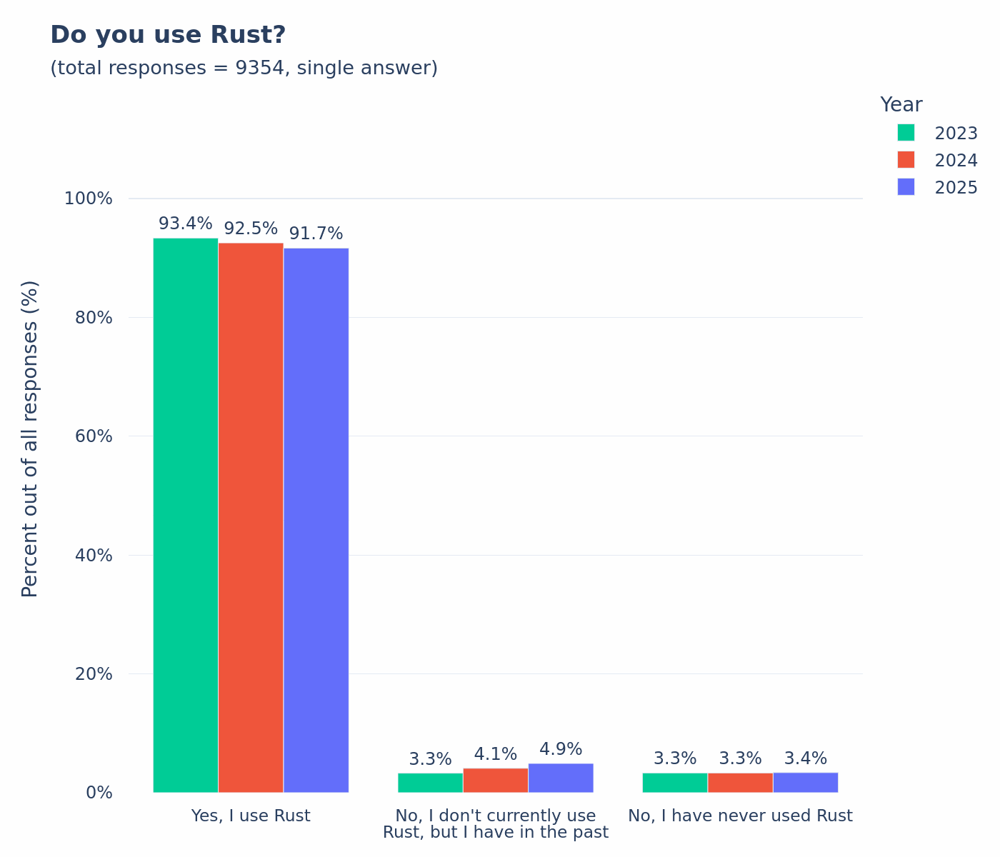
</noscript>

    

        [<a href="do-you-use-rust.png" target="_href_" title="Download chart as PNG">PNG</a>]&nbsp;[<a href="do-you-use-rust.svg" target="_href_" title="Download chart as SVG">SVG</a>]
    

<!-- Chart do-you-use-rust end -->
<!-- Chart why-did-you-stop-using-rust start -->

    
<noscript>
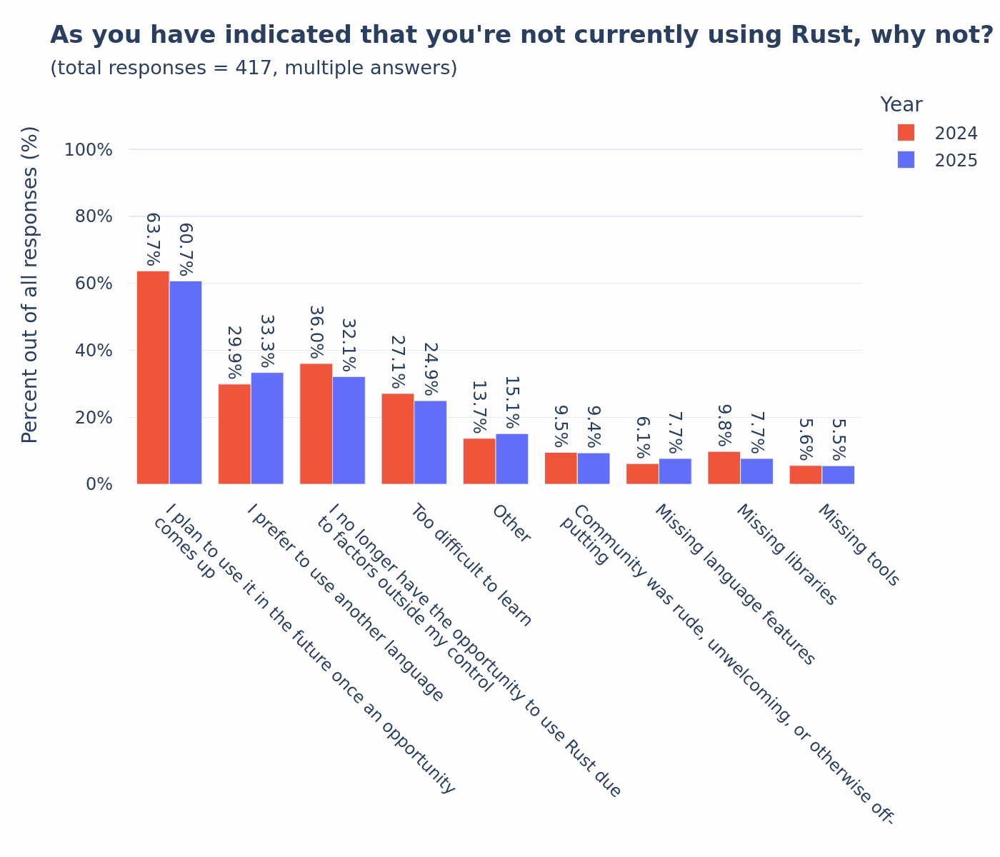
</noscript>

    

        [<a href="why-did-you-stop-using-rust.png" target="_href_" title="Download chart as PNG">PNG</a>]&nbsp;[<a href="why-did-you-stop-using-rust.svg" target="_href_" title="Download chart as SVG">SVG</a>]&nbsp;[<a href="why-did-you-stop-using-rust-wordcloud.png" target="_href_" title="Download open answers as wordcloud PNG">Wordcloud of open answers</a>]
    

<!-- Chart why-did-you-stop-using-rust end -->

Some specific topic we were interested in: how often people download crates using a git repository pinned in the Cargo.toml (something like `foo = { git = "https://github.com/foo/bar" }`).

<!-- Chart how-do-you-download-crates start -->

    
<noscript>
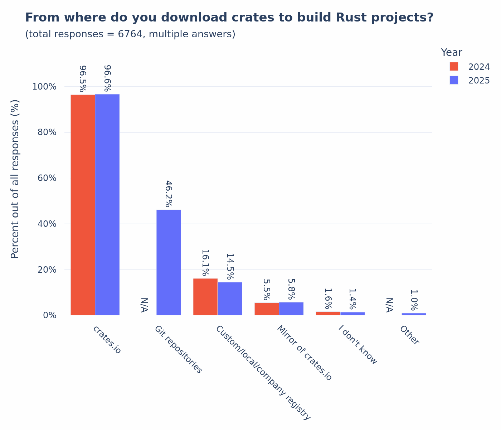
</noscript>

    

        [<a href="how-do-you-download-crates.png" target="_href_" title="Download chart as PNG">PNG</a>]&nbsp;[<a href="how-do-you-download-crates.svg" target="_href_" title="Download chart as SVG">SVG</a>]&nbsp;[<a href="how-do-you-download-crates-wordcloud.png" target="_href_" title="Download open answers as wordcloud PNG">Wordcloud of open answers</a>]
    

<!-- Chart how-do-you-download-crates end -->

and if people actually find the output of [`--explain`] useful. Internal discussions hinted that we were not too sure about that but this graph contradicts our prior assumption. Seems like many Rust users actually do find compiler error code explanations useful.

<!-- Chart do-you-use-compiler-error-codes start -->

    
<noscript>
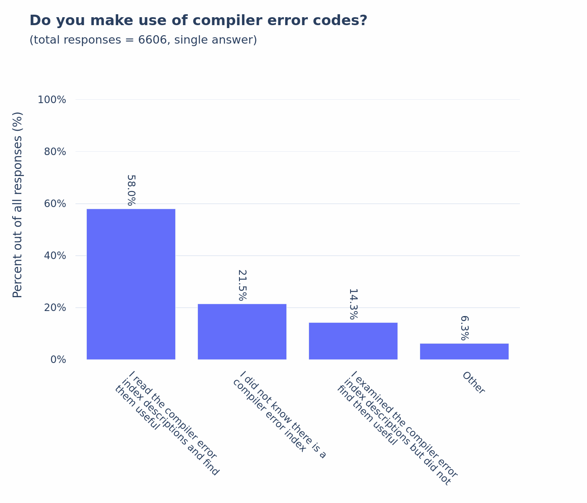
</noscript>

    

        [<a href="do-you-use-compiler-error-codes.png" target="_href_" title="Download chart as PNG">PNG</a>]&nbsp;[<a href="do-you-use-compiler-error-codes.svg" target="_href_" title="Download chart as SVG">SVG</a>]&nbsp;[<a href="do-you-use-compiler-error-codes-wordcloud.png" target="_href_" title="Download open answers as wordcloud PNG">Wordcloud of open answers</a>]
    

<!-- Chart do-you-use-compiler-error-codes end -->

[`--explain`]: https://doc.rust-lang.org/rustc/command-line-arguments.html#--explain-provide-a-detailed-explanation-of-an-error-message
[report-2024]: https://raw.githubusercontent.com/rust-lang/surveys/main/surveys/2024-annual-survey/report/annual-survey-2024-report.pdf

## Challenges and wishes about Rust

We landed long-awaited features in 2025 (`let chains` and `async closures`) and the survey results show that they are indeed very popular and often used. That's something to celebrate! Now `generic const expressions` and `improved trait methods` are bubbling up in the charts as the most-wanted features. Most of the other desired features didn't change significantly.

<!-- Chart which-features-do-you-want-stabilized start -->

    
<noscript>
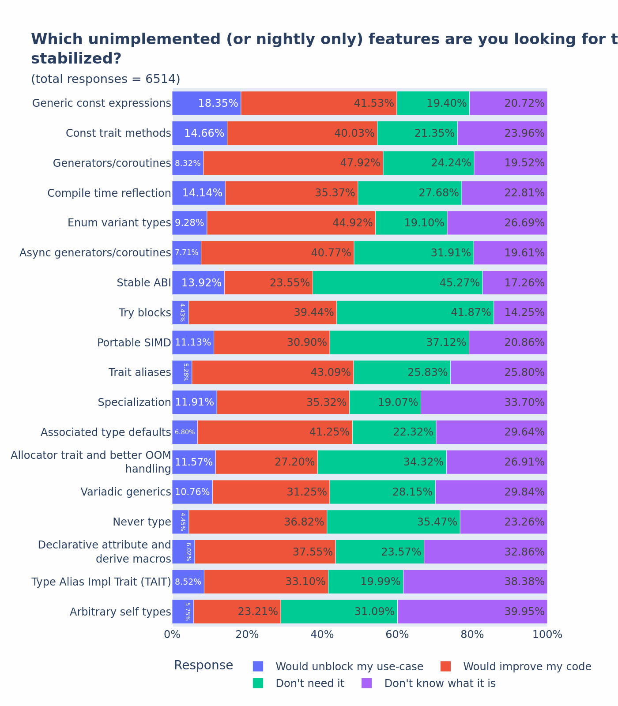
</noscript>

    

        [<a href="which-features-do-you-want-stabilized.png" target="_href_" title="Download chart as PNG">PNG</a>]&nbsp;[<a href="which-features-do-you-want-stabilized.svg" target="_href_" title="Download chart as SVG">SVG</a>]&nbsp;[<a href="which-features-do-you-want-stabilized-wordcloud.png" target="_href_" title="Download open answers as wordcloud PNG">Wordcloud of open answers</a>]
    

<!-- Chart which-features-do-you-want-stabilized end -->

When asked about which non-trivial problems people encounter, little changes overall compared to 2024: resource usage (slow compile times and storage usage) is still up there. The debugging story slipped from 2nd to 4th place (~2pp). We [just started](https://blog.rust-lang.org/2026/02/23/rust-debugging-survey-2026/) a survey to learn more about it!

<!-- Chart which-problems-limit-your-productivity start -->

    
<noscript>
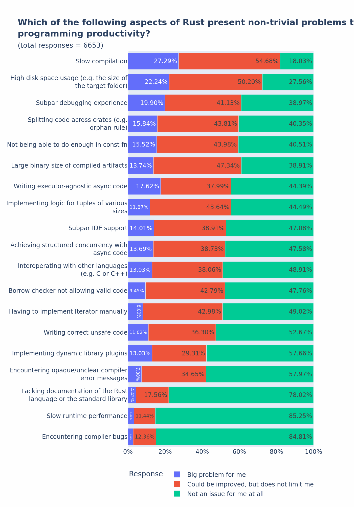
</noscript>

    

        [<a href="which-problems-limit-your-productivity.png" target="_href_" title="Download chart as PNG">PNG</a>]&nbsp;[<a href="which-problems-limit-your-productivity.svg" target="_href_" title="Download chart as SVG">SVG</a>]&nbsp;[<a href="which-problems-limit-your-productivity-wordcloud.png" target="_href_" title="Download open answers as wordcloud PNG">Wordcloud of open answers</a>]
    

<!-- Chart which-problems-limit-your-productivity end -->

## Learning about Rust

Noticeable (within a ~3pp) flection in attendance for online and offline communities to learn about Rust (like meetups, discussion forums and other learning material). This hints at some people moving their questions to LLM tooling (as the word cloud for open answers suggests). Still, our online documentation is the preferred canonical reference, followed by studying the code itself.

<!-- Chart what-kind-of-learning-materials-have-you-consumed start -->

    
<noscript>
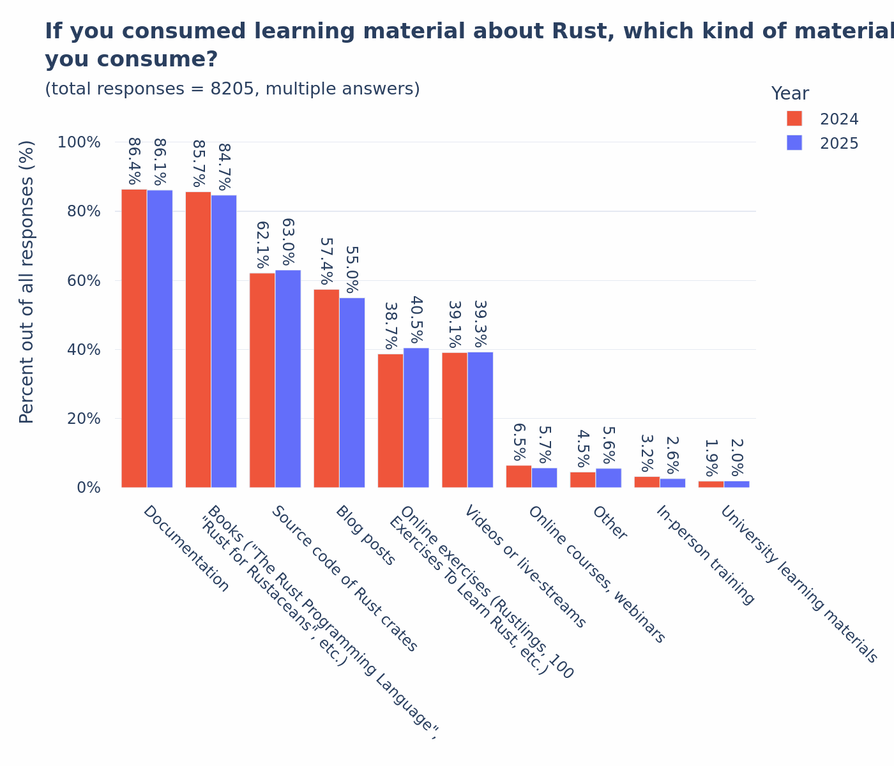
</noscript>

    

        [<a href="what-kind-of-learning-materials-have-you-consumed.png" target="_href_" title="Download chart as PNG">PNG</a>]&nbsp;[<a href="what-kind-of-learning-materials-have-you-consumed.svg" target="_href_" title="Download chart as SVG">SVG</a>]&nbsp;[<a href="what-kind-of-learning-materials-have-you-consumed-wordcloud.png" target="_href_" title="Download open answers as wordcloud PNG">Wordcloud of open answers</a>]
    

<!-- Chart what-kind-of-learning-materials-have-you-consumed end -->

<!-- Chart how-often-do-you-engage-in-community-events start -->

    
<noscript>
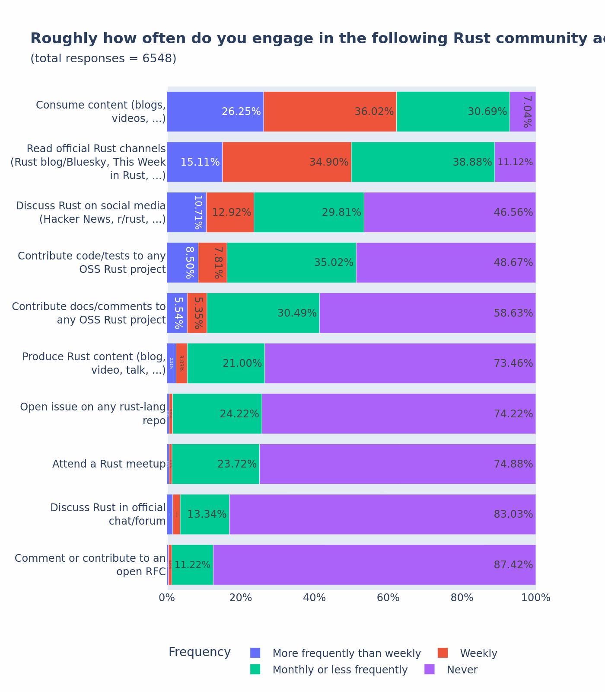
</noscript>

    

        [<a href="how-often-do-you-engage-in-community-events.png" target="_href_" title="Download chart as PNG">PNG</a>]&nbsp;[<a href="how-often-do-you-engage-in-community-events.svg" target="_href_" title="Download chart as SVG">SVG</a>]
    

<!-- Chart how-often-do-you-engage-in-community-events end -->

## Industry and community

Confirmed the hiring trend from organisations looking for more Rust developers. The steady growth may indicate a structural market presence of Rust in companies, codebases consolidate and the quantity of Rust code overall keeps increasing.

<!-- Chart is-your-organization-planning-on-hiring-rust-developers start -->

    
<noscript>
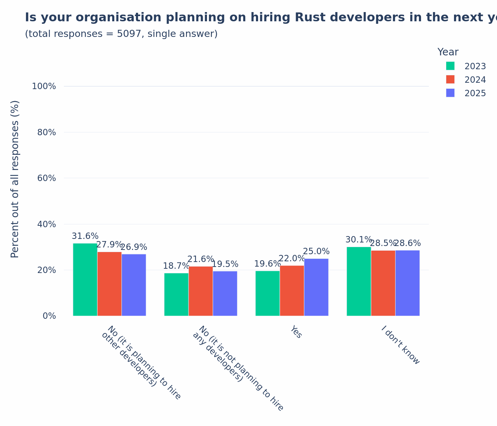
</noscript>

    

        [<a href="is-your-organization-planning-on-hiring-rust-developers.png" target="_href_" title="Download chart as PNG">PNG</a>]&nbsp;[<a href="is-your-organization-planning-on-hiring-rust-developers.svg" target="_href_" title="Download chart as SVG">SVG</a>]
    

<!-- Chart is-your-organization-planning-on-hiring-rust-developers end -->

As always we try to get a picture of the concerns about the future of Rust. Given the target group we are surveying, unsurprisingly the majority of respondents would like even more Rust! But at the same time concerns persist about the language becoming more and more complex.

Slight uptick for "developer and maintainers support". We know and we are working on it. There are ongoing efforts from RustNL ([https://rustnl.org/fund](https://rustnl.org/fund)) and on [the Foundation side](https://rustfoundation.org/media/announcing-the-rust-foundation-maintainers-fund/). Funding efforts should focus on retaining talents that otherwise would leave after some time of unpaid labor.

This graph is also a message to companies using Rust: please consider supporting Rust project contributors and authors of Rust crates that you use in your projects. Either by joining [the Rust Foundation](https://rustfoundation.org/members/), by allowing some paid time of your employees to be spent on Rust projects you benefit from or by funding through other collect funds (like [https://opencollective.com](https://opencollective.com), [https://www.thanks.dev](https://www.thanks.dev) and similar) or personal sponsorships (GitHub, Liberapay or similar personal donation boxes).

Trust in the Rust Foundation is improving, which is definitively good to hear.

<!-- Chart what-are-your-biggest-worries-about-rust start -->

    
<noscript>
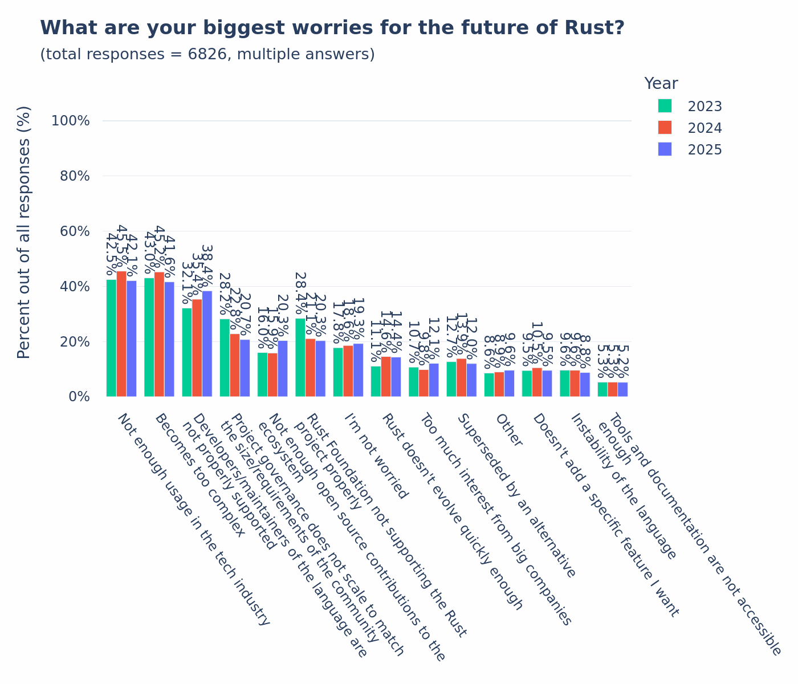
</noscript>

    

        [<a href="what-are-your-biggest-worries-about-rust.png" target="_href_" title="Download chart as PNG">PNG</a>]&nbsp;[<a href="what-are-your-biggest-worries-about-rust.svg" target="_href_" title="Download chart as SVG">SVG</a>]&nbsp;[<a href="what-are-your-biggest-worries-about-rust-wordcloud.png" target="_href_" title="Download open answers as wordcloud PNG">Wordcloud of open answers</a>]
    

<!-- Chart what-are-your-biggest-worries-about-rust end -->

As a piece of trivia we ask people which tools they use when programming in Rust. The Zed editor did a remarkable jump upward in the preferences of our respondents (with Helix as a good second). Editors with agentic support are also on the rise (as the word cloud shows) and seems they are eroding the userbase of VSCode and IntelliJ, if we were to judge by the histogram.

We're happy to meet again those 11 developers still using Atom (hey 👋!) and we salute those attached to their classic editors choice like Emacs and Vim (or derivatives).

<!-- Chart what-ide-do-you-use start -->

    
<noscript>
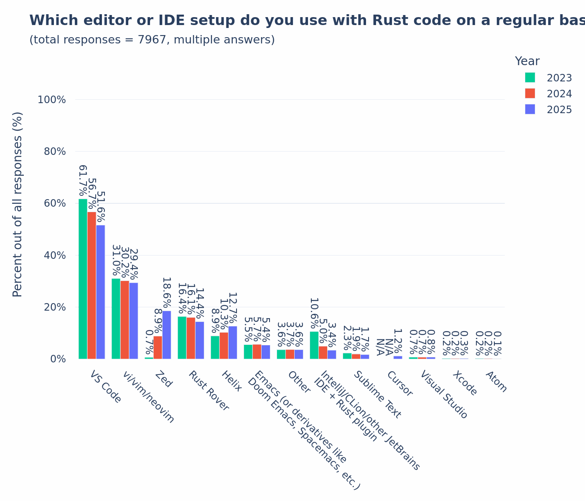
</noscript>

    

        [<a href="what-ide-do-you-use.png" target="_href_" title="Download chart as PNG">PNG</a>]&nbsp;[<a href="what-ide-do-you-use.svg" target="_href_" title="Download chart as SVG">SVG</a>]&nbsp;[<a href="what-ide-do-you-use-wordcloud.png" target="_href_" title="Download open answers as wordcloud PNG">Wordcloud of open answers</a>]
    

<!-- Chart what-ide-do-you-use end -->

And finally a small group photo (17%) of what some respondents wanted to share about themselves. These numbers should be read in context: 8% of the respondents to this survey identify as LGBTQ+ folks, 6% as women and so on. Even if these numbers are just slightly better than last year, taken in context they show a picture that a very *very* small percentage of marginalized groups of people make it to our project (we are doing still *better* than other tech communities!) and is a reminder that one of our core values is to strive to be a diverse and welcoming FOSS community **for everyone**. But this only comes if we work hard on *effective* outreach programs.

<!-- Chart which-marginalized-group start -->

    
<noscript>
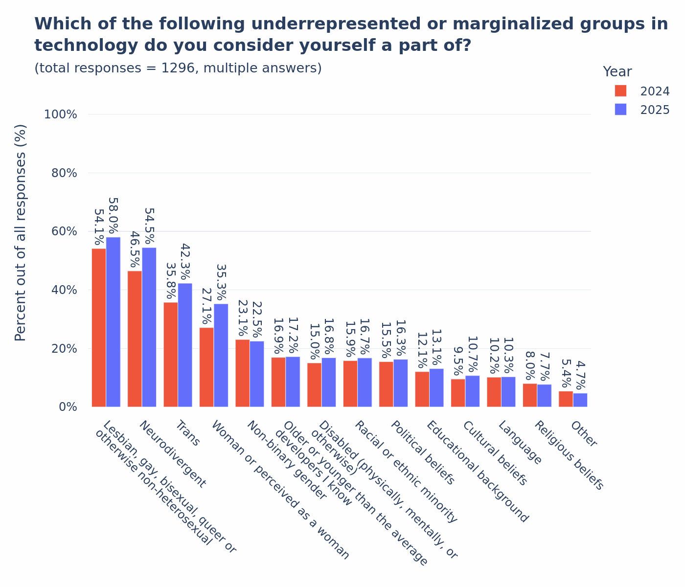
</noscript>

    

        [<a href="which-marginalized-group.png" target="_href_" title="Download chart as PNG">PNG</a>]&nbsp;[<a href="which-marginalized-group.svg" target="_href_" title="Download chart as SVG">SVG</a>]
    

<!-- Chart which-marginalized-group end -->

## Conclusions

Overall, no big surprises and a few trends confirmed.

If you want to dig more into details, feel free to download the [PDF report][report].

We want once again to thank all the volunteers that helped shaping and translating this survey and to all the participants, who took the time to provide us a picture of the Rust community.

[report]: https://raw.githubusercontent.com/rust-lang/surveys/main/surveys/2025/annual-survey/report/annual-survey-2025-report.pdf

## A look back

Since this year we publish a round number, if you fancy a trip down the memory lane here the blog posts with the past years' survey results:
- [2024 State of Rust Survey results](https://blog.rust-lang.org/2025/02/13/2024-State-Of-Rust-Survey-results/)
- [2023 Rust Annual Survey results](https://blog.rust-lang.org/2024/02/19/2023-Rust-Annual-Survey-2023-results/)
- [2022 Rust Annual Survey results](https://blog.rust-lang.org/2023/08/07/Rust-Survey-2023-Results/)
- [2021 Rust Survey results](https://blog.rust-lang.org/2022/02/15/Rust-Survey-2021/)
- [2020 Rust Survey results](https://blog.rust-lang.org/2020/12/16/rust-survey-2020/)
- [2019 Rust Survey results](https://blog.rust-lang.org/2020/04/17/Rust-survey-2019/)
- [2018 Rust Survey results](https://blog.rust-lang.org/2018/11/27/Rust-survey-2018/)
- [2017 Rust Survey results](https://blog.rust-lang.org/2017/09/05/Rust-2017-Survey-Results/)
- [2016 State of Rust survey](https://blog.rust-lang.org/2016/06/30/State-of-Rust-Survey-2016/)

<!-- Chart scripts -->

<!-- Chart scripts -->

