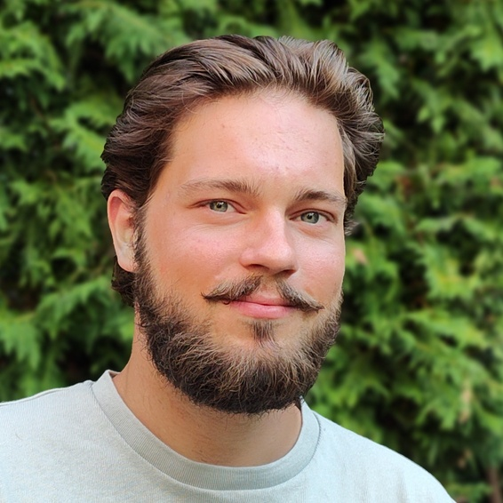
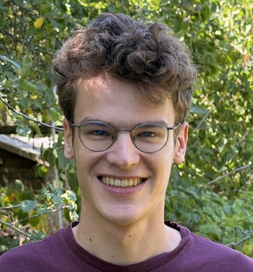

+++
path = "9999/12/31/announcing-our-first-maintainers-in-residence"
title = "Announcing our first Maintainers in Residence"
authors = ["Lori Lorusso", "Jakub Beránek"]

[extra]
team = "the Funding team"
team_url = "https://www.rust-lang.org/governance/teams/launching-pad#team-funding"
+++

We are very happy to announce the Rust Project's first round of Maintainers in Residence:
**Gen Li** ([@rami3l]), **Chris Denton** ([@ChrisDenton]), **Alejandra González** ([@blyxyas]), **León Liehr** ([@fmease]), and Maintainer Grant recipients: **Jason Newcomb** ([@Jarcho]) and **Jonas Böttiger** ([@joboet]). These contributors will be funded for their `rust-lang` maintenance activities for (at least) the following 12 months!

The funding of the Maintainer in Residence (MiR) and Maintainer Grantee roles is possible thanks to generous donations to the Rust Foundation Maintainers Fund (RFMF) from Google, AWS, OpenAI, the Rust Project Leadership Council and also individual sponsors. We also want to thank the people who advocated for maintainer funding within their companies; Tyler Mandry from Google, Niko Matsakis and Jess Izen from AWS and Predrag Gruevski from OpenAI, and also the whole [Rust Leadership Council][leadership-council] and our [funding advisors][funding-advisors-team]. If you would like to help us support even more Rust contributors, consider [donating][gh-sponsors] to RFMF.

Below, you can learn more about the MiR program and how we chose the funded contributors, and also [get to know them](#gen-li-rami3l).

## Background

The Maintainer in Residence program, established in [RFC 3931][rfmf-rfc], is designed to provide stable financial support for Rust contributors, so that they can truly focus on crucial [maintenance][what-is-maintenance-post] activities. Currently, there are three categories of support that we offer:
- Full-time MiR: funded for 5 days/week of Rust Project work
- Half-time MiR: funded for ~2.5 days/week of Rust Project work
- Maintainer Grant: funded for ~1 day/week of Rust Project work

Funding for this program comes from the Rust Foundation Maintainers Fund, which was [launched][rfmf-post] recently, and the whole program is managed by the Rust [Funding team][funding-team].

When deciding who to fund, we took a systematic approach. First, we looked at Rust teams to understand their maintenance baseline (the smallest number of maintainers they need to ensure a healthy long-term status of the given project or repository), and how far they currently are from that baseline. From there, we identified and prioritized Rust teams who were both critically underfunded, and have a high impact on the language and its users. These teams (in no particular order) were `rustdoc`, `rustup`, `cargo`, `compiler`, `libs`, `clippy`, `rustfmt`, `rust analyzer` and `mods`.

The next step was pairing these teams with maintainers looking for funding. And it turns out that finding such maintainers for some teams turned out to be much more difficult than we originally assumed! For example, some maintainers are already employed, some do not want to be funded, and while we did our best to promote our funding efforts, not everyone looking for funding actually asked us for it. We also realized that some teams on our list have essentially no active members, which makes it tricky to onboard new contributors, even if they would like to help out.

In the end, we decided to start by supporting six contributors, who will help maintain several critical Rust projects and teams and who could start immediately. However, we are not stopping there. Our funding efforts are ongoing, so stay tuned for more MiR announcements in the near future! If you would like to learn more about our process, check out our [recent post][funding-team-update-post].

And now, without further ado, let's meet our newly funded maintainers!

<!-- mir-list -->

## Gen Li (@rami3l)

    

        
        

            
Gen Li (<a href="https://github.com/rami3l">@rami3l</a>) is a full-time MiR focusing on Rustup.

            
He has been a Rustup team member since 2023 and its lead since 2025. He deeply cares about the facets of Rust that many might have taken for granted, and embodies all attributes we were looking for in a MiR: he wants to take on complex issues, continue mentoring, and work on important Rustup features, among many other things.

        

    

> Turning volunteering into an actual job has really been an empowering experience so far! I finally have the bandwidth to take a careful look at my inbox and can actually read each message without the fear of missing crucial details while rushing prompt replies, which has really helped me retain the essential compassion as a maintainer. I also get to interact with regular contributors a lot more often. Finally, I can't wait to see what I can come up with in terms of Project Goals :)

## Chris Denton (@ChrisDenton)

    

        
        

            
Chris Denton (<a href="https://github.com/ChrisDenton">@ChrisDenton</a>) is a half-time MiR focusing on the standard library, compiler, Rustup and anything Windows-related.

            
For the past five years Chris has been bringing his deep knowledge of Windows to help Rust sustain and improve its great cross-platform support. He will be unblocking other contributors in various Windows use cases, performing refactoring and code reviews and implementing new features across several areas of the Project.

        

    

> Even though it is still early days, I'm feeling pretty optimistic about the health of the Rust Project going forward, thanks to the recent funding efforts.

## Alejandra González (@blyxyas)

    

        
        

            
Alejandra González (<a href="https://github.com/blyxyas">@blyxyas</a>) is a half-time MiR focusing on Clippy.

            
She is a Clippy team member always keen on improving performance and helping new contributors. She will focus on making Clippy faster and also reviewing its pull requests, to help get the ~300 pull request backlog down. Additionally, she is excited to mentor people from the Rust for Linux project to work on Clippy, and fine tune the <a href="https://blog.rust-lang.org/inside-rust/2026/07/06/unite-for-clippy/">open peer review system</a> that Clippy started using earlier this year.

        

    

> Funding is the system that helps me pour my heart into a project without worrying about making ends meet. Having those needs met is a game-changer and boosts my productivity. One of the areas where I want to focus my efforts is mentoring new contributors. If new people coming is the lifeblood of a project, I want to be the cardiologist!

## León Liehr (@fmease)

    

        
        

            
León Liehr (<a href="https://github.com/fmease">@fmease</a>) is a half-time MiR focusing on rustdoc and the compiler.

            
He is a member of the rustdoc and compiler teams, who is usually working on the Rust type system or issues related to parsing. He will continue working on complex features that he started a few years ago, and also focus on general maintenance, code reviews, refactoring and mentoring.

        

    

> Being funded to work on Rust means I can sustainably focus my time and energy on a project I call a passion of mine.

## Jonas Böttiger (@joboet)

    

        
        

            
Jonas Böttiger (<a href="https://github.com/joboet">@joboet</a>) is a maintainer grantee focusing on the standard library.

            
He is a musicology student from Germany. When he is not playing the Cello or reading about Fanny Hensel, he applies his research skills to ensure that programs written in Rust run quickly and soundly on all platforms, no matter how quirky the operating system may be. He loves helping contributors write excellent code that they can be proud of; and considers it to be just as much fun as writing it himself.

        

    

> Getting funding for my work is a dream come true. It will allow me to continue doing the thing I love instead of worrying about whether I should rather invest all that time in a money-earning job with much less positive impact on the world around me.

## Jason Newcomb (@Jarcho)

    

        
        

            
Jason Newcomb (<a href="https://github.com/Jarcho">@Jarcho</a>) is a maintainer grantee focusing on Clippy.

            
He is primarily working on fixing bugs and making it easier to develop and contribute to Clippy. He is also focusing on making the review process as smooth as possible.

        

    

> Being funded allows me to work on something I care about and want to work on instead of what will get me paid. I'm looking forward to seeing how this will impact Clippy and the Rust project in general.
<!-- mir-list -->

## Conclusion

The contributors presented above will be funded for the next 12 months, though of course we hope that we will be able to extend their support going further, as this program is designed to be for long-term stable maintenance funding. We are very excited about them; each one of them has been with the Project for years, and we are very glad that we can support their maintenance work! All of them have already signed their contracts, so they are already being funded as we speak.

While there are many other Rust contributors who are doing awesome work, and who would also deserve to get proper funding for it, we think that this is a great start. We hope that the awesome work done by the funded maintainers will allow us to promote this program, so that we can fund even more Rust contributors!

We would like to once again sincerely thank everyone who made this possible, especially our sponsors. If you would like to help us fund more maintainers, consider [donating to RFMF][gh-sponsors]. You can also sponsor individual Rust contributors [directly][funding-page].

[rfmf-post]: https://blog.rust-lang.org/2026/06/02/launching-the-rust-foundation-maintainers-fund/
[what-is-maintenance-post]: https://blog.rust-lang.org/inside-rust/2026/01/12/what-is-maintenance-anyway/
[funding-team-update-post]: https://blog.rust-lang.org/inside-rust/2026/08/04/funding-team-progress-update-july-2026/
[funding-team]: https://rust-lang.org/governance/teams/#team-funding
[funding-advisors-team]: https://rust-lang.org/governance/teams/#team-funding-advisors
[funding-page]: https://rust-lang.org/funding/
[leadership-council]: https://rust-lang.org/governance/teams/leadership-council/
[gh-sponsors]: https://github.com/sponsors/rustfoundation
[rfmf-rfc]: https://rust-lang.github.io/rfcs/3931-rfmf-rust-foundation-maintainer-fund.html
[@rami3l]: https://github.com/rami3l
[@ChrisDenton]: https://github.com/ChrisDenton
[@blyxyas]: https://github.com/blyxyas
[@fmease]: https://github.com/fmease
[@Jarcho]: https://github.com/Jarcho
[@joboet]: https://github.com/joboet
