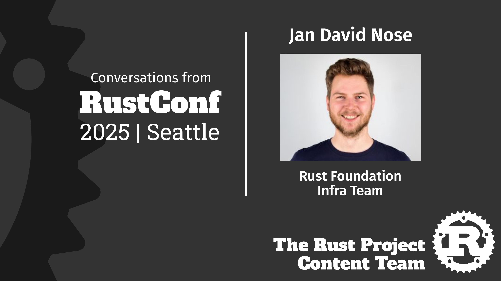

+++
path = "2025/11/22/content-team-interview-with-jan-david-nose-rust-infrastructure-team"
title = "Content Team: Interview with Jan David Nose, Rust Infrastructure Team"
authors = ["Pete LeVasseur"]

[extra]
team = "Content Team"
team_url = "https://rust-lang.org/governance/teams/launching-pad/#team-content"
+++

We had our first whirlwind outing as the [Rust Project Content Team] at RustConf 2025 in Seattle, Washington, USA. There we had a chance to speak with folks about interesting things happening in the Rust Project and wider Rust Community.

# Jan David Nose, Rust Infrastructure Team

In this interview, [Xander Cesari] sits down with [Jan David Nose], one of the full-time engineers on the [Rust Infrastructure Team]. JD and the team maintain and develop the infrastructure upon which Rust is developed and deployed, including a whole host of CI/CD tooling for developing the language itself as well as the infra behind crates.io that serves the commmunity and users. We're releasing this video on an accelerated timeline in light of the recent software supply chain attacks, but the interview was conducted prior to the recent news of compromised packages in other languages and ecosystems.

Check out the [interview here] or click below.

  

[Rust Project Content Team]: https://rust-lang.org/governance/teams/launching-pad/#team-content
[Xander Cesari]: https://github.com/MerrimanInd
[Jan David Nose]: https://github.com/jdno
[Rust Infrastructure Team]: https://rust-lang.org/governance/teams/infra/
[interview here]: https://youtu.be/r7i-2wHtNjw
