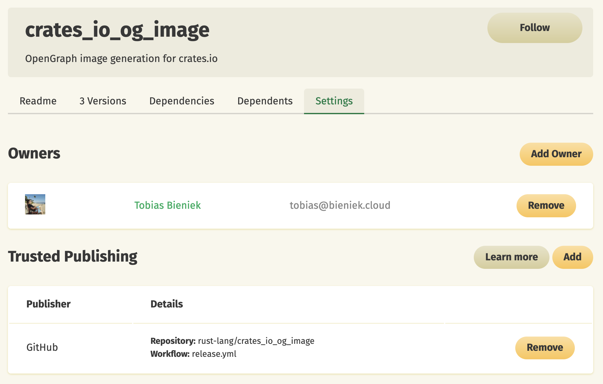
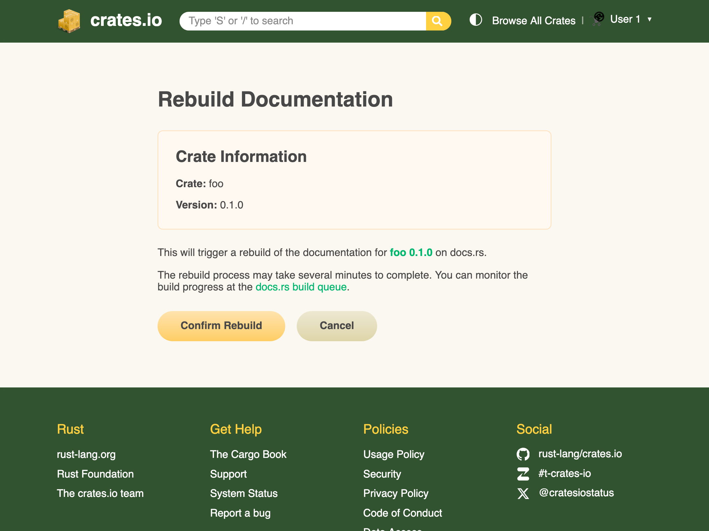
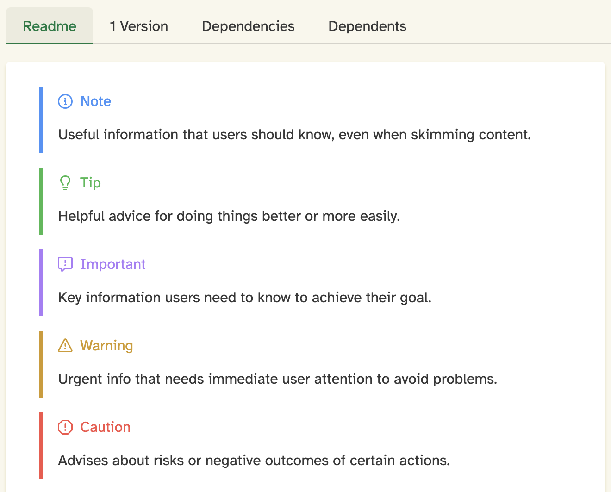

+++
path = "2025/07/11/crates-io-development-update-2025-07"
title = "crates.io: development update"
authors = ["Tobias Bieniek"]

[extra]
team = "the crates.io team"
team_url = "https://www.rust-lang.org/governance/teams/crates-io"
+++

Since our last development update in [February 2025](https://blog.rust-lang.org/2025/02/05/crates-io-development-update.html), we have continued to make significant improvements to [crates.io](https://crates.io/). In this blog post, we want to give you an update on the latest changes that we have made to crates.io over the past few months.

## Trusted Publishing

We are excited to announce that we have implemented "Trusted Publishing" support on crates.io, as described in [RFC #3691](https://rust-lang.github.io/rfcs/3691-trusted-publishing-cratesio.html). This feature was inspired by the PyPI team's excellent work in this area, and we want to thank them for the inspiration!

Trusted Publishing eliminates the need for GitHub Actions secrets when publishing crates from your CI/CD pipeline. Instead of managing API tokens, you can now configure which GitHub repository you trust directly on crates.io. That repository is then allowed to request a short-lived API token for publishing in a secure way using OpenID Connect (OIDC). While Trusted Publishing is currently limited to GitHub Actions, we have built it in a way that allows other CI/CD providers like GitLab CI to be supported in the future.

To get started with Trusted Publishing, you'll need to publish your first release manually. After that, you can set up trusted publishing for future releases. The detailed documentation is available at [https://crates.io/docs/trusted-publishing](https://crates.io/docs/trusted-publishing).



Here's an example of how to set up GitHub Actions to use Trusted Publishing:

```yaml
name: Publish to crates.io

on:
  push:
    tags: ['v*']  # Triggers when pushing tags starting with 'v'

jobs:
  publish:
    runs-on: ubuntu-latest

    environment: release  # Optional: for enhanced security
    permissions:
      id-token: write     # Required for OIDC token exchange

    steps:
    - uses: actions/checkout@v4
    - uses: rust-lang/crates-io-auth-action@v1
      id: auth
    - run: cargo publish
      env:
        CARGO_REGISTRY_TOKEN: ${{ steps.auth.outputs.token }}
```

## OpenGraph Images

Previously, crates.io used a single OpenGraph image for all pages. We have now implemented dynamic OpenGraph image generation, where each crate has a dedicated image that is regenerated when new versions are published.

These images include the crate name, keywords, description, latest version (or rather the default version that we show for the crate), number of releases, license, and crate size. This provides much more useful information when crates.io links are shared on social media platforms or in chat applications.


The image generation has been extracted to a dedicated crate: [crates_io_og_image](https://crates.io/crates/crates_io_og_image) ([GitHub](https://github.com/rust-lang/crates_io_og_image)). We're also adding basic theming support in [PR #3](https://github.com/rust-lang/crates_io_og_image/pull/3) to allow docs.rs to reuse the code for their own OpenGraph images.

Under the hood, the image generation uses two other excellent Rust projects: [Typst](https://typst.app/) for layout and text rendering, and [oxipng](https://github.com/oxipng/oxipng) for PNG optimization.

## docs.rs rebuilds

Crate owners can now trigger documentation rebuilds for docs.rs directly from the crate's version list on crates.io. This can be useful when docs.rs builds have failed or when you want to take advantage of new docs.rs features without having to publish a new release just for that.



We would like to thank our crates.io team member [@eth3lbert](https://github.com/eth3lbert) for implementing the initial version of this feature in [PR #11422](https://github.com/rust-lang/crates.io/pull/11422).

## README alert support

We've added support for rendering GitHub-style alerts in README files. This feature allows crate authors to use alert blocks like `> [!NOTE]`, `> [!WARNING]`, and `> [!CAUTION]` in their README markdown, which will now be properly styled and displayed on crates.io.



This enhancement was also implemented by [@eth3lbert](https://github.com/eth3lbert) in [PR #11441](https://github.com/rust-lang/crates.io/pull/11441), building on initial work by [@kbdharun](https://github.com/kbdharun).

## Miscellaneous

These were some of the more visible changes to crates.io over the past couple of months, but a lot has happened "under the hood" as well. Here are a couple of examples:

### Email system refactoring

Previously, we used the `format!()` macro and string concatenation to create emails, which made them hard to maintain and inconsistent in styling. We have migrated to the [minijinja](https://github.com/mitsuhiko/minijinja) crate and now use templates instead.

The new system includes a template inheritance system for consistent branding across all emails. This change also enables us to support HTML emails in the future.

### SemVer sorting optimization

Previously, we had to load all versions from the database and sort them by [SemVer](https://semver.org/) on the API server, which was inefficient for crates with many versions. Our PostgreSQL provider did not support the [semver extension](https://pgxn.org/dist/semver/), so we had to implement sorting in application code.

[PR #10763](https://github.com/rust-lang/crates.io/pull/10763) takes advantage of JSONB support in PostgreSQL and their btree ordering specification to implement SemVer sorting on the database side. This reduces the load on our API servers and improves response times for crates with many versions.

## Feedback

We hope you enjoyed this update on the development of crates.io. If you have any feedback or questions, please let us know on [Zulip](https://rust-lang.zulipchat.com/#narrow/stream/318791-t-crates-io) or [GitHub](https://github.com/rust-lang/crates.io/discussions). We are always happy to hear from you and are looking forward to your feedback!
