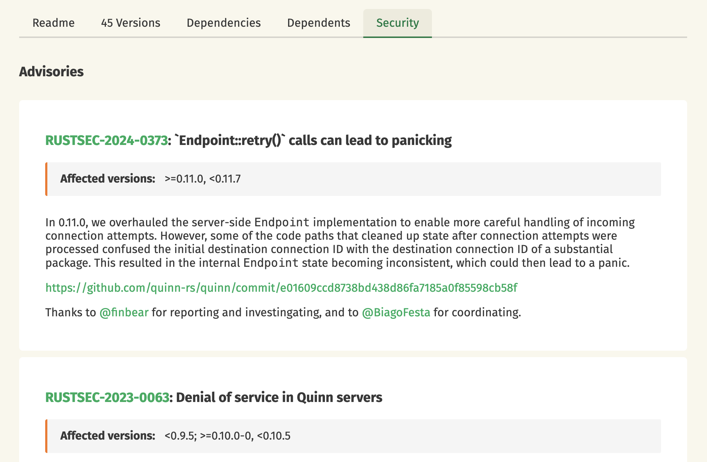

+++
path = "2026/01/21/crates-io-development-update"
title = "crates.io: development update"
authors = ["Tobias Bieniek"]

[extra]
team = "the crates.io team"
team_url = "https://www.rust-lang.org/governance/teams/crates-io"
+++

Time flies! Six months have passed since our last crates.io development update, so it's time for another one. Here's a summary of the most notable changes and improvements made to [crates.io](https://crates.io/) over the past six months.

## Security Tab

Crate pages now have a new "Security" tab that displays security advisories from the [RustSec](https://rustsec.org/) database. This allows you to quickly see if a crate has known vulnerabilities before adding it as a dependency.

The tab shows known vulnerabilities for the crate along with the affected version ranges. 

This feature is still a work in progress, and we plan to add more functionality in the future. We would like to thank the [OpenSSF](https://openssf.org/) (Open Source Security Foundation) for funding this work and [Dirkjan Ochtman](https://github.com/djc) for implementing it.

## Trusted Publishing Enhancements

In our July 2025 update, we announced Trusted Publishing support for GitHub Actions. Since then, we have made several enhancements to this feature.

### GitLab CI/CD Support

Trusted Publishing now supports [GitLab CI/CD](https://docs.gitlab.com/ee/ci/) in addition to GitHub Actions. This allows GitLab users to publish crates without managing API tokens, using the same OIDC-based authentication flow.

Note that this currently only works with GitLab.com. Self-hosted GitLab instances are not supported yet. The crates.io implementation has been refactored to support multiple CI providers, so adding support for other platforms like Codeberg/Forgejo in the future should be straightforward. Contributions are welcome!

### Trusted Publishing Only Mode

Crate owners can now enforce Trusted Publishing for their crates. When enabled in the crate settings, traditional API token-based publishing is disabled, and only Trusted Publishing can be used to publish new versions. This reduces the risk of unauthorized publishes from leaked API tokens.

### Blocked Triggers

The `pull_request_target` and `workflow_run` GitHub Actions triggers are now blocked from Trusted Publishing. These triggers have been responsible for multiple security incidents in the GitHub Actions ecosystem and are not worth the risk.

## Source Lines of Code

Crate pages now display source lines of code (SLOC) metrics, giving you insight into the size of a crate before adding it as a dependency. This metric is calculated in a background job after publishing using the [tokei](https://github.com/XAMPPRocky/tokei) crate. It is also shown on OpenGraph images:

Thanks to [XAMPPRocky](https://github.com/XAMPPRocky) for maintaining the `tokei` crate!

## Publication Time in Index

A new `pubtime` field has been added to crate index entries, recording when each version was published. This enables several use cases:

- Cargo can implement cooldown periods for new versions in the future
- Cargo can replay dependency resolution as if it were a past date, though yanked versions remain yanked
- Services like [Renovate](https://github.com/renovatebot/renovate) can determine release dates without additional API requests

Thanks to [Rene Leonhardt](https://github.com/reneleonhardt) for the suggestion and [Ed Page](https://github.com/epage) for driving this forward on the Cargo side.

## Svelte Frontend Migration

At the end of 2025, the crates.io team evaluated several options for modernizing our frontend and decided to experiment with porting the website to [Svelte](https://svelte.dev/). The goal is to create a one-to-one port of the existing functionality before adding new features.

This migration is still considered experimental and is a work in progress. Using a more mainstream framework should make it easier for new contributors to work on the frontend. The new Svelte frontend uses TypeScript and generates type-safe API client code from our [OpenAPI description](https://crates.io/api/openapi.json), so types flow from the Rust backend to the TypeScript frontend automatically.

Thanks to [eth3lbert](https://github.com/eth3lbert) for the helpful reviews and guidance on Svelte best practices. We'll share more details in a future update.

## Miscellaneous

These were some of the more visible changes to crates.io over the past six months, but a lot has happened "under the hood" as well.

- **Cargo user agent filtering**: We noticed that download graphs were showing a constant background level of downloads even for unpopular crates due to bots, scrapers, and mirrors. Download counts are now filtered to only include requests from Cargo, providing more accurate statistics.

- **HTML emails**: Emails from crates.io now support HTML formatting.

- **Encrypted GitHub tokens**: OAuth access tokens from GitHub are now encrypted at rest in the database. While we have no evidence of any abuse, we decided to improve our security posture. The tokens were never included in the daily database dump, and the old unencrypted column has been removed.

- **Source link**: Crate pages now display a "Browse source" link in the sidebar that points to the corresponding docs.rs page. Thanks to [Carol Nichols](https://github.com/carols10cents) for implementing this feature.

- **Fastly CDN**: The sparse index at index.crates.io is now served primarily via Fastly to conserve our AWS credits for other use cases. In the past month, static.crates.io served approximately 1.6 PB across 11 billion requests, while index.crates.io served approximately 740 TB across 19 billion requests. A big thank you to Fastly for providing free CDN services through their [Fast Forward program](https://www.fastly.com/fast-forward)!

- **OpenGraph image improvements**: We fixed emoji and CJK character rendering in OpenGraph images, which was caused by missing fonts on our server.

- **Background worker performance**: Database indexes were optimized to improve background job processing performance.

- **CloudFront invalidation improvements**: Invalidation requests are now batched to avoid hitting AWS rate limits when publishing large workspaces.

## Feedback

We hope you enjoyed this update on the development of crates.io. If you have any feedback or questions, please let us know on [Zulip](https://rust-lang.zulipchat.com/#narrow/stream/318791-t-crates-io) or [GitHub](https://github.com/rust-lang/crates.io/discussions). We are always happy to hear from you and are looking forward to your feedback!
