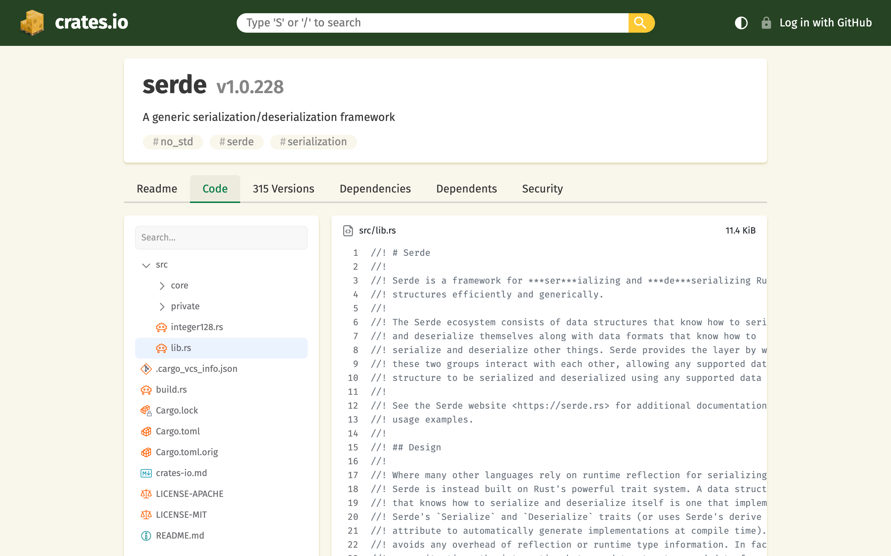
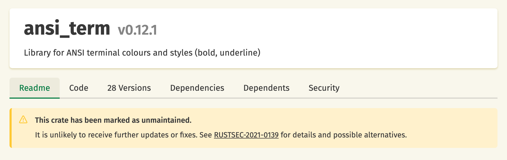
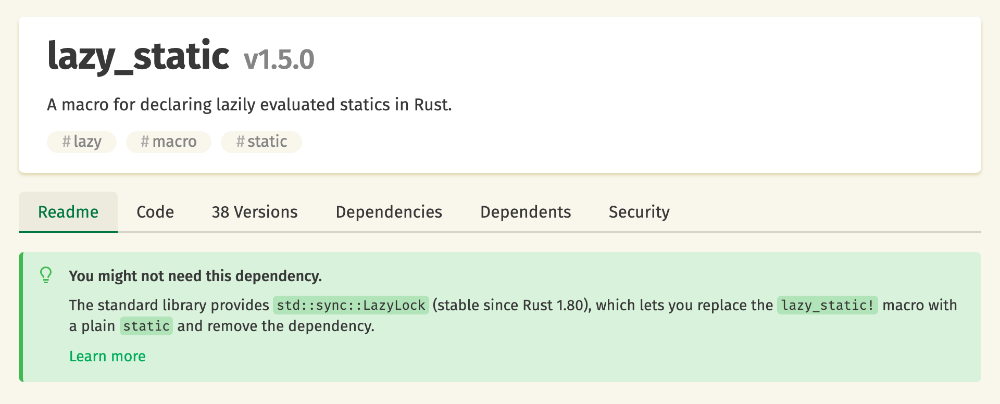
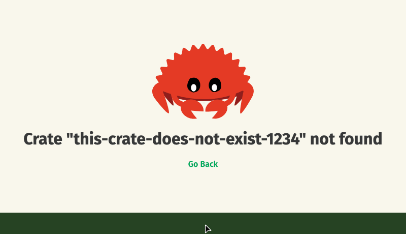

+++
path = "2026/07/13/crates-io-development-update"
title = "crates.io: development update"
authors = ["Tobias Bieniek"]

[extra]
team = "the crates.io team"
team_url = "https://www.rust-lang.org/governance/teams/crates-io"
+++

Another six months have passed since our [last development update](https://blog.rust-lang.org/2026/01/21/crates-io-development-update/), and the crates.io team has been busy. Here's a summary of the most notable changes and improvements made to [crates.io](https://crates.io/) since then.

## Source Code Viewer

Crate pages now have a "Code" tab that lets you browse the contents of published crate versions directly on crates.io. This shows you the exact files that cargo downloads when you add a crate as a dependency, which might differ from the linked repository. This makes it much easier to audit your dependencies, including files that never appear in the repository, like the normalized `Cargo.toml` files that `cargo` generates.

The viewer comes with a file tree sidebar with search functionality, syntax highlighting, and GitHub-style line selection, where clicking or dragging line numbers produces shareable `#L10-L20` URLs.

Under the hood, the server now builds a zip file for every published version. Since the `.crate` files that cargo consumes are gzipped tarballs without random access support, a background job re-packs each of them into a seekable zip archive plus a JSON manifest describing the contained files. Both are served from our static CDN. The frontend then fetches only the manifest and loads each file on demand with an HTTP range request. Because of this architecture, browsing crate sources essentially adds no load on the crates.io API servers. Existing crate versions have been backfilled, so this works for old releases too.

The rendering library behind the code viewer is a diff renderer at heart, and that's no accident: a version-to-version diff viewer built on the same infrastructure is currently in the works. This will allow you to review exactly what changed between two published versions, right on crates.io. Stay tuned!

## Untangling crates.io Accounts from GitHub

At the end of May, the crates.io team accepted [RFC #3946](https://github.com/rust-lang/rfcs/pull/3946). Crates.io accounts always have been tightly coupled to GitHub: signing in means "Log in with GitHub", and your crates.io identity is your GitHub username. The RFC changes that. It introduces usernames that are native to crates.io and independent of linked GitHub accounts, as a prerequisite for eventually supporting login via other identity providers.

The implementation of crates.io usernames has started, but there is still a lot left to do, most visibly the ability to change your crates.io username. After that is complete, there will be future RFCs and implementation for signing in with identity providers other than GitHub. Since all of this touches authentication and account security, we are deliberately taking it slow and rolling these changes out in small, carefully reviewed steps.

## Advisories and Suggestions

In our January update we introduced the "Security" tab, which shows security advisories from the [RustSec](https://rustsec.org/) database. We have since taken this integration one step further: crates that RustSec has flagged as unmaintained now show a warning banner directly on their crate pages, linking to the corresponding advisory for details and possible alternatives. Thanks to [Dirkjan Ochtman](https://github.com/djc) for implementing this feature!

Related to this, some popular crates have been largely absorbed into the Rust standard library over the years, like `lazy_static`, which has been superseded by `std::sync::LazyLock` since Rust 1.80. Crate pages of such crates now show a friendly "You might not need this dependency" banner describing the standard library replacement, and superseded crates in dependency lists get a small light bulb icon with a similar hint.

The dataset behind this feature lives in the new [rust-lang/std-replacement-data](https://github.com/rust-lang/std-replacement-data) repository, together with a documented inclusion policy: standard library replacements only, every entry must cite the stable `std` API and Rust version, and crate maintainers get a notice-and-comment window before an entry is added. New entries can be proposed upstream and can benefit other tools too.

## Ferris

The most delightful change of this cycle: the Ferris on our error pages now follows your mouse cursor with its eyes:

Getting a 404 error on crates.io is now slightly less sad.

## Svelte Frontend Migration Completed

In our [January update], we announced that we were experimenting with porting the crates.io frontend from Ember.js to [Svelte](https://svelte.dev/). This experiment has concluded successfully: the new frontend reached feature parity, went through a [public testing phase](https://blog.rust-lang.org/inside-rust/2026/04/17/crates-io-svelte-public-testing/) in April, became the default at the beginning of May, and the Ember.js app has been removed from our repository.

We designed this change to be invisible for our users, since the new frontend is a 1:1 port of the previous design and functionality. For the team and our contributors, however, it is a big deal: the frontend is now built on a more modern framework, which should make it easier for new contributors to get started. It also allows us to iterate faster, as the source code viewer above demonstrates.

We want to thank the [Ember.js team](https://emberjs.com/teams/) for a framework that served crates.io well for many years, and the [Svelte team](https://svelte.dev/) for making the transition so enjoyable.

## Miscellaneous

These were some of the more visible changes to crates.io over the past six months, but a lot has happened "under the hood" as well:

- **Search performance**: Relevance-sorted search queries previously ranked every crate matching the query, which could take 1-2 seconds for short or common search terms. Ranking is now bounded to the 1,000 matching crates with the most recent downloads.

- **Reverse dependencies performance**: The reverse dependencies endpoint no longer recomputes the full dependent set on every request. It is now served from a precomputed table kept in sync by database triggers, turning an expensive join into a bounded index scan.

- **New ARCHITECTURE.md**: If you've ever wondered how crates.io actually works, our [`ARCHITECTURE.md`](https://github.com/rust-lang/crates.io/blob/main/docs/ARCHITECTURE.md) document got a complete rewrite. It is now organized around the high-level systems that make up crates.io and how they fit together, and includes walkthroughs of what happens when you run `cargo publish`, why a typical crate download never touches our API servers, and how download counts are derived from CDN access logs.

- **Definition lists**: READMEs now render Markdown definition lists, a widely used Markdown extension. Our markdown renderer [comrak](https://crates.io/crates/comrak) already supported them, the extension just wasn't enabled yet. Thanks to [@mistaste](https://github.com/mistaste) for this contribution!

- **CDN cache tags**: Files uploaded to our static CDN now carry cache-tag metadata, allowing us to invalidate all cached files of a crate or a specific release in a single operation, instead of issuing one invalidation per file URL.

- **Caching improvements**: We removed a global `Vary: Cookie` response header that was preventing our CDNs from caching public API responses and frontend assets effectively. Per-user responses now use `Cache-Control: no-store` instead, resulting in better cache hit rates at the CDN edge.

- **Accessibility**: We have put a bit of effort into making crates.io friendlier to screen readers: decorative icons are now hidden from the accessibility tree, heading hierarchies have been fixed, and lists are marked up as proper lists. ARIA snapshot tests now ensure that regressions can't slip in unnoticed.

- **Git index performance**: The background worker's local clone of the git index is now a bare and shallow repository, eliminating roughly 250,000 checked-out files and the full commit history from its disk. The periodic index squashing now goes through the GitHub API instead of generating large git packs locally, which had previously caused out-of-memory failures on the production worker.

## Feedback

We hope you enjoyed this update on the development of crates.io. If you have any feedback or questions, please let us know on [Zulip](https://rust-lang.zulipchat.com/#narrow/stream/318791-t-crates-io) or [GitHub](https://github.com/rust-lang/crates.io/discussions). We are always happy to hear from you and are looking forward to your feedback!
