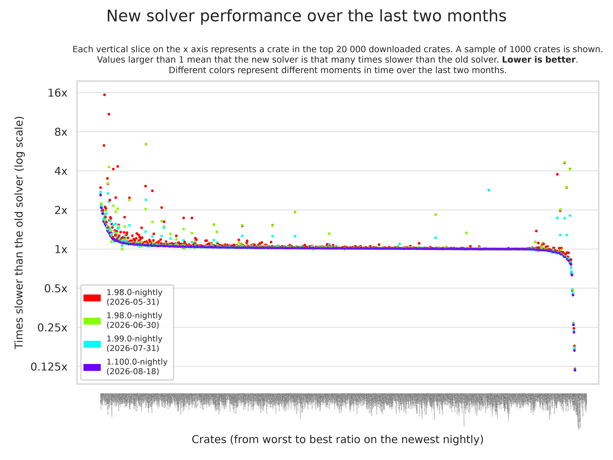

+++
path = "2026/08/21/enabling-next-solver-on-nightly"
title = "Enabling the next-generation trait solver on nightly"
authors = ["lcnr"]

[extra]
team = "The Rustc Trait System Refactor Initiative"
team_url = "https://github.com/rust-lang/trait-system-refactor-initiative/"
+++

After nearly 4 years of active development, [the next-generation trait solver](https://github.com/rust-lang/rust-project-goals/issues/113) is close to stabilization. We are enabling it by default on nightly to surface any remaining issues and plan to stabilize it in the next months. This is the largest single change to the Rust compiler since its initial release. It completely replaces how we prove where-clauses, normalize associated types, and much more. **Please try out the latest nightly and [open an issue](https://github.com/rust-lang/rust/issues) if you encounter any bugs or regressions.**

This is an internal component of the compiler. The main benefits of this rework will come in the future. The removal of the old implementation will unblock features such as [Type Alias Impl Trait and Return Type Notation][RTN], allow us to add new implicit default trait bounds (e.g., [`Move` and `Forget`]), and enable us to fix [the remaining type system unsoundnesses][Project Zero].

Even so, this already fixes a huge number of issues. As an underapproximation, we currently know of [more than 200 issues on GitHub fixed by this change](https://github.com/rust-lang/rust/issues?q=is%3Aissue%20state%3Aopen%20label%3Afixed-by-next-solver). This also has a significant impact on compile times; more on that later. When developing on nightly, you may accidentally rely on behavior only supported by the new trait solver.

This is an incredibly big change which results in a non-trivial amount of breakage. Most of these changes are intended improvements to type inference or the removal of undesirable behavior. We are tracking the known issues and breakage [in a pinned GitHub issue](https://github.com/rust-lang/rust/issues/160895).


## What can I do?

Please update to the latest nightly version by using `rustup update nightly` and use it to test your existing projects and libraries.

> ⚠️ While the next-generation trait solver has been enabled on our `main` branch, this change will only be accessible on the nightly channel starting from Saturday 22nd August. You can already test it before then by providing `-Znext-solver=globally` as a command-line argument ⚠️

Please tell us if you encounter any breakage, compile-time performance regression, or bad diagnostics. We have not yet spent too much time on error messages for the next-generation trait solver, so we would also appreciate you using this nightly for development to find poor diagnostics and other bugs in our error handling.

If you encounter any issue, take a quick look at [the pinned GitHub issue](https://github.com/rust-lang/rust/issues/160895) to see if the affected crate is already listed, and if not, please open [a new issue](https://github.com/rust-lang/rust/issues/new?template=bug_report.md)! To disable the next-generation trait solver on nightly, you can pass `-Znext-solver=coherence` to `rustc`, use `RUSTFLAGS=-Znext-solver=coherence`, or change your project's [`.cargo/config.toml`](https://doc.rust-lang.org/cargo/reference/config.html) configuration file:

```toml
[target.x86_64-unknown-linux-gnu]
rustflags = ["-Znext-solver=coherence"]
```

## What exactly does this mean?

We will go into more detail about the next-generation trait solver, how we got here, and what it changes when fully stabilizing it. This is a quick summary of its main impact.

### `impl Trait` handling

The way opaque types — return-position `impl Trait` (RPIT), but also the unstable [Type Alias Impl Trait (TAIT) and Return Type Notation (RTN)][RTN] — are handled in the type system has nearly completely changed. This fixes a lot of bugs and edge cases with them and should make their behavior a lot more consistent in general. This change is why the next-generation trait solver is necessary to stabilize TAIT and RTN.

The implementation change mostly does not matter for RPIT as we special-cased `impl Trait` from the method signature when type checking the method body. This means the only way to observe the old behavior is via recursive function calls. The following snippet errors with the existing implementation, but compiles with `-Znext-solver` enabled: [godbolt](https://rust.godbolt.org/z/3faWKn4aE)

```rust
fn foo(b: bool) -> impl Sized {
    if b {
        // The old implementation errored here.
        foo(false) + 1
    } else {
        0
    }
}
```

### Associated types in higher-ranked types

The most impactful change is way we handle associated types referencing bound variables, i.e., lifetimes from a `for<'a>` binder, for example, the type `for<'a> fn(<T as Trait>::Assoc<'a>)`. While most users don't encounter such types directly, there are widely used crates which do. This change impacts existing code by removing incorrect type inference, such as in [bevy](https://github.com/bevyengine/bevy/pull/18840) and [minijinja](https://github.com/mitsuhiko/minijinja/pull/787).

It also fixes a bunch of unnecessary errors like in the following example: [godbolt](https://rust.godbolt.org/z/MMsEjTxeE)
```rust
trait OtherTrait {
    type Assoc<'a>;
}
impl OtherTrait for u32 {
    type Assoc<'a> = &'a u32;
}


trait Trait {}
impl<T: OtherTrait> Trait for (T, for<'a> fn(<T as OtherTrait>::Assoc<'a>)) {}


fn impls<T: Trait>() {}

fn main() {
    // The old implementation failed to prove
    // the where-bound of `impls`.
    impls::<(u32, for<'a> fn(&'a u32))>();
}
```

### Compile-time performance

<sub>co-authored with [jana](https://github.com/jdonszelmann) :3</sub>

We've spent a lot of time on the compile-time performance of the next-generation trait solver. There have been many cases where it performed quadratically or even exponentially slower than the old solver.

Especially the last few weeks were mainly spent on improving performance. This work was shared by many people, with major contributions by [Nick Nethercote](https://github.com/nnethercote), [jana](https://github.com/jdonszelmann), [Rémy Rakic](https://github.com/lqd), and [mira](https://github.com/inkreasing).

As part of this effort, [Rémy Rakic](https://github.com/lqd) compared the performance of both implementations for the top 20,000 crates on [crates.io](https://crates.io/crates?sort=downloads). Below you is a visualization of the performance changes over the last two months.



On the left and the right, the major outliers can be found. Note that the sample of crates here is biased *towards* such crates, because those are more interesting to us. Nearly all crates we tested in the top 20k had effectively the same performance with both implementations.

This graph shows that we've mainly focused our efforts on the negative outliers and made significant progress there. While many of the crates that previously took more than twice as long to compile with the new solver are still slightly slower, our work has made a few of them actually compile *faster* than with the old solver.

We will continue to improve its performance over the coming months, and there are still a lot of optimization opportunities compared to the existing implementation. My expectation is that, in the long term, nearly all crates will benefit from the next-generation trait solver. I am especially excited about the huge performance benefits for some trait-heavy crates.

As an example, [a Chess implementation in Rust's type system](https://github.com/Dragon-Hatcher/type-system-chess) hangs with the old implementation while taking a minute with the new one. There are also more practical crates with huge performance benefits, e.g., the [`datafusion` crate](https://crates.io/crates/datafusion) compiles more than 8x faster now. For more details about the recent performance work, see [this blog post by jana](https://donsz.nl/blog/new-solver-performance).

---

Again, thank you for testing with the latest nightly and [opening a GitHub issue if you encounter any issues](https://github.com/rust-lang/rust/issues)! We're excited to fully stabilize the next-generation trait solver soon.


[`Move` and `Forget`]: https://rust-lang.github.io/rust-project-goals/2026/move-trait.html
[Project Zero]: https://rust-lang.github.io/rust-project-goals/2026/roadmap-project-zero.html
[RTN]: https://rust-lang.github.io/rust-project-goals/2026/rtn.html
