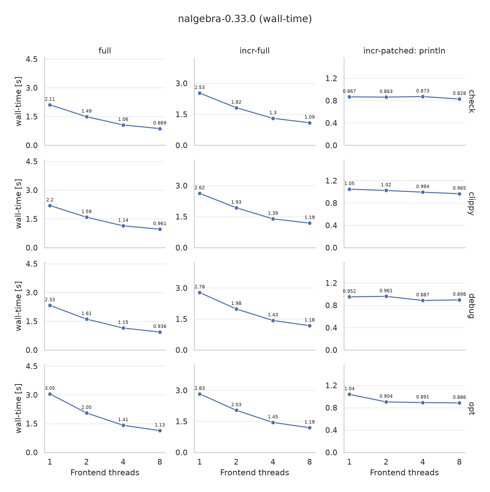

+++
path = "2026/09/28/enabling-parallel-frontend-on-nightly"
title = "Enabling the parallel frontend on nightly"
authors = ["Jakub Beránek"]

[extra]
team = "The Compiler Team"
team_url = "https://www.rust-lang.org/governance/teams/compiler"
+++

TL;DR: We are enabling the parallel frontend of the Rust compiler on nightly by default,
to find remaining issues in preparation for its stabilization.

## Context

The Rust compiler has been using multiple threads to compile code in its "backend" part (using LLVM) for a long time. However, its "frontend" part (which includes type checking or borrow checking) has been executing in serial, on a single thread, which of course limits the performance of the compiler. If you are interested in a more in-depth explanation of parallelism in the Rust compiler, see this [previous post][previous-post-backend].

The compiler frontend actually had support for running in parallel for a long time, but it was not enabled by default due to various issues. [Three years ago][previous-post], we made it possible to opt into the parallel frontend on the nightly channel, with the plan to stabilize it in 2024. Clearly, we did not achieve that goal, but work on the parallel frontend was still slowly progressing in the meantime.

Last year, [Vadim Petrochenkov][petrochenkov], together with several other contributors, started a coordinated effort to finally get the parallel frontend over the finish line. Since then, many long-standing issues were fixed, and its performance was improved. Now we are at a point where we would like to make it widely available. But before that, we want to find out if people encounter issues with it in the wild, which is why we will soon enable it by default only on the nightly channel. Once we are confident enough that it is working well, we want to stabilize it. 

## Benefits

The primary benefit of enabling the parallel frontend is, of course, faster compilation of Rust programs.

We benchmarked the parallel frontend in our [benchmark suite][rustc-perf], which measures the duration to compile the *leaf* crate in a crate graph. As usually, the results were varied. In some benchmarks, the parallel frontend barely helped. In others, for example when performing a `cargo check` of the `nalgebra`, `cargo` or `diesel` crates, the compilation was almost three times faster!

In the table below, you can find the aggregated wall-time mean change for the real-world benchmarks in our suite, when building a single crate from scratch across several configurations, compared to the same build using a sequential frontend.

| Frontend threads / Profile |  `check` | `clippy` |  `debug` |    `opt` |
|:--------------------------:|---------:|---------:|---------:|---------:|
|             2              | -21.95 % | -20.74 % |  -14.2 % | -12.51 % |
|             4              | -37.99 % | -36.01 % | -29.14 % | -23.67 % |
|             8              | -44.23 % | -41.76 % |  -36.1 % | -27.88 % |

Note that the performance benefits for incremental rebuilds are much more modest, and also very hard to compare, because the performance of rebuilds depends on what was changed and how were the codegen units laid out. In our benchmark suite, we saw a mean improvement of 3-5% for incremental rebuilds. But we currently do not have great benchmarks for this use-case, so your results might vary.

We can also zoom in on an individual crate. Here is a chart of how the wall-time scales when compiling the `nalgebra 0.33` crate, for a full non-incremental build (`full`), full incremental build (`incr-full`) and an incremental rebuild (`incr-patched`) across several build configurations:



What is interesting to note is that enabling the parallel frontend can actually also make the backend faster, for reasons explained [here][previous-post-frontend].

It is important to note that all benchmark results presented above measured only the compilation of a single crate. When compiling a whole crate graph, your CPU cores might already be saturated because of backend (LLVM) parallelism or by Cargo compiling multiple crates in parallel. So the final performance effect will vary heavily based on the workload that you are running, and on the number of cores that you have available.

We also benchmarked `cargo check` end-to-end (checking the whole crate graph) on the `cargo` crate itself on a machine with 8 CPU cores. With 8 threads, it resulted in a ~15% end-to-end improvement:

- 36.7s with 1 frontend thread
- 35.1s with 2 frontend threads
- 31.9s with 4 frontend threads
- 30.8s with 8 frontend threads

As can be seen from the results above, when the CPU cores are already saturated with parallel crate compilation and LLVM, the positive effect of the parallel frontend is reduced.

## Tuning the thread count

At the start, the nightly toolchain will default to the parallel frontend using only `2` threads. This is a conservative choice that should still allow us to find potential issues.

If you want to test out the performance with different thread counts, you can override the number of threads used for the frontend using the `--jobs-frontend` compiler flag. It can be specified either in the `RUSTFLAGS` environment variable, or you can put it into a [`.cargo/config.toml`][cargo-config] file:

```toml
[build]
rustflags = ["-Zunstable-options", "--jobs-frontend=8"]
```

Currently, the performance of the parallel frontend will likely not scale very well above ~8 threads, but you can try it on your workload to test what happens. Note that using higher thread counts will likely lead to higher memory usage of the compiler, and in extreme cases might cause you to run out of memory.

## Limitations and known issues

Due to the used parallelism, the produced order of diagnostics might not be deterministic when using the parallel frontend.

In some situations, the generated binary might also not be reproducible, though we currently consider these cases bugs, and we would like to identify them and fix them.

There are currently some [known issues][parallel-frontend-reproducibility-issues] related to the reproducibility of the Rust compiler when using the parallel frontend, which are being worked on.

## How do I opt out?

To reiterate: this is only being enabled on nightly for now. If you are using the stable toolchain, you will still be using the sequential frontend by default.

If you want to disable the parallel frontend on the nightly channel, pass `-Zunstable-options --jobs-frontend=1` to `rustc`, either via the `RUSTFLAGS` environment variable, or with the [`.cargo/config.toml`][cargo-config] configuration file:

```toml
[build]
rustflags = ["-Zunstable-options", "--jobs-frontend=1"]
```

If you have to do this for some reason, please do tell us why [on GitHub][tracking-issue] or [on Zulip][zulip-topic]. We would especially like to know about any compiler crashes that you encounter, or the produced binaries not being reproducible when the parallel frontend is enabled.

## What's next?

Over the next few months, we will be monitoring GitHub and Zulip for any reported issues about the parallel frontend. Once we have enough confidence that it is working well, and there are no major issues, we would like to move forward and finally stabilize it.

We would also like to improve its performance, and make more things parallel. So far, a lot of the work on the parallel frontend so far has been focused on making it work correctly, rather than tuning its performance down to the last percent. We thus expect that we might still be able to make further performance improvements to it.

We would also like to make more parts of the frontend actually parallel, as some parts are currently still sequential even if parallelism is enabled. Last year, we had a Google Summer of Code project focused on enabling [parallel macro expansion and name resolution][gsoc-project]. This work is still ongoing, and once completed, it would make the compiler frontend even more parallel.

[previous-post]: https://blog.rust-lang.org/2023/11/09/parallel-rustc/
[previous-post-frontend]: https://blog.rust-lang.org/2023/11/09/parallel-rustc/#new-intraprocess-parallelism-the-front-end
[previous-post-backend]: https://blog.rust-lang.org/2023/11/09/parallel-rustc/#existing-intraprocess-parallelism-the-back-end
[petrochenkov]: https://github.com/petrochenkov
[gsoc-project]: https://blog.rust-lang.org/2025/11/18/gsoc-2025-results/#improving-the-rustc-parallel-frontend-parallel-macro-expansion
[zulip-topic]: https://rust-lang.zulipchat.com/#narrow/channel/187679-t-compiler.2Fparallel-rustc/topic/Parallel.20frontend.20issues/with/624551811
[tracking-issue]: https://github.com/rust-lang/rust/issues/113349
[rustc-perf]: https://github.com/rust-lang/rustc-perf
[cargo-config]: https://doc.rust-lang.org/cargo/reference/config.html
[parallel-frontend-reproducibility-issues]: https://github.com/rust-lang/rust/issues?q=state%3Aopen%20label%3AA-reproducibility%20label%3AA-parallel-compiler
