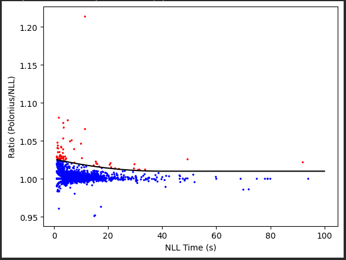
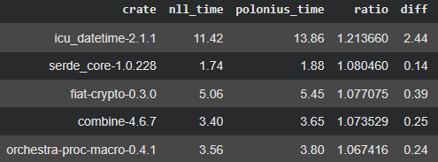

+++
path = "2026/08/04/enabling-polonius-alpha-on-nightly"
title = "Enabling the next iteration of the borrow checker on nightly"
authors = ["Jack Huey"]
aliases = ["2026/08/04/enabling-polonius-alpha-on-nighty"]

[extra]
team = "Polonius working area"
team_url = "https://rust-lang.zulipchat.com/#narrow/channel/186049-t-types.2Fpolonius"
+++

TL;DR We are enabling the next iteration of the borrow checker (coined Polonius Alpha)
on nightly in preparation for stabilization in the next few months.

## Whaaaaaat?

Yes! You heard it right! The next iteration of the Rust borrow checker is coming! Rust's first borrow checker ("AST borrowck") was very limited and was phased out [in 2019](https://blog.rust-lang.org/2019/11/01/nll-hard-errors/) in favor of [NLL](https://rust-lang.github.io/rfcs/2094-nll.html), other than a "migrate mode" that was used to provide nice error messages. That migrate mode was finally removed [in 2022](https://blog.rust-lang.org/2022/08/05/nll-by-default).

The [Polonius borrow checker](https://github.com/rust-lang/polonius) spun out of the NLL effort in 2018. The [initial formulation](https://smallcultfollowing.com/babysteps/blog/2018/04/27/an-alias-based-formulation-of-the-borrow-checker/) passed the NLL test suite and accepted (sound) code that NLL did not. However, performance was a critically-limiting factor; generally borrow check was slower than NLL, but certain programs were considerably slower than NLL to the extent that using that implementation/formulation of Polonius was a non-starter. [Attempts were made](https://github.com/nikomatsakis/polonius.next) over the years to implement the Polonius formulation in a performant manner, without much luck in addressing the core issues.

In 2023, [a new formulation](https://smallcultfollowing.com/babysteps/series/polonius-revisited/) of a Polonius-style borrow checker was imagined that required minimal rearchitecture of the existing NLL implementation and could be extended to allow more code to compile. We [had hoped](https://blog.rust-lang.org/inside-rust/2023/10/06/polonius-update/), to try to stabilize this new formulation in 2024; but, various things popped up that delayed this.

But! We're nearly there now! At this point, there are no known remaining issues with the subset coined Polonius Alpha that we intend to stabilize. And, performance is generally acceptable for stabilization (will discuss that a bit below).

So, **we are enabling the Polonius Alpha borrow checker on nightly** for testing until we stabilize fully later in the year. We're doing this in order to help find:
- Any serious performance regressions we're unaware of
- Unsoundness in the formulation that we haven't thought about
- Any weird diagnostic issues that we need to improve
    - Note: we have not *yet* seen any diagnostic changes

You can report any issues [on Github](https://github.com/rust-lang/rust/issues/160456) or [on Zulip](https://rust-lang.zulipchat.com/#narrow/channel/186049-t-types.2Fpolonius/topic/Polonius.20Alpha.20enabled.20on.20nightly/near/614373312).

## Okay, what's new?

The key thing that Polonius Alpha enables that NLL does not is *flow-sensitive* borrow checking of lifetime outlives relationships.

Perhaps the smallest example demonstrating what will pass with Polonius Alpha but not the current NLL is:

```rust
fn reborrow(a: &mut u8) -> &mut u8 {
    let b = &mut *a;
    if true { b } else { a }
}
```

However, the example you will see more often is:

```rust
fn get_mut_or_default<'r, K: Hash + Eq + Copy, V: Default>(
    map: &'r mut HashMap<K, V>,
    key: K,
) -> &'r mut V {
    match map.get_mut(&key) {
        Some(value) => value,
        None => {
            map.insert(key, V::default());
            map.get_mut(&key).unwrap()
        }
    }
}
```

The issue is that the `Some(value) => value` branch causes the borrow checker to think that the borrow returned by `map.get_mut(&key)` lives for the entire function (because of the `&'r mut V` return type), even though that borrow isn't live in the `None` branch. NLL's analysis is *flow-insensitive*.

Polonius Alpha passes this because its analysis is *flow-sensitive*, and it knows that the borrow isn't live in the `None` branch.

Now, Polonius Alpha is not *perfect*; some programs that would compile under legacy Polonius (the slow original implementation) don't compile with Polonius Alpha. (This is of course why we call it "Polonius Alpha"). For example:

```rust
struct X { next: Option<Box<X>> }

fn conditional() {
    let mut b = Some(Box::new(X { next: None }));
    let mut p = &mut b;
    while let Some(now) = p {
        if true {
            p = &mut now.next;
        }
    }
}
```

(As a slight note: we have also found programs that compile with Polonius Alpha but not legacy Polonius, so it's not really a full subset.)

## So, what about performance?

Polonius Alpha currently does strictly equal or more work compared to NLL, so we have been paying particular attention to potential performance regressions.

From the top ten thousand crates by downloads on crates.io, we have seen relatively few "significant" regressions, and even crates that have a "significant" regression are typically *relatively* minimal:



*Each point represents a crate within the 10,000 most-downloaded crates. The black line is an arbitrary threshold of significance, set to a 1% regression and quadratically scaled below 30 seconds. Red points are crates that pass this arbitrary regression threshold. X-axis is compile time (for the leaf crate only without dependencies) under NLL; Y-axis is the ratio of compile time under Polonius Time compared to NLL.*

If you look at the top five crates, they are:



Outside the top ten thousand crates, we have focused mainly on crates with many borrows. The worst case we've seen is a 2-3x regression.

We have done some initial triage of the causes of these regressions and are thinking about the best way to fix them. Though, overall we think these regressions are fairly reasonable even if we *can't* fix them, given how rare and relatively minimal they are compared to the additional power Polonius Alpha brings over NLL.

## I really don't want this. How do I opt-out?

To reiterate: this is only being enabled on nightly. But if you want to disable Polonius Alpha, and only use the stable NLL, you can pass `-Zpolonius=off` to `rustc`, use `RUSTFLAGS=-Zpolonius=off`, or with a project's [`.cargo/config.toml`](https://doc.rust-lang.org/cargo/reference/config.html) configuration file:

```toml
[target.x86_64-unknown-linux-gnu]
rustflags = ["-Zpolonius=off"]
```

If you have to do this, for some reason, please do tell us why [on Github](https://github.com/rust-lang/rust/issues/160456) or [on Zulip](https://rust-lang.zulipchat.com/#narrow/channel/186049-t-types.2Fpolonius/topic/Polonius.20Alpha.20enabled.20on.20nightly/near/614373312).

## What's next?

Over the next few months, we will be monitoring Github and Zulip for any reported issues about Polonius Alpha. We will also be working to address known performance regressions. Finally, we will be working on internal documentation about the implementation. All prior to stabilization. Then, we are aiming to stabilize prior to the end of the year!

Although some programs that we *want* to compile don't work with Polonius Alpha (nor NLL today), we don't currently have any concrete plans to continue active feature work on the Polonius implementation after the stabilization of Polonius Alpha. We expect to continue to optimize the implementation and address any performance regressions for a little while. We will likely come back to Polonius feature-work *at some point*, but given that Polonius Alpha solves the most-encountered borrow-check issues, we are shifting our time to other high-priority work for the near future.
