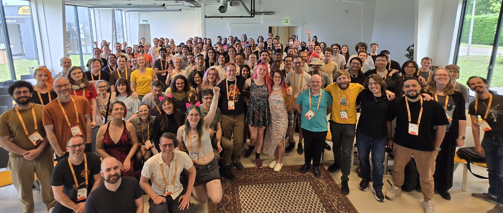

+++
path = "inside-rust/9999/12/31/all-hands-2026-retrospective"
title = "All Hands 2026 retrospective"
authors = ["Nurzhan Saken"]

[extra]
team = "the Program team"
team_url = "https://www.rust-lang.org/governance/teams/launching-pad#team-program"
+++

In May 2026, 166 Rustaceans gathered in Utrecht for the Rust All Hands. This event is an opportunity for the Rust Project members and guests to work on Rust in person for several days — discuss its future, resolve blockers, build connections between teams, and so on (but not make any final decisions!).

This was the second All Hands organized by [RustNL](https://rustnl.org/), after [the one last year](https://blog.rust-lang.org/inside-rust/2025/09/30/all-hands-2026/) revived the tradition after a six-year hiatus. It was co-located with RustWeek both times, closing it off after the conference. And yes, the All Hands will happen again in 2027! More details on that at the end.

Also co-located with the All Hands was the Unconference, where invited ecosystem maintainers and contributors collaborated with each other and with Rust Project members. This year, there were six participating groups: [Bevy Engine](https://bevy.org/), [Ariel OS](https://ariel-os.org/), [Linebender](https://linebender.org/), the [Safety-Critical Rust Consortium](https://github.com/Safety-Critical-Rust-Consortium), [Rust GPU](https://github.com/Rust-GPU), and [Rust Embedded](https://github.com/rust-embedded) — with around 60 members in total.

Similarly to last year, there was a Rust Project track on the second day of the conference, with talks presented by Project members (see the [recordings](https://www.youtube.com/playlist?list=PL8Q1w7Ff68DBkk0ddSEqdf97swuDvMSKS)). The talks touched on some of the topics that the Rust teams discussed in greater depth in the All Hands sessions.

## Sessions

There were 73 sessions spread across 3 days and 11 rooms, most of which were [pre-scheduled](https://raw.githubusercontent.com/rust-lang/all-hands-2026/main/all-hands-schedule.pdf), though some happened spontaneously. You can find the session notes in [rust-lang/all-hands-2026](https://github.com/rust-lang/all-hands-2026/issues).

The [State of the Rust teams](https://github.com/rust-lang/all-hands-2026/issues/37) session kicked off the All Hands and provided a (literal) platform for teams to tell everyone about their activities.

Many sessions focused on pressing topics in the Project's governance. The [Leadership Council](https://github.com/rust-lang/all-hands-2026/issues/23) and [Project Directors](https://github.com/rust-lang/all-hands-2026/issues/34) both held Q&A panels about their roles and processes, and how they relate to one another and the Rust Foundation. The [moderation panel](https://github.com/rust-lang/all-hands-2026/issues/52) provided a safe space for Rust moderators to discuss the challenges they face, with support from [Q (head moderator of Hachyderm)](https://hachyderm.io/@quintessence). The [Project culture discussion](https://github.com/rust-lang/all-hands-2026/issues/35) examined sources of disempowerment for maintainers and contributors, and ways to address them. The sessions on [Project Goals](https://github.com/rust-lang/all-hands-2026/issues/19), [north stars](https://github.com/rust-lang/all-hands-2026/issues/25), and [funding](https://github.com/rust-lang/all-hands-2026/issues/20) looked at improving how the Project coordinates and communicates work. Finally, there was a discussion about [improving the RFC process](https://github.com/rust-lang/all-hands-2026/issues/6), possibly by integrating some ideas from the [TC39 process](https://github.com/rust-lang/all-hands-2026/issues/27).

As expected, most of the sessions focused on the evolution of Rust itself. The teams discussed a wide variety of efforts, including [const generics](https://github.com/rust-lang/all-hands-2026/issues/64), [const traits](https://github.com/rust-lang/all-hands-2026/issues/39), field projections and reborrowing ([1](https://github.com/rust-lang/all-hands-2026/issues/16), [2](https://github.com/rust-lang/all-hands-2026/issues/53), [3](https://github.com/rust-lang/all-hands-2026/issues/68)), [in-place initialization](https://github.com/rust-lang/all-hands-2026/issues/17), [SIMD](https://github.com/rust-lang/all-hands-2026/issues/45), [allocators](https://github.com/rust-lang/all-hands-2026/issues/48)[^allocator], [custom lints](https://github.com/rust-lang/all-hands-2026/issues/13), [stability attributes](https://github.com/rust-lang/all-hands-2026/issues/14) for libraries, [`rustc` as a library](https://github.com/rust-lang/all-hands-2026/issues/31), the [Sized Hierarchy](https://github.com/rust-lang/all-hands-2026/issues/54), and [auto traits](https://github.com/rust-lang/all-hands-2026/issues/28). Beyond these, there were numerous sessions on compiler internals, codegen, semantics, specification, tooling, and infrastructure.

[^allocator]: This renewed the momentum to [stabilize `Allocator`](https://github.com/rust-lang/rust/pull/156882)!

Interoperability was another prominent topic. Discussions covered the [overall Rust/C++ interop problem and solution space](https://github.com/rust-lang/all-hands-2026/issues/11)[^talk-interop], the [state of Rust/C++ interop using Crubit](https://github.com/rust-lang/all-hands-2026/issues/67)[^talk-crubit], and [safer interop via combining LLVM IR with Rust MIR](https://github.com/rust-lang/all-hands-2026/issues/26). It was also great to see in-person collaboration between the Rust Project and both [Rust for Linux](https://github.com/rust-lang/all-hands-2026/issues/18)[^talk-rfl] and [Rust for CPython](https://github.com/rust-lang/all-hands-2026/issues/32), aimed at unblocking further integration of Rust into the Linux kernel and CPython.

[^talk-interop]: See related [talk by Teor](https://youtu.be/0c-MNe1Nwe8) and [talk by Tyler Mandry](https://youtu.be/1NnCJTVYPA4).
[^talk-crubit]: See related [talk by Bastian Kersting](https://youtu.be/mLzJfuaomZw).
[^talk-rfl]: See related [talk by Greg Kroah-Hartman](https://youtu.be/Nzmj7K0FNRY) and [live podcast by Greg K-H and Alice Ryhl](https://youtu.be/E0spRyDu5kk)

## Feedback

Overall, people loved the All Hands! Responders rated it 9.5/10 on average, and indicated they'd return next year if given the chance.

Here are some of the things they shared:

> Got some very awesome conversations about effects with Jana Dönszelmann and later Tyler Mandry and Benno Lossin which have gotten me very excited and I'm writing blog posts as we speak.
>
> I'm also full of ideas from the mods convo with Q, that I expect to bear fruit in subtle ways.
>
> We may also have unblocked `rustc_public`, and are working with t-infra to be able to statically compile a `rustc` driver.
>
> — Nadrieril

> The week was full of good surprises! I was surprised at the significant interest in the things I'm working on, based on conversations and the attendance at the workshops (and the related talks).
>
> I was happy to see we're covering most of the high priority interop issues people are concerned about. That was a really good outcome.
>
> There are also a bunch of exciting things in the early stages of discussions or scoping work. Some might never happen, but if/when they are ready, I'm looking forward to sharing them.
> 
> — teor

> For `cargo-semver-checks`, we decided on a path forward for building rustdoc JSON with correct features enabled, which is sufficient to unblock cross-crate analysis. We also agreed that it would be desirable to run it on PRs to the standard library, because accidental breakage happens there too and it's extremely painful to deal with. We have a clear path forward here too.
>
> We also got to consensus that it would be good to ship (on stable) a `rustup` component with the `rustdoc` JSON of that target triple's standard library, while making the component itself unstable because the JSON format is not stable. This is a fine line, and we technically only just nailed down the details earlier this week, but the bulk of the spicy conversations happened in person.
>
> I have more, these are just the first things that came to mind. I have probably a year and a half's worth of stuff to build off of just things that got unblocked at RustWeek. Now I just need more hours in the day to code! :)
>
> — Predrag Gruevski

> In addition to all the value the Rust Project got out of the "official" portions like the talks, All Hands sessions, etc. I also wanted to give [one example](https://github.com/obi1kenobi/cargo-semver-checks/issues/532#issuecomment-4625323394) of "I randomly bumped into someone in the hallway / at the hotel, and learned something invaluable as a result." It was a stroke of good fortune that I happened to bump into the right people, in the right context, to learn about that obscure edge case that will make `cargo-semver-checks` a more useful tool for the Rust community. This was far from the only such case at the All Hands!
>
> There's inherent value in having people in the same place, and in facilitating opportunities for informal mingling — whether it's in hallways, at the post-event social sessions, at the hotel(s) where many people are staying, etc. I'm thrilled that the organizing team again paid a lot of attention to creating such opportunities in many ways: with the choice of venue, with how the schedule was created, with offering recommended hotel blocks that were relatively close to each other, etc.
>
> — Predrag Gruevski

> I covered so many different and varied topics, from [meta-dictionary trait solving](https://github.com/rust-lang/all-hands-2026/issues/44) with lcnr & the rest of t-types over [formality discussions](https://github.com/rust-lang/all-hands-2026/issues/75) with tiif, Xiang & Nico to talking with Aapo about reborrowing and so many more! (Not to mention the huge amount of people I talked with about field projections!) I feel bad making a list, because inevitably I would forget people, because it was so packed!
>
> — Benno Lossin

> my highlight on the technical side is definitely that we seem to have finished the non-aliasing-model parts of the opsem. :) specifically, [reference](https://github.com/rust-lang/all-hands-2026/issues/55) and [union validity](https://github.com/rust-lang/all-hands-2026/issues/58). FCPs are in progress.
> 
> We didnt make as much progress on terminology as I had hoped, though we did uncover new interesting questions which is at least some progress.
>
> — Ralf Jung

> I'm thrilled that we settled union operational semantics at the All Hands.
>
> I really appreciated the random conversations with people I didn't know. I'm glad that the event provides a low-friction way for Rust team members to make themselves available to others. :heart:
>
> Oh, another one! I loved the "state of the teams" session (thanks to Lori Lorusso for coordinating it). I know it kinda ballooned with the addition of more teams, and I'm glad it did; I loved having a quick overview of the state of many different teams, including teams I haven't had much view into before.
>
> — Josh Triplett

> As someone totally new to the Project getting to meet people in person was really good and totally overwhelming but in a good way. I really enjoyed getting to have discussions with so many different people about a variety of rust and non rust topics. I really appreciate and can't thank the team reps enough that not only supported my session but created it (no way it would have worked if you all didn't step up to the stage) and for Mara giving me the opportunity to thank everyone in the closing session. This event and Mara's support did a lot for me and for what my position hopes to achieve. Now get those funding intake forms in!!!!
>
> — Lori Lorusso

> Myself being fairly new, I went in not expecting much beyond just wanting to meet everyone, have a good time and watch people do their thing. But I contributed a fair amount to some meetings and had some very nice and productive 1:1 chats. It's also a totally different feeling contributing to rust now when you've met so many people IRL. 100% would do again.
> 
> — mejrs

> I was at the unconf rather than the all-hands, but I just wanted to say it was a fantastic experience! Having the two events co-located was great for the ability to build connections between ecosystem and project people and work on problems and solutions together. Everyone I interacted with from the project was incredibly friendly and enthusiastic and projected an infectious can-do attitude about making Rust better. As this was my first-time at a Rust event, I came in feeling a bit intimidated about being in the same building as all these brilliant people who have done such impactful work, and I left feeling welcomed, included, and excited for next year.
>
> — Jonathan Keller

## All Hands 2027

The Rust All Hands will return next year! It will be part of [RustWeek 2027](https://2027.rustweek.org/) in **Utrecht, the Netherlands**, on **27–29 May**.

Save the date, and we'll be sharing more information later!

Huge thanks to [Mara](https://mara.nl/) and [RustNL](https://rustnl.org/) for keeping up this amazing tradition with such a deep level of care.

See you next year!
