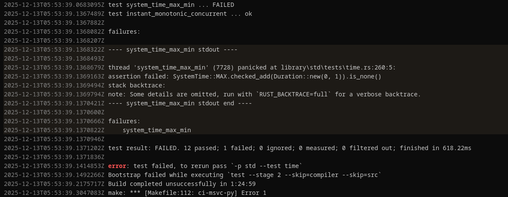

+++
path = "inside-rust/2026/01/13/infrastructure-team-q4-2025-recap-and-q1-2026-plan"
title = "Infrastructure Team 2025 Q4 Recap and Q1 2026 Plan"
authors = ["Marco Ieni"]

[extra]
team = "The Rust Infrastructure Team"
team_url = "https://www.rust-lang.org/governance/teams/infra#team-infra"
+++

As we close out the fourth quarter of 2025 and step into 2026, here’s what the Infrastructure Team delivered and what we’re focusing on next.

You can find the previous blog post of this series [here](@/inside-rust/infrastructure-team-2025-q3-recap-and-q4-plan.md).

## Q4 2025 Accomplishments

### More settings configured in the `team` repo

The Infrastructure Team always tries to move manually configured settings into Infrastructure as Code (IaC).
IaC has various benefits:

- It helps teams self-serve, since they can inspect their configuration even without admin privileges
  and request changes via pull requests.
- It improves security by making configuration drift harder. Manual changes are still possible, but
  they will be detected more easily and reverted on the next run of the IaC automation.

#### GitHub environments

All GitHub environments for Rust Project repositories are now defined in the [`team`](https://github.com/rust-lang/team) repo.

Here's an example from the [bors](https://github.com/rust-lang/team/blob/1a808bd0d6dfb4ff278b7dd07e5f9c8bf39906d9/repos/rust-lang/bors.toml#L17C1-L21C20) repository file:

```toml
[environments.production]
branches = ["main"]

[environments.staging]
branches = ["main"]
```

Thanks to [amustaque97](https://github.com/amustaque97) for his great work on the
[GitHub environments issue](https://github.com/rust-lang/team/issues/2037)!

#### Trusted publishing

All crates owned by the Rust Project that use crates.io [trusted publishing](https://crates.io/docs/trusted-publishing)
now configure it as IaC via the [`team`](https://github.com/rust-lang/team) repo.

Here's an example from the [measureme](https://github.com/rust-lang/team/blob/main/repos/rust-lang/measureme.toml) repository file:

```toml
[[crates-io]]
crates = ["analyzeme", "decodeme", "measureme"]
publish-workflow = "publish.yml"
publish-environment = "publish"
```

The work to configure trusted publishing for all the Rust Project crates will be easier now.

### Crates.io index and docs.rs served via Fastly

The `crates.io` index and the `docs.rs` website are now served by the Fastly CDN.

We made this change because Fastly donates its CDN to us, and we want to use our AWS credits for other resources.

For docs.rs, we also enabled Fastly shielding, which adds an additional caching layer to reduce the
load on our origin server.
Here's the effect of enabling shielding on the number of active connections after a brief experiment on
December 2 and enabling it permanently on December 3:


Note that the `crates.io` index is still partially served by CloudFront, and we can configure how much traffic goes to each CDN.

Thanks to the crates.io and docs.rs teams for helping with this!

### The new Bors is used to merge Rust compiler pull requests
The Infra and [Bors](https://rust-lang.org/governance/teams/infra/#team-infra-bors) teams continued working on migrating the Rust CI from the legacy Bors ([Homu](https://github.com/rust-lang/homu)) to the new [Bors](https://github.com/rust-lang/bors), written in Rust.

We have now enabled the new bot to merge `rust-lang/rust` PRs, completing the migration off Homu and improving the reliability of our continuous integration infrastructure 🎉.

We would like to thank all contributors who contributed to the development of bors, in particular [Võ Hoàng Long](https://github.com/l0ngvh) and [Sakibul Islam](https://github.com/Sakib25800).

### rustc-perf benchmarks are now executed in parallel
We made progress with the [Project Goal](https://rust-lang.github.io/rust-project-goals/2025h1/perf-improvements.html) for parallel benchmarking of the Rust compiler. We now have two x64 machines that run benchmarks in parallel, which reduced the latency of getting a full compiler benchmark result from ~1h 20m to ~40m.

In 2026, we plan to make further improvements to the benchmarking suite, such as enabling benchmarking on other hardware architectures.

### Repository default branch renames

The following repositories have renamed their default branch from `master` to `main`:

- [`annotate-snippets-rs`](https://github.com/rust-lang/annotate-snippets-rs)
- [`ar_archive_writer`](https://github.com/rust-lang/ar_archive_writer)
- [`cmake-rs`](https://github.com/rust-lang/cmake-rs)
- [`compiler-builtins`](https://github.com/rust-lang/compiler-builtins)
- [`docs.rs`](https://github.com/rust-lang/docs.rs)
- [`infra-team`](https://github.com/rust-lang/infra-team)
- [`moderation-team`](https://github.com/rust-lang/moderation-team)
- [`rust`](https://github.com/rust-lang/rust)
- [`rustfmt`](https://github.com/rust-lang/rustfmt)
- [`rustup`](https://github.com/rust-lang/rustup)
- [`rustwide`](https://github.com/rust-lang/rustwide)
- [`stdarch`](https://github.com/rust-lang/stdarch)
- [`team`](https://github.com/rust-lang/team)
- [`this-week-in-rust`](https://github.com/rust-lang/this-week-in-rust)

### Hired a new teammate

The Rust Foundation hired a new Infrastructure Engineer in Q4.
They’ll start in January 2026, increasing the team’s capacity to better serve the Project.

Thanks to [Kobzol](https://github.com/Kobzol) for helping with the hiring process!

### Triagebot enhancements

Triagebot is our trusty bot incessantly processing workflows on GitHub and on our Zulip chat.

We implemented several notable changes in Q4 2025.

#### Triagebot label command now supports aliases

We now have a mechanism for creating aliases when applying batches of labels to an issue (or a pull request) on GitHub. If you find yourself repeatedly applying or removing the same set of labels, you can now create an alias.

Example:
```
@rustbot label +regression-untriaged +I-prioritize +needs-repro
```
could become an alias:
```
@rustbot label regression-needs-triaging
```

Thanks to [@apiraino](https://github.com/apiraino) for implementing the feature in [#2216][triagebot-2216] ([documentation][triagebot-alias-docs]).

[triagebot-2216]: https://github.com/rust-lang/triagebot/pull/2216
[triagebot-alias-docs]: https://forge.rust-lang.org/triagebot/labeling.html#aliases

#### Turn automatic backport nominations into suggestions

We now offer project teams a streamlined workflow for backports to the stable/beta release channels. Patches fixing regressions can be manually "nominated" for backport by anyone interested in having said patch tested earlier. Backport nominations are discussed during the weekly triage team meetings (and then approved or declined).

Now teams can configure the triagebot to:
  - Automatically nominate patches fixing `P-high`/`P-critical` regressions occurred in the beta/stable release channels.
  - Automatically open topics in our Zulip chat to evaluate backports asynchronously (see the [compiler][t-compiler-backports] and [rustdoc][t-rustdoc-backports] channels). During the triage meeting, the topic is quickly skimmed and a decision can be taken faster.

Thanks to [@apiraino](https://github.com/apiraino) for implementing the feature in [#2191][triagebot-2191] ([documentation][triagebot-backport-nom]).

[triagebot-2191]: https://github.com/rust-lang/triagebot/pull/2191
[triagebot-backport-nom]: https://forge.rust-lang.org/triagebot/backport.html
[t-compiler-backports]: https://rust-lang.zulipchat.com/#narrow/channel/474880-t-compiler.2Fbackports
[t-rustdoc-backports]: https://rust-lang.zulipchat.com/#narrow/channel/266220-t-rustdoc

#### New Triagebot commands: `r? me` and `@rustbot reroll`

Two new triagebot features have been added to improve reviewer assignment.

First, [@Urgau](https://github.com/Urgau) implemented support for using `r? me` as a shorthand for *self-assignment* in [#2218](https://github.com/rust-lang/triagebot/pull/2218). This provides a convenient alternative to manually typing `r? @username` when assigning a pull request to yourself.

Second, [@Kobzol](https://github.com/Kobzol) added the new `@rustbot reroll` command in [#2219](https://github.com/rust-lang/triagebot/pull/2219). This new command *re-runs the automatic reviewer assignment logic* normally triggered when a PR is first opened, using the latest diff and owner map.

#### `[no-mentions]` handler removed from Triagebot

We have removed the `[no-mentions]` handler from triagebot, as it is no longer needed. This handler was originally used to ask users to avoid `@`-mentions in commit messages to avoid triggering user notifications.

Thanks to [GitHub’s recent change](https://github.blog/changelog/2025-11-07-removing-notifications-for-mentions-in-commit-messages/), which *disables notifications for mentions in commits*, this workaround is no longer necessary. We appreciate GitHub for making this improvement and simplifying the workflow for everyone involved.

#### Highlighting of log lines in Triagebot’s GHA log viewer

Triagebot’s GitHub Actions log viewer now supports *highlighting selected log lines*, similar to GitHub’s own code highlighting feature.

This improvement was implemented by [@Urgau](https://github.com/Urgau) in [#2234](https://github.com/rust-lang/triagebot/pull/2234). It allows users to select one or more lines in build logs and share them easily using highlighted URLs, making it simpler to point others directly to relevant sections of long logs.

Here’s an example of the new functionality in action:



#### Triagebot `[mentions]` now supports glob patterns

The `[mentions]` configuration in triagebot now supports *glob pattern matching*.

This improvement was implemented by [@Urgau](https://github.com/Urgau) in [#2244](https://github.com/rust-lang/triagebot/pull/2244). With this change, it’s now possible to group related paths under a single rule.

For example, it is now possible to write:

```toml
[mentions."library/{dec2flt,flt2dec}"]
cc = ["@ghost"]
```

instead of maintaining two separate entries for each directory.

### Internal Sites team takes its first action

The new [t-internal-sites](https://rust-lang.zulipchat.com/#narrow/channel/538071-t-internal-sites) team, responsible for maintaining and supporting the Rust project’s internal websites such as the [Forge](https://forge.rust-lang.org/) and the [RFCs site](https://rust-lang.github.io/rfcs), has taken its first action.

The team began by addressing [stale non-RFC pull requests](https://rust-lang.zulipchat.com/#narrow/channel/538071-t-internal-sites/topic/Stale.20non-RFC.20PRs/with/553453671) which had been stale due to the lack of ownership before t-internal-sites introduction.

## Q1 2026 Plans

### Finish Q4 2025 goals

In Q4 2025, we didn't manage to finish all our goals, so we will continue working on them in Q1 2026:

- **docs.rs infrastructure modernization:** Although we made various improvements to docs.rs in Q4 2025,
  such as improving the CDN setup,
  we still want to move from the single EC2 instance to a modern, managed deployment.
- **External hardware CI policy:** publish requirements for running Rust CI on external hardware.
- **GCP Dev Desktops:** spin up one or two dev desktops in GCP.

You can read more about these goals in our [Q4 2025 plan](@/inside-rust/infrastructure-team-2025-q3-recap-and-q4-plan.md#q4-2025-plans).

### Account and Access Management

Finish the work started in [rust-lang/infra-team#64](https://github.com/rust-lang/infra-team/issues/64)
by setting up a Google Workspace for the Rust Project for automated account and access management using SAML.

### Move to GitHub Rulesets

To have more flexibility and configurability, we want to migrate from branch protection rules to
[GitHub Rulesets](https://docs.github.com/en/repositories/configuring-branches-and-merges-in-your-repository/managing-rulesets/about-rulesets)
across all Rust Project repositories.

The branch protection rules are already defined as code in the `team` repo, so we will
need to update the IaC automation to create rulesets instead of branch protection rules.

This would also allow us to configure merge queues as IaC, which is currently not possible (see [rust-lang/team#1735](https://github.com/rust-lang/team/issues/1735)).

## Join us!

If you're interested in contributing to Rust's infrastructure, have a look at the
[infra-team](https://github.com/rust-lang/infra-team) repository to learn more about us
and reach out on [Zulip](https://rust-lang.zulipchat.com/#narrow/channel/242791-t-infra).

We are always looking for new contributors!
