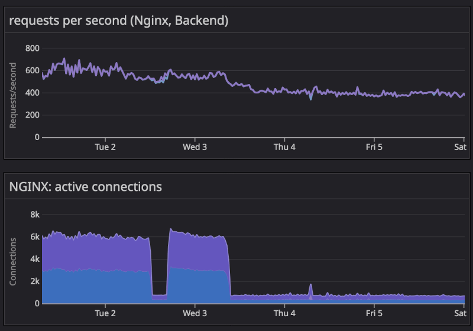

+++
path = "inside-rust/9999/12/31/infrastructure-team-q4-2025-recap-and-q1-2026-plan"
title = "Infrastructure Team 2025 Q4 Recap and Q1 2026 Plan"
authors = ["Marco Ieni"]

[extra]
team = "The Rust Infrastructure Team"
team_url = "https://www.rust-lang.org/governance/teams/infra#team-infra"
+++

As we close out the fourth quarter of 2025 and step into 2026, here’s what the Infrastructure Team delivered and what we’re focusing on next.

You can find the previous blog post of this series [here](@/inside-rust/infrastructure-team-2025-q3-recap-and-q4-plan.md).

## Q4 2025 Accomplishments

### More settings configured in the `team` repo

The infrastructure team always tries to move manually configured settings to Infrastructure as Code (IaC).
IaC has various benefits:

- It helps teams self-serve more, as they can inspect the configuration of their settings even without
  admin privileges and allows to request for changes easily via Pull Requests.
- It improves the security, as it makes drifts harder. Manual changes are still possible but
  they will be detected more easily and will be reverted at the next run of the IaC automation.

#### GitHub environments

All GitHub environments for Rust Project repos are now defined in the [`team`](https://github.com/rust-lang/team) repo.

Here's an example from the [bors](https://github.com/rust-lang/team/blob/1a808bd0d6dfb4ff278b7dd07e5f9c8bf39906d9/repos/rust-lang/bors.toml#L17C1-L21C20) repository file:

```toml
[environments.production]
branches = ["main"]

[environments.staging]
branches = ["main"]
```

Thanks to [amustaque97](https://github.com/amustaque97) for his great work on the
[GitHub environments issue](https://github.com/rust-lang/team/issues/2037)!

#### Trusted publishing

All crates owned by the Rust Project using Crates-io [trusted publishing](https://crates.io/docs/trusted-publishing)
now configure trusted publishing as IaC via the [`team`](https://github.com/rust-lang/team) repo.

Here's an example from the [measureme](https://github.com/rust-lang/team/blob/main/repos/rust-lang/measureme.toml) repository file:

```toml
[[crates-io]]
crates = ["analyzeme", "decodeme", "measureme"]
publish-workflow = "publish.yml"
publish-environment = "publish"
```

The work to configure trusted publishing for all the Rust Project crates will be easier now.

### Crates.io index and Docs.rs served via Fastly

The `crates.io` index and the `docs.rs` website are now served by the Fastly CDN.

We made this change because Fastly donates their CDN to us and we want to use our AWS credits for other resources.

For docs-rs, we also activated Fastly shielding, which adds an additional caching layer to reduce the
load on our origin server.
Here's the effect of enabling shielding on the number of active connections after a brief experiment on
December 2 and enabling it permanently on December 3:



Note that the `crates.io` index is still partially served by Cloudfront, and we can configure how much traffic goes to each CDN.

Thanks to the crates-io and docs-rs team for helping with this!

### The new Bors is used to merge Rust compiler pull requests
The Infra and [Bors](https://rust-lang.org/governance/teams/infra/#team-infra-bors) teams continued working on migrating the Rust CI from the legacy Bors ([Homu](https://github.com/rust-lang/homu)) to the new [Bors](https://github.com/rust-lang/bors), written in Rust.

We have now enabled the new bot also for merging `rust-lang/rust` PRs, thus finishing the migration off homu and improving the reliability of our continuous integration infrastructure 🎉.

We would like to thank all contributors who contributed to the development of bors, in particular [Võ Hoàng Long](https://github.com/l0ngvh) and [Sakibul Islam](https://github.com/Sakib25800).

### rustc-perf benchmarks are now executed in parallel
We made progress with the [Project Goal](https://rust-lang.github.io/rust-project-goals/2025h1/perf-improvements.html) for parallel benchmarking of the Rust compiler. We now have two x64 machines that run benchmarks in parallel, which reduced the latency of getting a full compiler benchmark result from ~1h 20m to ~40m.

This year, we plan to make further improvements to the benchmarking suite, such as enabling benchmarking on other hardware architectures. 

### Repository default branch renames

The following repositories have renamed their default branch from `master` to `main`:

- [`annotate-snippets-rs`](https://github.com/rust-lang/annotate-snippets-rs)
- [`ar_archive_writer`](https://github.com/rust-lang/ar_archive_writer)
- [`cmake-rs`](https://github.com/rust-lang/cmake-rs)
- [`compiler-builtins`](https://github.com/rust-lang/compiler-builtins)
- [`docs.rs`](https://github.com/rust-lang/docs.rs)
- [`infra-team`](https://github.com/rust-lang/infra-team)
- [`moderation-team`](https://github.com/rust-lang/moderation-team)
- [`rust`](https://github.com/rust-lang/rust)
- [`rustfmt`](https://github.com/rust-lang/rustfmt)
- [`rustup`](https://github.com/rust-lang/rustup)
- [`rustwide`](https://github.com/rust-lang/rustwide)
- [`stdarch`](https://github.com/rust-lang/stdarch)
- [`team`](https://github.com/rust-lang/team)
- [`this-week-in-rust`](https://github.com/rust-lang/this-week-in-rust)

### Hired a new teammate

The Rust Foundation hired a new Infrastructure Engineer in Q4.
They’ll start in January 2026, increasing the team’s capacity to better serve the Project.

Thanks to [Kobzol](https://github.com/Kobzol) for helping with the hiring process!

## Q1 2026 Plans

### Finish Q4 2025 goals

In Q4 2025 we didn't manage to finish all our goals, so we will continue working on them in Q1 2026:

- **docs.rs infrastructure modernization:** Although we did various improvements on docs-rs in Q4 2025,
  such as improving the CDN setup,
  we still want to move from the single EC2 instance to a modern, managed deployment.
- **External hardware CI policy:** publish requirements for running Rust CI on external hardware.
- **GCP Dev Desktops:** spin up one or two dev desktops in GCP.

You can read more about these goals in our [Q4 2025 plan](@/inside-rust/infrastructure-team-2025-q3-recap-and-q4-plan.md#q4-2025-plans).

### Account and Access Management

Finish the work started in [rust-lang/infra-team#64](https://github.com/rust-lang/infra-team/issues/64)
by setting up a Google Workspace for the Rust Project for automated account and access management using SAML.

### Move to GitHub Rulesets

To have more flexibility and configurability, we want to migrate from branch protection rules to
[GitHub Rulesets](https://docs.github.com/en/repositories/configuring-branches-and-merges-in-your-repository/managing-rulesets/about-rulesets)
across all Rust Project repositories.

The branch protection rules are already defined as code in the `team` repo, so we will
need to update the IaC automation to create rulesets instead of branch protection rules.

This would also allow us to configure merge queues as IaC, which is currently not possible (see [rust-lang/team#1735](https://github.com/rust-lang/team/issues/1735)).

## Join us!

If you're interested in contributing to Rust's infrastructure, have a look at the
[infra-team](https://github.com/rust-lang/infra-team) repository to learn more about us
and reach out on [Zulip](https://rust-lang.zulipchat.com/#narrow/channel/242791-t-infra).

We are always looking for new contributors!
