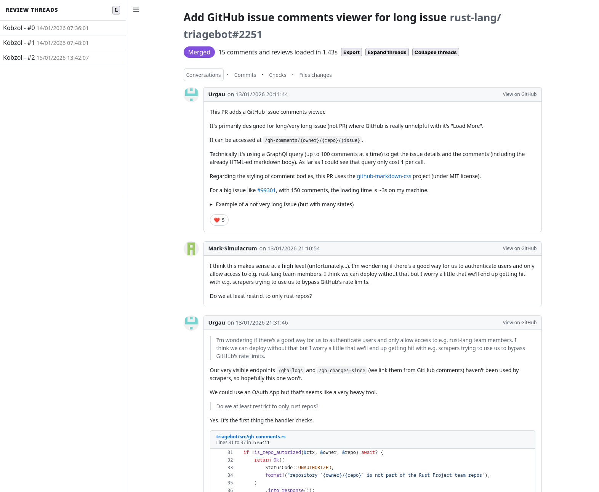

+++
path = "inside-rust/2026/04/14/infrastructure-team-q1-recap-and-q2-plan"
title = "Infrastructure Team 2026 Q1 Recap and Q2 Plan"
authors = ["Marco Ieni"]

[extra]
team = "The Rust Infrastructure Team"
team_url = "https://www.rust-lang.org/governance/teams/infra#team-infra"
+++

Here's what the Infrastructure Team delivered in Q1 2026 and what we're focusing on in Q2.

You can find the previous blog post of this series [here](@/inside-rust/infrastructure-team-2025-q4-recap-and-q1-2026-plan/index.md).

## Q1 Accomplishments

### Move to GitHub Rulesets

We started migrating from branch protection rules to
[GitHub Rulesets](https://docs.github.com/en/repositories/configuring-branches-and-merges-in-your-repository/managing-rulesets/about-rulesets).

> Rulesets are the new way in which GitHub suggests protecting branches and tags.
> They allow more configurability with respect to classic branch protections, and
> they are the only way in which you can setup new functionalities such as merge queues
> via API.

We converted all repositories, except for
the [`rust`](https://github.com/rust-lang/rust) repository. We are [working on it](https://github.com/rust-lang/team/pull/2327)!

As part of this effort, we also made all the branch protection and ruleset options we use
configurable via the `team` repository, so that they can be managed as Infrastructure as Code (IaC).

Here are the newly available configuration options:

- [`allowed-merge-apps`](https://github.com/rust-lang/team/blob/d12b9d821a4494aa16c8666e5d6131d96873dd17/docs/toml-schema.md?plain=1#L460)
- [`merge-queue`](https://github.com/rust-lang/team/blob/d12b9d821a4494aa16c8666e5d6131d96873dd17/docs/toml-schema.md?plain=1#L462)
- [`prevent-deletion`](https://github.com/rust-lang/team/blob/d12b9d821a4494aa16c8666e5d6131d96873dd17/docs/toml-schema.md?plain=1#L487)
- [`prevent-force-push`](https://github.com/rust-lang/team/blob/d12b9d821a4494aa16c8666e5d6131d96873dd17/docs/toml-schema.md?plain=1#L490)
- [`require-conversation-resolution`](https://github.com/rust-lang/team/blob/d12b9d821a4494aa16c8666e5d6131d96873dd17/docs/toml-schema.md?plain=1#L433)
- [`require-linear-history`](https://github.com/rust-lang/team/blob/d12b9d821a4494aa16c8666e5d6131d96873dd17/docs/toml-schema.md?plain=1#L438)

For more details, see the [GitHub issue](https://github.com/rust-lang/team/issues/2356).

### Improved CI security

We always try to improve our security posture. Here are the most relevant examples for this quarter:

- In the [`team`](https://github.com/rust-lang/team) repository, we enabled [Renovate](https://docs.renovatebot.com/), a bot
  that automatically creates pull requests to keep GitHub Actions and Rust
  dependencies up to date.
  This makes it easier for us to keep our dependencies up to date and fix security issues in a timely manner.
- In the [`compiler-builtins`](https://github.com/rust-lang/compiler-builtins) CI, we
  [enabled Renovate](https://github.com/rust-lang/compiler-builtins/pull/1114) and [resolved](https://github.com/rust-lang/compiler-builtins/pull/1113) the security issues reported by [`zizmor`](https://zizmor.sh) in preparation for running the RISC-V self-hosted runner in CI in a more secure way.
- We released `crates-io-auth-action` [v1.0.4](https://github.com/rust-lang/crates-io-auth-action/releases/tag/v1.0.4), updating its dependencies and moving it from Node 20 to Node 24 after GitHub announced the deprecation of Node 20 on Actions runners.

### Two new dev desktops

We provisioned two new dev desktops: `dev-desktop-us-2.infra.rust-lang.org` and `dev-desktop-eu-2.infra.rust-lang.org`.

We also enabled IPv6 access for dev desktops, making them easier to reach from more network environments.
See the [GitHub issue](https://github.com/rust-lang/simpleinfra/issues/186).

Learn more in the [Forge docs](https://forge.rust-lang.org/infra/docs/dev-desktop.html).

### Bigger docs.rs instance

We are experiencing an unprecedented increase in crates published on `crates.io`,
which is putting a lot of pressure on the `docs.rs` infrastructure, which has to build
the documentation for more crates than before.

To keep up with this growth, we upgraded the `docs.rs` instance to a more powerful one, doubling
the available RAM and CPU cores.

### Improved access controls for Rust infrastructure with SAML SSO

We introduced Google SSO as part of Rust infrastructure offerings.
We enabled Google Workspace accounts for the infrastructure team and validated the SAML setup for some of the key infrastructure providers, like Datadog and Fastly.

More on that in the [GitHub issue](https://github.com/rust-lang/infra-team/issues/64).

### Triagebot enhancements

Triagebot is our trusty bot incessantly processing workflows on GitHub and on our Zulip chat.

We implemented several notable changes in Q1 2026.

#### GitHub issue comments viewer

We've added to Triagebot a [GitHub issues and PRs viewer](https://github.com/rust-lang/triagebot/pull/2251). It's primarily designed for long issues and PRs where GitHub is unhelpful with its "Load More" button.

It can be accessed via the [`View all comments` link](https://github.com/rust-lang/triagebot/pull/2278) at the top of long issues and PRs.

Example for [triagebot#2251](https://triage.rust-lang.org/gh-comments/rust-lang/triagebot/issues/2251):

And while it started rather small in its ambitions, it evolved quite a bit over the last quarter with:
 - a self-contained "Export" button (implemented in [#2274](https://github.com/rust-lang/triagebot/pull/2274))
 - a table of contents for review threads (implemented in [#2360](https://github.com/rust-lang/triagebot/pull/2360))
 - expand/collapse thread buttons (implemented in [#2355](https://github.com/rust-lang/triagebot/pull/2355))
 - and other small improvements

#### Organization-wide default configuration

Triagebot has many features and configurations, and while it's not difficult to enable a feature in a repo (the cost of a PR), it doesn't scale to the size of the rust-lang organization and its >200 repositories.

In order to address the uneven availability of features across all the repositories, we've [added support for organization-wide default configuration](https://github.com/rust-lang/triagebot/pull/2292) in the Triagebot codebase and started enabling some features org-wide.

Announcements of soon-to-be-enabled org-wide features are done in [#**t-infra/announcements>Triagebot Organization-Wide Defaults**](https://rust-lang.zulipchat.com/#narrow/channel/533458-t-infra.2Fannouncements/topic/Triagebot.20Organization-Wide.20Defaults/with/579425485) on Zulip.

#### `user-info` command

This new Zulip command first appeared as [the `comments` command](https://github.com/rust-lang/triagebot/pull/2271) for viewing recent user comments, but [was extended](https://github.com/rust-lang/triagebot/pull/2317) into a more general `user-info` command, which shows recent activity (PRs, repositories) and account creation date for the given GitHub user account.

This is part of our efforts to help reviewers and maintainers with sloppy AI-generated PRs.

#### Per-team rotation mode

Triagebot handles the automatic assignment of reviewers in multiple repositories. Until February, it was not possible to set per-team rotation mode.

This is now possible via the Zulip command `work set-team-rotation-mode <team> off/on`, implemented in [#2273](https://github.com/rust-lang/triagebot/pull/2273) by `@Kobzol`.

#### Per-repository review preferences

Continuing with the theme of reviewer assignments, it was previously only possible to set a review preference for `rust-lang/rust`, despite the multiple repositories handled by Triagebot.

`@Kobzol` fixed that in [#2286](https://github.com/rust-lang/triagebot/pull/2286). It is now possible to [set per-repository review preferences](https://forge.rust-lang.org/triagebot/review-queue-tracking.html#usage).

#### Report banned users to moderator stream on Zulip

As part of supporting different team needs, we've implemented an automatic reporting system on Zulip for banned users in our GitHub organization (implemented in [#2269](https://github.com/rust-lang/triagebot/pull/2269)).

The goal of this feature is to relieve moderators from taking screenshots and manually archiving offending comments and user actions by automatically retrieving that information and posting it in the moderators’ Zulip channel.

#### Clippy's Zulip lint nomination topic

Similar to the previous topic, we've also helped **T-clippy** [set up an automatic FCP topic on Zulip](https://github.com/rust-lang/rust-clippy/pull/16614) when they want to nominate a lint for discussion.

As part of this work, we have also [added the ability to add back a comment on GitHub](https://github.com/rust-lang/triagebot/pull/2334) with the link to the created Zulip topic.

#### New Zulip commands to handle backports and assign priority to issues

Project members can now use two new Zulip commands to apply labels on rust-lang/rust issues and pull requests:
- `backport [stable | beta ] [approve | decline ] <pr #>`: to accept or decline for backport a patch fixing a regression
- `assign-prio <issue #> [ critical | high | medium | low | <empty>]`: to assign a priority label to an issue (admittedly mostly used by the Compiler Team but it's available to everyone)

For more details, see the [documentation](https://forge.rust-lang.org/triagebot/zulip-commands.html#stream-commands).

## Q2 Plans

### Finish Q1 goals

In Q1, we didn't manage to finish all our goals, so we will continue working on them in Q2:

- **docs.rs infrastructure modernization:** Although we made some improvements to docs.rs in Q1,
  such as using GitHub OIDC for publishing container images to AWS ECR,
  we still want to move from the single EC2 instance to a modern, managed deployment.
- **External hardware CI policy:** Publish requirements for running Rust CI on external hardware.
- **Move to GitHub Rulesets:** Migrate the `rust` repository to GitHub Rulesets.
- **SAML SSO:**
  - Enable provisioning Google Workspace accounts from the `team` repository.
  - Onboard all users that require infrastructure access and add the SAML setup for other service providers, like AWS.

### Improve CI security and developer experience

We want to keep making the CI of the Rust Project both safer and easier to work with.

We have many ideas and we're not sure which ones we will prioritize yet, but here are some examples:

- Make it easier for Rust Project members to adopt tools like Renovate to keep their dependencies up to date and secure.
- Check CVEs of our dependencies.
- Add more static analysis tools such as [`zizmor`](https://zizmor.sh) to secure more CI workflows.
- Improve our CI observability by creating dashboards around metrics such as CI jobs duration and failure rate.
  Since the Rust Foundation [joined](https://rustfoundation.org/media/rust-foundation-joins-datadogs-open-source-program/)
  Datadog’s Open Source Program, we plan to use Datadog for this task.
- Improve visibility of the test coverage of the CI jobs.

### Hardware security keys for critical infrastructure access

We want to secure access to critical Rust infrastructure even further by using hardware security keys. The Rust Foundation partnered with [Yubico](https://www.yubico.com/why-yubico/secure-it-forward/), and we want to provide YubiKeys
to the Rust teams with access to critical infrastructure.

Our plan is to distribute hardware keys in May, during the [Rust All Hands](https://2026.rustweek.org/#week-schedule).
See the related [GitHub issue](https://github.com/rust-lang/infra-team/issues/245).

## Join us!

If you're interested in contributing to Rust's infrastructure, have a look at the
[infra-team](https://github.com/rust-lang/infra-team) repository to learn more about us
and reach out on [Zulip](https://rust-lang.zulipchat.com/#narrow/channel/242791-t-infra).

We are always looking for new contributors!
