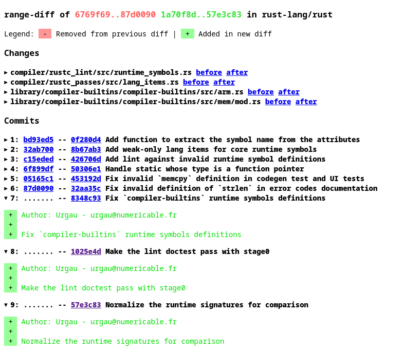
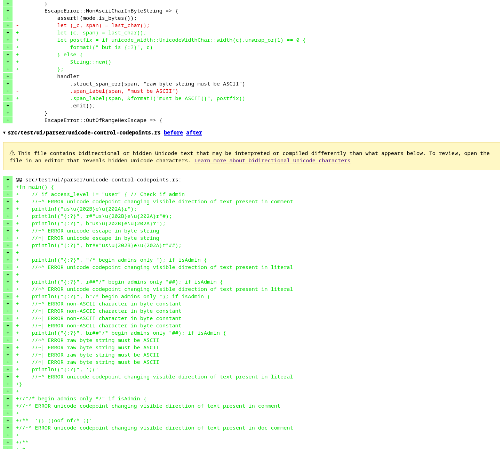

+++
path = "inside-rust/2026/07/15/infrastructure-team-q2-recap-and-q3-plan"
title = "Infrastructure Team 2026 Q2 Recap and Q3 Plan"
authors = ["Ubiratan Soares"]

[extra]
team = "The Rust Infrastructure Team"
team_url = "https://www.rust-lang.org/governance/teams/infra#team-infra"
+++

Here's what the Infrastructure Team delivered in Q2 2026 and what we're focusing
on in Q3.

You can find the previous blog post of this series [here](@/inside-rust/infrastructure-team-2026-q1-recap-and-q2-plan/index.md).

## Q2 2026 Accomplishments

### GitHub Rulesets are now the default protections

We migrated the [`rust-lang/rust`](https://github.com/rust-lang/rust) repository to
[GitHub Rulesets](https://docs.github.com/en/repositories/configuring-branches-and-merges-in-your-repository/managing-rulesets/about-rulesets)
and finished moving off the legacy GitHub branch protections. Rulesets are
now the default way to configure protections for `rust-lang` repositories through
[`team`](https://github.com/rust-lang/team).

### GitHub apps are now enabled through team

We [re-enabled](https://github.com/rust-lang/team/pull/2255)
the ability to install GitHub apps in `rust-lang` repositories through `team`.
This improves the developer experience
for contributors and reduces the operational overload for Infrastructure Team members.

### Shared Renovate Presets

[Renovate](https://github.com/renovatebot/renovate) is the tool the Infrastructure Team
recommends to the Project for keeping dependencies and GitHub Actions up to date.

We created shared Renovate [presets](https://github.com/rust-lang/renovate)
to simplify the Renovate configurations of the `rust-lang` repositories.
These presets aim to get
the benefits of dependency updates while minimizing the number of PRs to review.
We also [documented](https://forge.rust-lang.org/infra/docs/renovate.html)
how to adopt Renovate in repositories.

### Code security for rust-lang repositories

As part of our security work, we enabled [GitHub Secret Scanning](https://docs.github.com/en/code-security/concepts/secret-security/secret-scanning)
for all `rust-lang` repositories. We triaged all alerts tagged as *leaked secrets*
and confirmed that they were false positives.

In addition, in collaboration with the [crates.io](http://crates.io)
team, we started experimenting with Datadog Code Security to get additional
visibility into security issues inferred directly from source files. We [documented](https://github.com/rust-lang/infra-team/blob/main/service-catalog/datadog/code-security.md)
how to opt into this feature, and we want to try it with more repositories in
the future. This work is a follow-up of the
[Rust Foundation partnership with Datadog](https://rustfoundation.org/media/rust-foundation-joins-datadogs-open-source-program/).

### New GitHub Actions runners powered by external hardware

We enabled new **powerpc64** and **RISC-V** GitHub Actions runners for
`rust-lang` repositories. We also documented which external runners are powered
by external hardware and where they are used in [rust-forge](https://forge.rust-lang.org/infra/docs/external-ci-runners.html).

In addition, we created a new infrastructure
[guideline](https://github.com/rust-lang/infra-team/blob/main/service-catalog/rust-ci/external-runners/README.md)
to help onboard external hardware into the Rust CI infrastructure.

### Experiments with macos-26 on CI

We started experimenting with `macos-26` in `rust-lang/rust` CI.
[We created an additional CI job](https://rust-lang.zulipchat.com/#narrow/channel/533458-t-infra.2Fannouncements/topic/Experimental.20test.20job.20.60aarch64-apple-macos-26.60/with/601619992)
and have been tracking how it performs. It's worth mentioning that GitHub will [migrate](https://github.blog/changelog/2026-05-14-github-actions-upcoming-image-migrations/#macos-latest-migration-begins-june-15)
all `macos-latest` images to `macos-26` in June and July.

### CI dashboard available again

In December 2024, we [created](https://github.com/rust-lang/rustc-dev-guide/pull/2167)
a Datadog dashboard to track CI visibility for the
[`rust-lang/rust`](https://github.com/rust-lang/rust) repository. It proved very
valuable, but we had to [remove](https://github.com/rust-lang/infra-team/pull/242)
it because its cost was not sustainable.

Now that the Rust Foundation is part of
[Datadog's Open Source Program](https://rustfoundation.org/media/rust-foundation-joins-datadogs-open-source-program/),
we enabled it again.

In the past, the dashboard helped us track the top failing jobs, slowest jobs, and overall
pipeline duration over time. We expect it to be just as useful going forward.

### Hardware Security Keys for critical infrastructure access

We introduced [official support for hardware keys](https://github.com/rust-lang/infra-team/issues/245)
as part of the Rust infrastructure security processes. We created a
[policy mandating multi-factor authentication with hardware keys](https://forge.rust-lang.org/infra/policies/mfa-critical-systems.html)
for people and teams with access to systems considered critical, and in
[partnership with Yubico](https://www.yubico.com/why-yubico/secure-it-forward/)
we empowered Rust Project members with YubiKeys.

We also [documented how Project members can configure these devices](https://forge.rust-lang.org/infra/docs/hardware-security-keys.html)
for existing use cases. We want to expand this support further, enabling new
ways to use the keys.

### Partnership with Canonical and Ubuntu Pro for EC2 instances

As a follow-up to [Canonical joining the Rust Foundation](https://canonical.com/blog/canonical-joins-the-rust-foundation-as-a-gold-member) in March,
we got access to [Ubuntu Pro](https://ubuntu.com/pro) licenses and
applied them to our EC2 instances,
including the instance running [docs.rs](http://docs.rs).

We improved our Infrastructure as Code setup to apply these changes, so that Ubuntu
Pro will be enabled by default even in future instances.

### Faster mergeability checks in Bors

We switched from GitHub's REST API to the GraphQL API and cut Bors
pull request mergeability check times from an average of 30 minutes to just 1 minute.

### Add the concept of community reviews before PR assignment

As part of multiple discussions that happened during the 2026 All-hands, the Clippy team asked the Triagebot team to be able to delay the assignment of a reviewer until one or multiple community reviews were done.

That work was carried out in [triagebot#2426](https://github.com/rust-lang/triagebot/pull/2426) ([docs](https://forge.rust-lang.org/triagebot/pr-assignment.html#community-reviews)) and has just been enabled in [Clippy repository](https://github.com/rust-lang/rust-clippy/issues?q=state%3Aopen%20label%3AS-waiting-on-community-reviews).

### Reintroduce delegation approval for merge queue repositories

When we switched our repositories to GitHub merge queues instead of bors (our custom merging bot), we lost the ability to delegate approval on behalf of the reviewer.

That functionality is quite useful when there are only some nits left and the reviewer feels confident about the author's ability to resolve them without having to re-review and approve the changes.

Work was carried out in [triagebot#2412](https://github.com/rust-lang/triagebot/pull/2412) and [triagebot#2436](https://github.com/rust-lang/triagebot/pull/2436) to add such functionality back. It's currently only enabled on the Clippy repository:
 - `@rustbot delegate[=@handle]`
 - `@rustbot merge`

### Continue supporting the moderation team with locking/unlocking of issues

As part of the effort to help the moderation team better moderate issues and pull requests in our different repositories and organizations, triagebot gained support for locking and unlocking an issue/PR from a GitHub command and Zulip DM.

### Quality of life improvements in our range-diff viewer for GitHub PRs

We landed multiple quality of life improvements in our range-diff viewer for GitHub PRs.

#### Filtering of context-only hunks

As part of our range-diff, we try as much as possible to only show the relevant parts of a diff. Context changes (lines that changed on main only) are not relevant, and we made a significant effort to filter them out from the shown diff.

More details are available in [triagebot#2398](https://github.com/rust-lang/triagebot/pull/2398).

#### Commit messages diff

Our range-diff now shows the list of commits and diffs them with the previous ones.

New commits:



#### Warning against Unicode Bidi characters

Following what GitHub does when it detects Unicode Bidi characters in a PR diff, we now also warn since [triagebot#2440](https://github.com/rust-lang/triagebot/pull/2440).



## Small tweaks to the triagebot

A new [triagebot command][cmd-assign-priority] to assign a priority value to regressions directly from Zulip, useful when doing triage. Example:
```
@**triagebot** assign-priority 123456 high
```

Minor tweaks (in [b1e783a2] and [6611570e]) to the triagebot `backport` and `user-info` commands, which now support shorter variants:
```
# Supported syntaxes for the `backport` command
@**triagebot** backport accept beta 123456
@**triagebot** backport accept beta
@**triagebot** backport accept

# Supported syntaxes for the `user-info` command
@**triagebot** user-info https://www.github.com/apiraino
@**triagebot** user-info apiraino
```

[b1e783a2]: https://github.com/rust-lang/triagebot/commit/b1e783a2
[6611570e]: https://github.com/rust-lang/triagebot/commit/6611570e
[cmd-assign-priority]: https://forge.rust-lang.org/triagebot/zulip-commands.html#stream-commands

## Q3 2026 Plans

### Finish leftover work from Q2

In Q3, we will continue working on some of the things we could not finish in Q2:

* Improve access controls for Rust infrastructure with SAML SSO.
* Modernize the [docs.rs](http://docs.rs) infrastructure.

### Improve GitHub Actions security

We've been actively working on GitHub Actions security through our
[Outreachy mentorship program](@/outreachy-2026-may.md).
This effort started in April when we adopted zizmor as a
Static Application Security Testing solution for GitHub Actions in some of our repositories.

As a follow-up of [one of our Rust All-Hands sessions](https://github.com/rust-lang/all-hands-2026/issues/51), we started working on a
[system to foster zizmor](https://github.com/rust-lang/crabwatch) auditing and progressive adoption across the `rust-lang`
[organization](https://github.com/rust-lang/).

### Move mailing lists from Mailgun to Google Groups to reduce spam

As a follow-up to setting up the Google Workspace for the Rust Project,
we want to evaluate whether Google Groups can reduce spam for existing mailing
lists, which are currently managed through Mailgun. We want to keep the same
developer experience by provisioning these new mailing lists through `team`.
If the results are satisfactory, we will also migrate existing lists.

### Consolidate logs on Datadog

As part of our efforts to improve observability, we want to consolidate all log
management in Datadog. Next, we want to push logs from all services into
it, including those from our bots (`triagebot`, `bors`, etc).

### Reduce reliance on external resources in CI

We want `rust-lang/rust` CI to depend less on third-party services during builds
and tests. When CI downloads required artifacts from external sources,
an outage in those services can cause failures unrelated to Rust itself.

To make CI more reliable, we plan to mirror more of those artifacts in the
Rust project's [CI mirrors](https://github.com/rust-lang/ci-mirrors).

### Stricter networking access rules for crater agents

As discussed during the Rust All-Hands, we want to improve the security of
crater agents by [isolating their network access](https://github.com/rust-lang/crater/issues/838).

### Start planning for GitHub REST API upgrade

The current GitHub REST API version ("2022-11-28") will be deprecated in about 2 years (see the
[GitHub announcement][gh-announcement]). We [pinpointed][efb2e090] it in our GitHub client and plan
to start testing the new version ("2026-03-10") and see what it breaks.

[efb2e090]: https://github.com/rust-lang/triagebot/commit/efb2e090
[gh-announcement]: https://docs.github.com/rest/about-the-rest-api/api-versions?apiVersion=2026-03-10

## Join us

If you're interested in contributing to Rust's infrastructure, have a look at the
[infra-team](https://github.com/rust-lang/infra-team) repository to learn more about us
and reach out on [Zulip](https://rust-lang.zulipchat.com/#narrow/channel/242791-t-infra).

We are always looking for new contributors!
