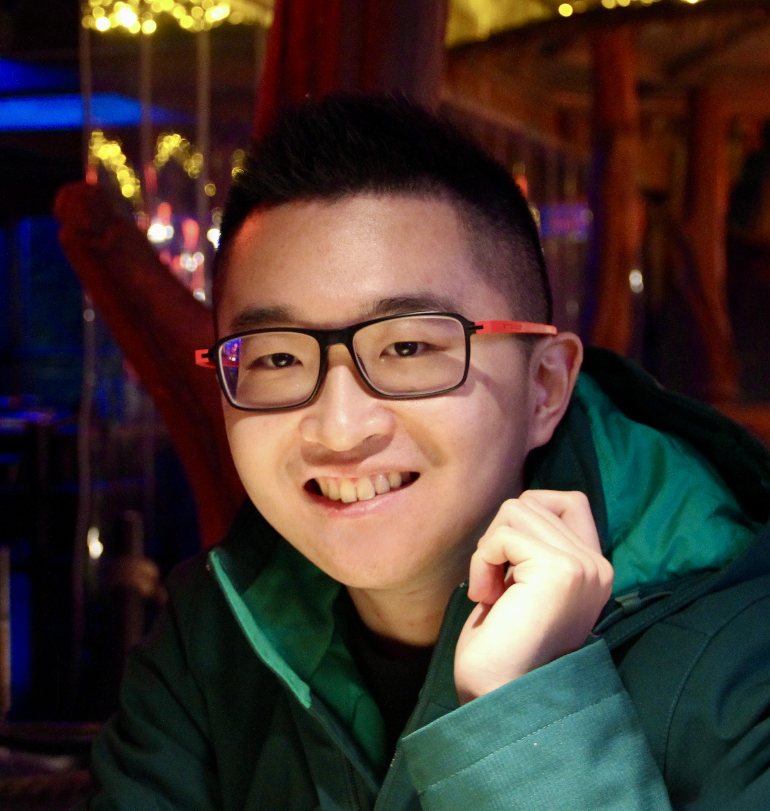

+++
path = "inside-rust/2026/07/06/maintainer-spotlight-gen-li-rami3l"
title = "Maintainer spotlight: Gen Li (@rami3l)"
authors = ["Jakub Beránek", "Lori Lorusso"]

[extra]
team = "the Content team"
team_url = "https://www.rust-lang.org/governance/teams/launching-pad#team-content"
+++

There are [hundreds][all-members-page] of people who [maintain][maintenance-post] the Rust toolchain, often on a volunteer basis on top of another job. The Rust [Content team][content-team] is working on a series of blog posts highlighting some of these prolific contributors to recognize the awesome work that they are doing in order to make Rust better for everyone. You can find the previous post [here][previous-post].
**Consider [donating][rfmf] to the Rust Foundation Maintainers Fund if you'd like to support Rust Project maintainers.**

<aside style="float: right; clear: both; margin-left: 10px;">
  
</aside>

In this post, we would like to introduce **Gen Li** ([@rami3l](https://github.com/rami3l/)). Gen started contributing to Rust around four years ago. In 2023, he joined the Rustup team, and in 2025 he became the lead of this team. Apart from working on Rustup, Gen Li also mentored several Rust contributors as a part of Google Summer of Code (GSoC).

We interviewed Gen to find out what how he joined the Rustup team and what are his thoughts on coding as a social activity. Read more below!

**Can you briefly introduce yourself?**

Hi, my name is Gen Li. I come from Chongqing, an industrial city in southwestern China. I studied engineering and computer science at École Centrale de Pékin in Beijing, and I also went through a study exchange program in France, where I studied at the Centrale Nantes engineering school. After I graduated, I worked in China for a while, and last year I moved to Paris, so now I am based in France.

**How did you start with Rust?**

During my university studies, I was working with Python a lot, mostly to automate various processes, such as analyzing lab data. I got annoyed by Python a little bit, because it was hard to write correct code, and the package management story at that time was quite confusing[^uv]. When I wanted to dive deeper and figure out how things in Python are actually implemented, I realized that it is often done in other languages, such as C, Cython or Fortran, which seemed quite complex.

[^uv]: That was before [`uv`][uv] existed!

In 2019, my friend [@lynzrand][lynzrand] introduced me to this cool new language that he has been playing with. I decided to try it, and then took it as a personal challenge to try to learn all the new concepts that I found in Rust. My first experience of building something serious in it was helping that friend build a component for an online service used for teaching classes.

What impressed me a lot about Rust was the whole developer experience and its tooling, such as the compiler or Cargo. Especially the whole unified process of creating, packaging and shipping a Rust project and the great documentation and error messages that guide you along the way.

I also examined other technologies and spent a lot of time learning (and fighting!) their tooling, and found that Rust really hit the sweet spot, so I decided to stick with it.

**How did you get involved with the Rust Project?**

I wanted to explore what it takes to create good tooling, and what makes Rust such an extraordinary experience. What I found great is that software in the Rust Project is written in Rust wherever possible, which means that it is not necessary to master multiple languages to make adjustments to the toolchain, and every improvement that we make to Rust then directly helps its contributors, which is something that I am really fond of.

My first contribution was to the wider Rust ecosystem. When writing a small Rust automation tool that used [clap] for argument parsing, I found out that `clap` had a bug. I was able to investigate it and fix it, so I was able to make a meaningful [contribution][clap-pr] to `clap`. Contributing to this project also led to my first interaction with [Ed Page][epage], a member of the Cargo team, who maintained `clap`.

That was a really nice experience, so I wanted to contribute more to "famous" Rust projects. I continued with scratching my own itches, so after I found a bug with derive expansion in Rust Analyzer, which I was using daily, I sent my first [pull request][first-pr] to the upstream Rust toolchain. At that time, I was still a "drive-by" contributor, mostly fixing the bugs that bothered me, but I eventually wanted to participate more.

**How did you join the Rustup team?**

[Weihang Lo][weihanglo], a Cargo contributor who organized a large Telegram Rust community that I was a part of, told me that the Rustup team was in danger. That was surprising to me, because at that time I thought that Rustup was very stable and that it doesn't need any new development, and could stay as-is "forever". Of course, now I know that is not the case.

[Robert Collins][rbtcollins], the only Rustup team member at that time, was calling for help. Given that I already had an intermediate knowledge of Rust, I thought that I could probably help maintaining it to get it out of the hardship that it was experiencing at the moment. So I contacted Robert and tried to do some basic maintenance tasks, starting from trivial fixes, and later also implementing larger features.

A few months later, I was invited to the Rustup team, together with [Dirkjan Ochtman][djc], a very experienced Rust maintainer. Together, we kind of restarted the maintenance of Rustup, and we have been maintaining it ever since. In 2024, [Chris Denton][chris-denton] joined the team, bringing invaluable Windows expertise.

**How did joining the Rustup team affect your perspective on it?**

Rustup is a crucial component of the overall Rust developer experience, which excels thanks to different tools (compiler, Cargo, Rustup, etc.) being tightly integrated and working well together. Contrary to what I used to think, it actually requires quite a lot of maintenance! We have to keep up both with changes to the Rust toolchain and its components, but also changes to operating systems. We also try to optimize its performance, due to the list of components and Rust targets growing over time, both in size and count. It is not possible to simply stick to what was done in the past ten years; we constantly have to adapt. This was a big mental shift for me.

Another thing that surprised me was the social aspect of contributing to open source. I used to think that the Rust Project *had to be* managed by some mysterious mechanism that I didn't understand, which would organize and structure work and provide resources to contributors. I learned that this is currently far from reality, and that almost everything is self-directed. For anything to happen, someone has to actively produce an effort to do it. Everyone is focusing on the one aspect that matters to them, and there is essentially no top-down management.

In general, I am happy that I am a member of the Rust Project, because I love helping other people out and volunteering, but it is also an incredible learning experience for me. I am constantly learning new things, even about Rustup and its various subsystems, which were developed over time by many people before me.

**What have you been up to in the Rustup team since you joined it?**

Between 2023 and 2025, it seemed that little has changed with Rustup, despite several new releases and minor bugfixes being released. However, in reality, we have done a lot of refactoring and modernization work, such as reworking the logging system and finalizing the migration to `tokio`, which was possible thanks to Robert's prior efforts. This work was quite important for the long-term health of Rustup's codebase, although most Rust users probably did not notice any changes during this period, because it all kind of happened behind the scenes.

In 2026, we have finally started shipping user-visible UX improvements, such as the new command-line interface style and toolchain installation acceleration, which has received a lot of praise from the community. It should be noted that these changes simply wouldn't be possible without the aforementioned maintenance groundwork.
It is this long-term work that has brought us the nice results we see today, and I really wish to make that sustainable.

**In the past two years, you were a mentor in the GSoC program. What was that like?**

Even though the Rustup team is now in a better state than it was a few years ago, we still need to find new contributors to meet the ever-growing demand for new Rustup features and improvements, and to reduce our bus factor :) That is why I decided to participate in Google Summer of Code last year, as it is a great opportunity to onboard new contributors, and it makes me very happy that I can mentor them. While I could implement a new feature myself, it is much better to guide someone to work on it.

I'm very happy that last year we found [Francisco Gouveia][franciscotgouveia], whose GSoC project was focused on making Rustup [concurrent][gsoc-2025-project] and thus making toolchain installation faster. This project had great results, and helped optimize Rustup downloads across the globe. Francisco has been super helpful all along the project, and we saw a lot of potential in him, which is why we invited him to join the Rustup team after his GSoC project concluded. That is a real success story! Now I am looking forward to this year's [GSoC project][gsoc-2026-project].

I am constantly learning new stuff while mentoring, which is great. I also learned that mentoring is all about communicating, and it helped me improve my responses in various situations, both professionally and personally.

**You seem to have a lot of things on your plate. How do you find the time to contribute to Rust?**

That's not an easy question to answer for me. On the one hand, Rust has always been my passion, and I am still very motivated to contribute, which is also why I constantly come back to help with various things, even at weekends or during the night. I also have many ideas on what to improve in Rustup if I had enough time for it, e.g. implementing toolchain deduplication or repairs.

But on the other hand, after my graduation, I have to prioritize my professional life, and also life outside code. I still have some spare time, but it is very hard to find long uninterrupted time slots that would allow me to focus on complex fixes or even major redesigns of Rustup to address some of its long-standing problems.

I know now that the risk of open source burnout is real. Sometimes things feel stressful and unpredictable, and it sometimes comes to me that holidays don't actually feel like holidays anymore, because I have to bounce between multiple things.

Currently, I am actively looking for opportunities to find funding for my work on Rustup, and potentially also other relevant projects that I could help out with, such as `bootstrap` (the Rust compiler build system) or the release process of the Rust toolchain.

**What advice would you give to someone who would like to contribute to Rust?**

For a start, it is good to start engaging with the Rust Project! Even if it is a small thing. I know many contributors who started their stories by fixing small issues that bothered them, such as making typo fixes or documentation enrichments, and later expanded to work on larger features. When your contribution resolves a real problem for your usage of Rust, it will give you more motivation to work on it. My contribution journey started by fixing tooling bugs that I encountered while using Rust, and through that I found a real purpose in contributing to Rust.

However, contributions do not have to be only technical. Open source is all about communicating and interacting with other people. You can make a difference simply by advertising what you are doing, for example by sharing your experiences with Rust in a certain domain. One of my contributions was that I have encouraged my schoolmate, [@roife][roife], to contribute to Rust, and now they are a regular contributor to Rust Analyzer and became a member of the Rust Project :)

Of course, you should remain constructive and not spam or harass people. Always interact with people responsibly!

**Would you like to change something in the Rust Project?**

If I had a magic wand, I'd use it to make maintenance and cleanup work get more attention and recognition. I think that we should also highlight the overall "health" of the Rust Project more often.

I believe that more people in the Rust Project should have the opportunity and means to continue doing what they are really good at. I believe in the power of individuals, and we should value that even more in our community. There are so many passionate and talented people working on Rust, and I would like them to see more recognition and more funding.

**Would you like to share anything else with the Rust community?**

Coding is a social activity, and a means of communication. If we can feel the love that others put into the code that they wrote, and bundle technical parts together with the human parts, then we will be able to achieve something greater in a more harmonious way.

We thank Gen for sharing his thoughts with us, and for all his work on improving Rustup!

[all-members-page]: https://rust-lang.org/governance/people
[content-team]: https://rust-lang.org/governance/teams/launching-pad/#team-content
[rfmf]: https://github.com/sponsors/rustfoundation
[maintenance-post]: https://blog.rust-lang.org/inside-rust/2026/01/12/what-is-maintenance-anyway/
[previous-post]: https://blog.rust-lang.org/inside-rust/2026/06/03/maintainer-spotlight-tiffany-pek-yuan-tiif/
[uv]: https://github.com/astral-sh/uv
[first-pr]: https://github.com/rust-lang/rust-analyzer/pull/13732
[clap]: https://github.com/clap-rs/clap
[clap-pr]: https://github.com/clap-rs/clap/pull/2501
[epage]: https://github.com/epage
[weihanglo]: https://github.com/weihanglo
[djc]: https://github.com/djc
[chris-denton]: https://github.com/chrisdenton
[franciscotgouveia]: https://github.com/FranciscoTGouveia
[lynzrand]: https://github.com/lynzrand
[roife]: https://github.com/roife
[rbtcollins]: https://github.com/rbtcollins
[gsoc-2025-project]: https://blog.rust-lang.org/2025/11/18/gsoc-2025-results/#make-rustup-concurrent
[gsoc-2026-project]: https://summerofcode.withgoogle.com/programs/2026/projects/jP7dTlN6
