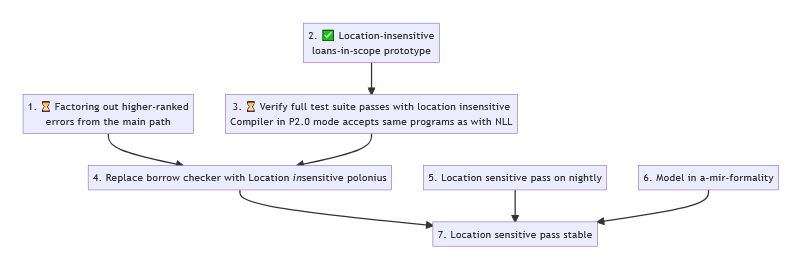

+++
path = "inside-rust/2023/10/06/polonius-update"
title = "Polonius update"
authors = ["Rémy Rakic and Niko Matsakis"]
aliases = ["inside-rust/2023/10/06/polonius-update.html"]

[extra]
team = "The Polonius Working Group"
team_url = "https://www.rust-lang.org/governance/teams/compiler#Polonius%20working%20group"
+++

This post lays out a roadmap to try to get Polonius on stable by Rust 2024. It identifies some high-level milestones and summarizes the key goals, as well as the recent progress.

## Background on Polonius

Polonius refers to a few things. It is a [new formulation](http://smallcultfollowing.com/babysteps/blog/2018/04/27/an-alias-based-formulation-of-the-borrow-checker/) of the borrow checker. It is also a [specific project](https://github.com/rust-lang/polonius) that implemented that analysis, based on datalog. Our current plan does not make use of that datalog-based implementation, but uses what we learned implementing it to focus on reimplementing Polonius within rustc.

The motivating example for Polonius is the so-called ["Problem Case #3: conditional control flow across functions"](https://github.com/rust-lang/rfcs/blob/master/text/2094-nll.md#problem-case-3-conditional-control-flow-across-functions): here, returning a reference out of a function, from a conditional.

```rust
fn get_default<'r, K: Hash + Eq + Copy, V: Default>(
    map: &'r mut HashMap<K, V>,
    key: K,
) -> &'r mut V {
    match map.get_mut(&key) { // -------------+ 'r
        Some(value) => value,              // |
        None => {                          // |
            map.insert(key, V::default()); // |
            //  ^~~~~~ ERROR               // |
            map.get_mut(&key).unwrap()     // |
        }                                  // |
    }                                      // |
}                                          // v
```

Returning the mutable reference `value` in the `Some` path requires the mutable loan on `map` to live until the end of the function. This prevents mutation in the `None` path even though no mutable loan on `map` would exist there in the first place.

Fixing this borrowck issue requires more precision about flow-sensitivity. It also hints at limitations in our modeling of lifetimes, which appear more clearly in cases with only slightly more complicated control flow, like [issue #47680](https://github.com/rust-lang/rust/issues/47680):

```rust
struct Thing;

impl Thing {
    fn maybe_next(&mut self) -> Option<&mut Self> { None }
}

fn main() {
    let mut temp = &mut Thing;

    loop {
        match temp.maybe_next() {
            Some(v) => { temp = v; }
            None => { }
        }
    }
}
```

The current borrow checker rejects this code. It does this because it sees that there is a loan of `temp` to call `temp.maybe_next()`. It also sees that this loan can flow around the loop — in particular, the loan is referenced by `v`, which is then stored into `temp`. Therefore, it reports an error when we attempt to mutably borrow `temp` at the top of the loop, since there may be a loan still existing from a prior iteration.

*However*, a more careful read shows that, while the borrow may flow around the loop, it only does so on the `Some` path, and on that path `temp` is overwritten. This means that the `temp` we will be borrowing on the next iteration is in fact a different location than the one we borrowed on the previous iteration. On the `None` path, meanwhile, the loan ends.

This kind of "case by case" distinguishing — seeing that the flow only occurs on one path, and that on that path there is a reassignment, requires more precision than the current borrow checker can achieve.

Issues like "NLL problem case #3", issue #47680 and others, were therefore deferred from NLLs, and left as future work, [Polonius](http://smallcultfollowing.com/babysteps/blog/2018/04/27/an-alias-based-formulation-of-the-borrow-checker/).

The key ideas being:
- switching from a model of _lifetimes_ as sets of points in the CFG (with _outlives_ relationships), to a model of _origins_ as sets of loans (with _subset_ relationships).
- computing and tracking the subset relationships at each point in the Control Flow Graph (whereas the existing borrowck computes a single subtype relation).


## Milestones

This is a rough roadmap, where we have the most visibility on the first steps:
- each step has unknowns that will define what things need to be done in the later steps
- therefore we're talking more about milestones for the longer term roadmap, and proper tasks for the shorter term.

Here are the roadmap's milestones:



### 1. Factoring out higher-ranked concerns from the main path

Today, the trait solver produces higher-ranked outlives constraints and the borrow checker solves them. In the future, we would like to make the [next trait solver](https://github.com/rust-lang/trait-system-refactor-initiative/) responsible for solving these higher-ranked constraints itself, so that it only produces the simpler `subset` constraint used in Polonius. This would allow us to solve implication predicates like `for<T> { if (T: 'a, 'a: 'b) { T: 'b } }` without having to effectively reproduce the same trait solving logic again. [This blog post](https://smallcultfollowing.com/babysteps/blog/2019/01/21/hereditary-harrop-region-constraints/) describes the problem and possible solution in more detail.

In the shorter term, we are exploring refactoring the borrow checker to separate out the higher-ranked processing from the ordinary processing. The goal would be to preprocess the outlives constraints in a kind of Polonius ["leak check"](https://rustc-dev-guide.rust-lang.org/traits/hrtb.html#basic-matching-and-placeholder-leaks), where we can compute the higher-ranked errors. This could then be removed once the trait solver can solve these constraints.

Current status: ⏳ members of the types team are starting to work on this task in the next few days.


### 2. Location-insensitive loans in scope

Out of the two key differences between Polonius and the existing borrow check (regions as "sets of loans", and computing subtyping relations at each point in the CFG), this step is aimed at resolving the *first* difference, but not the second, so we call it the "location *in*sensitive loans in scope" (because subtyping is being done once, not per location): the idea can be described as "NLLs with the Polonius model".

Note that other aspects of the existing borrow checker are still flow-sensitive.

In this step, we will compute the set of live loans via outlives constraints only, instead of computing the CFG points where regions are live (which is then used to compute when loans go out of scope). We believe this is equivalent to the existing borrow check in terms of the errors that get reported.

Importantly, this change paves the way for adding location sensitivity (sets of loans are also a better foundation for far-future improvements to the borrow checker such as safe internal references).

Current status: ✅ we have completed prototypes, and have [an open PR](https://github.com/rust-lang/rust/pull/113218) to land this under a `-Z` flag, which should happen in the near future.

### 3. Verify full test suite passes with location-insensitive Polonius

That PR does pass the full 15000+ tests in our suite, but we haven't yet checked on the crates published on crates.io with a crater run.

Compared to our internal test suite, the vast majority of published crates are expected to build without errors. In that regard, it should be unlikely that issues would be found there, but it will be done regardless.

Current status: ⏳ in-progress, the crater run itself will be done before the PR lands.


### 4. Replace parts of the borrow checker with location-insensitive Polonius


The prototype only does additional work, and does not modify the existing analysis.

In this step, we will refactor the borrow checker so that its data structures store sets of loans, and do more performance work: for example, remove redundant computation, investigate worst-case scalability and constant factors.

It's expected that performance will be similar, and we can then imagine enabling the location-insensitive pass without the feature flag, and removing some of the old code.

To keep the high quality diagnostics from the years of work of many contributors, it's possible that the new analysis could run, and if errors are detected, only then use the existing analysis and diagnostics.

Current status: we've done some early investigations on the data-structures changes needed, some of redundant parts that could be removed, etc.

### 5. Location-sensitive pass on nightly

Then the (harder-to-do-efficiently) work to incorporate location-sensitivity can start. This step will implement the first version of the analysis.

At this point it can still be inefficient, and use the feature flag, but this is when the borrow checker should accept more expressive code than the current NLLs.

Current status: we're in the design phase here, to adapt our datalog prototype and algorithms to rustc, imagining alternative ways to compute and propagate the subset constraints along the CFG.

### 6. Model borrow checking and Polonius in a-mir-formality

The Types team is building a model of Rust's MIR and trait system called [`a-mir-formality`][]. Once it reaches a sufficiently complete status, the intent is that the model will always be extended to cover new language features prior to stabilization. We are therefore working to add Polonius into the model. This will in fact be the second time doing such modeling, as we already added Polonius to a previous incarnation of a-mir-formality. In fact, that modeling work is what gave us the insights that enabled the location-insensitive Polonius formulation now landing on nightly.

[`a-mir-formality`]: https://github.com/rust-lang/a-mir-formality

Interestingly, this work is completely independent of rustc, and could in theory be started soon, and done in parallel with the other efforts.

### 7. Location-sensitive pass stable

In this milestone, we expect a lot of work on optimizations, and productization.

If a similar experience to NLLs in edition 2018 is to be expected again, another substantial amount of work and polish will also be needed to handle diagnostic differences and issues, ensuring errors and notes are clear enough, as well as the documentation.

At this point, the location-sensitive pass is hopefully efficient enough, tested in practice, somewhat formally verified, and can be enabled in edition 2024.

Around this time, librarification efforts can also be rebooted, to turn the in-tree Polonius into a library, maybe using [Stable MIR][]. This is so that it could be reused elsewhere, for example in [rust-analyzer][], or [gccrs][], or by researchers working on verification tools (like [kani][], [prusti][] and [creusot][]).

[Stable MIR]: https://github.com/rust-lang/team/pull/729
[rust-analyzer]: https://github.com/rust-lang/rust-analyzer
[gccrs]: https://github.com/Rust-GCC/gccrs
[kani]: https://github.com/model-checking/kani/
[prusti]: https://github.com/viperproject/prusti-dev/
[creusot]: https://github.com/xldenis/creusot

## Conclusion

We are very excited to see the plan for Polonius coming into focus. At the moment, as we are still doing foundational work, we are not looking for volunteers or contributors unless they are well versed in the compiler. We do expect that as the project proceeds, there will be more and more need for new contributions. Stay tuned for updates!
