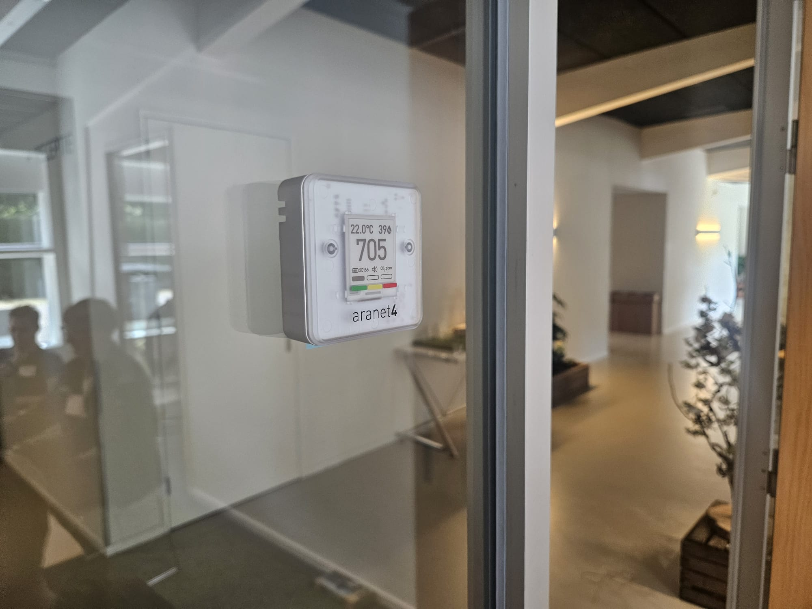
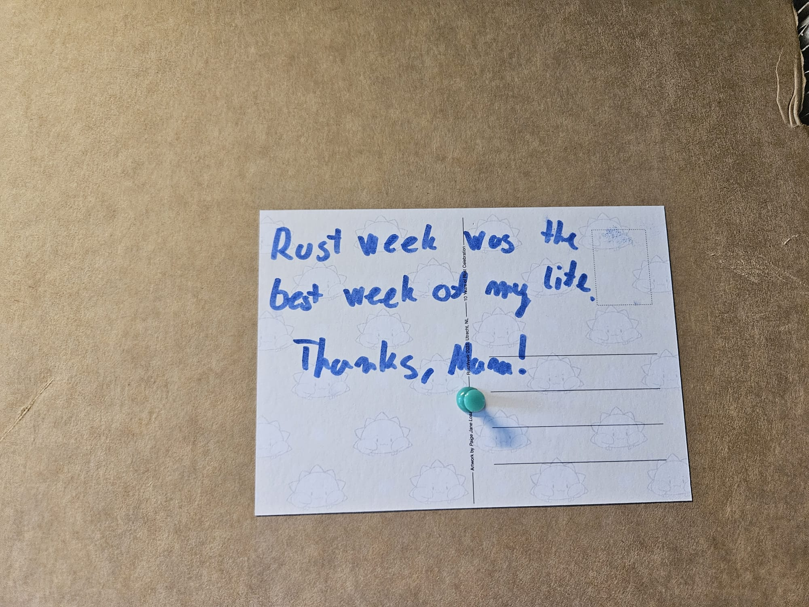

+++
path = "inside-rust/9999/12/31/rust-all-hands-2025-recap"
title = "Rust All Hands 2025 Recap"
authors = ["Mara Bos"]

[extra]
team = "Leadership Council"
team_url = "https://www.rust-lang.org/governance/teams/leadership-council#team-leadership-council"
+++

The all-hands has happened!

More than 150 project members and invited guests attended, making this the largest in-person collaborative event in the history of the Rust project.

On Wednesday, several Rust project members gave talks to other project members and (potential) contributors, as part of the "Rust Project Track" at the RustWeek conference. The recordings are available [on YouTube](https://www.youtube.com/playlist?list=PL8Q1w7Ff68DBJsobwUVTr_vbb2MbxisAF). 📹

On Thursday, we celebrated the 10 year birthday of Rust 1.0. With over 300 people, we celebrated, listened to speeches from various former and current team members and contributors, and watched the live [release of Rust 1.87.0](https://blog.rust-lang.org/2025/05/15/Rust-1.87.0/) on stage.

On Friday and Saturday, the actual Rust All-Hands 2025 took place. For two full days spread over 10 different meeting rooms, both [pre-planned](https://docs.google.com/spreadsheets/d/1G07-f2pwAzEztZMpuxcCW3EWFS1pEX4ShNbsg91Qqjw/edit?gid=0#gid=0) and ad-hoc discussions took place on a very wide range of topics. Meeting notes have been collected in this Zulip topic: [#all-hands-2025 > Meeting notes!](https://rust-lang.zulipchat.com/#narrow/channel/486433-all-hands-2025/topic/Meeting.20notes!/with/518928628)

Many many long standing issues have been unblocked. Many new ideas were discussed, both small and big. Conflicts were resolved. Plans were made. And many personal connections were formed and improved. ❤

I've collected feedback from the participants (67 of you replied so far), and the replies where overwhelmingly positive with an average score of 9.5/10. 🎉 The vast majority would like this to be a yearly event. I've started working on making that happen!

Thank you all for attending! See you all next year! 🎊
