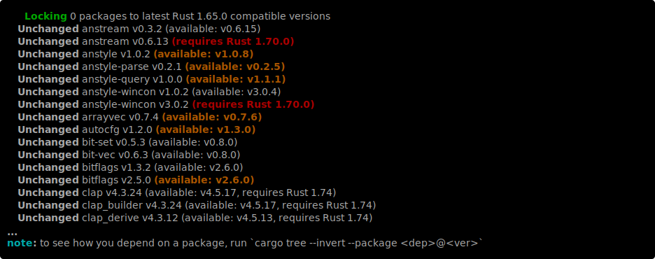

+++
path = "inside-rust/2024/10/01/this-development-cycle-in-cargo-1.82"
title = "This Development-cycle in Cargo: 1.82"
authors = ["Ed Page"]
aliases = ["inside-rust/2024/10/01/this-development-cycle-in-cargo-1.82.html"]

[extra]
team = "The Cargo Team"
team_url = "https://www.rust-lang.org/governance/teams/dev-tools#cargo"
+++

# This Development-cycle in Cargo: 1.82

This is a summary of what has been happening around Cargo development for the merge window for Rust 1.82.

<!-- time period: 2024-07-26 through 2024-09-05 -->

- [Plugin of the cycle](#plugin-of-the-cycle)
- [Implementation](#implementation)
  - [`cargo info`](#cargo-info)
  - [Shell completions](#shell-completions)
  - [MSRV-aware Cargo](#msrv-aware-cargo)
  - [`cargo publish --workspace`](#cargo-publish-workspace)
  - [`cargo::error` build script directive](#cargo-error-build-script-directive)
  - [`cargo update --precise <prerelease>`](#cargo-update-precise-prerelease)
  - [Snapshot testing](#snapshot-testing)
- [Design discussions](#design-discussions)
  - [`time`](#time)
  - [Build probes](#build-probes)
  - [Detecting unused dependencies](#detecting-unused-dependencies)
  - [`--all-targets` and doctests](#all-targets-and-doc-tests)
  - [`target-dir` and `artifact-dir`](#target-dir-and-artifact-dir)
  - [`cargo update --save`](#cargo-update-save-and-zminimal-versions)
- [Misc](#misc)
- [Focus areas without progress](#focus-areas-without-progress)

## Plugin of the cycle

Cargo can't be everything to everyone,
if for no other reason than the compatibility guarantees it must uphold.
Plugins play an important part of the Cargo ecosystem and we want to celebrate them.

Our plugin for this cycle is [`cargo-show-asm`](https://crates.io/crates/cargo-show-asm) which allows you to see what your Rust code compiles to, including assembly, WASM, LLVM-IR, or MIR.

Thanks to [epage](https://github.com/epage) for the suggestion!

[Please submit your suggestions for the next post.](https://rust-lang.zulipchat.com/#narrow/stream/246057-t-cargo/topic/Plugin.20of.20the.20Dev.20Cycle/near/420703211)

## Implementation

##### `cargo info`

*Update from [1.81](https://blog.rust-lang.org/inside-rust/2024/08/15/this-development-cycle-in-cargo-1.81.html#cargo-info)*

FCP has closed and `cargo info` has been merged into Cargo ([#14141](https://github.com/rust-lang/cargo/pull/14141))!
During the discussion, a bug was uncovered which led to us removing the reporting of owners for now ([#14418](https://github.com/rust-lang/cargo/pull/14418)).


Thanks [Rustin170506](https://github.com/Rustin170506) for driving this to stabilization!

##### Shell completions

This summer we have [shannmu](https://github.com/shannmu) contributing to Cargo as part of [Google Summer of Code](https://summerofcode.withgoogle.com/) with the goal of reducing shell completion brittleness while making them more powerful by moving the implementations into Rust ([#6645](https://github.com/rust-lang/cargo/issues/6645)).
So far, the work has mostly focused extending the unstable support for Rust-native completions in `clap_complete` to provide a foundation that is at parity with Cargo's hand written completions, hopefully.
See [`clap_complete::env`](https://docs.rs/clap_complete/latest/clap_complete/env/index.html) for the user-facing side of this feature and [clap#3166](https://github.com/clap-rs/clap/issues/3166) for development progress.

Recently, shannmu has been experimenting with applying this to Cargo in a private fork and has started the first step to integrating this into mainline Cargo in [#14493](https://github.com/rust-lang/cargo/pull/14493).

##### MSRV-aware Cargo

*Update from [1.80](https://blog.rust-lang.org/inside-rust/2024/06/19/this-development-cycle-in-cargo-1.80.html#msrv-aware-cargo)*

Without a "perfect" solution in sight, we went ahead and adjusted the config from our placeholders
```toml
[resolver]
something-like-precedence = "something-like-rust-version"
```
to
```toml
[resolver]
incompatible-rust-version = "fallback"
```
([#14296](https://github.com/rust-lang/cargo/pull/14296))

With that in place and not aware of any other blockers,
we put out a new round of [call-for-testing](https://github.com/rust-lang/cargo/issues/13873#issuecomment-2276647842).
We're grateful for the feedback we've received!

A particularly confusing aspect of the `fallback` strategy is that Cargo may select a dependency that is either
- Too new for your `package.rust-version` because no MSRV-compatible version was available and so Cargo did a `fallback` to an MSRV-incompatible one
- Older than is needed by your package if your version requirement is too liberal and your package doesn't set `package.rust-version` but something else in your workspace does

After several tweaks to Cargo's locking output (
[#14401](https://github.com/rust-lang/cargo/pull/14401)
[#14440](https://github.com/rust-lang/cargo/pull/14440).
[#14445](https://github.com/rust-lang/cargo/pull/14445).
[#14457](https://github.com/rust-lang/cargo/pull/14440).
[#14459](https://github.com/rust-lang/cargo/pull/14459).
[#14461](https://github.com/rust-lang/cargo/pull/14461).
[#14471](https://github.com/rust-lang/cargo/pull/14471).
), Cargo now report to users
- when it selected a dependency version that is incompatible with the MSRV of workspace members that transitively depend on it
- when a newer version of a package is available that is compatible with the MSRV of workspace members that transitively depend on it



<!-- team meeting: 2024-08-20 -->
<!-- team meeting: 2024-08-27 -->
The testing feedback was more than `fallback` behavior being confusing but that it can fail to provide the benefits of an MSRV-aware resolver when in a workspace with multiple MSRVs ([#14414](https://github.com/rust-lang/cargo/issues/14414)).
The ideal state would be that when resolving a dependency, Cargo only consider the MSRVs of the workspace members that transitively depend on it.
The problem is that Cargo doesn't know every path to a dependency until the resolve is done.
Cargo selects a version of a dependency when it first comes across it and then only tries another version if the selected version is rejected by another path to it.
If we `deny`d dependency versions with an incompatible MSRV, with enough work we could hit the ideal case.
The problem is how much work this would take and that there are times packages intentionally select MSRV-incompatible dependencies (e.g. features with a different MSRV, not caring about MSRV for dev-dependencies, etc).
Our `fallback` strategy requires that Cargo pick a "good enough" version when it come across a dependency version because another path to it cannot reject it and cause a new version to be selected.
Currently, the "good enough" version is the lowest of all `package.rust-version`s in a workspace.
For any package in a workspace with a higher MSRV, this puts users in the situation of either intentionally holding back their dependency versions to make up for Cargo's shortcomings or they lose out on an MSRV-aware resolver.

So far, the only solution we've come up with for this is to double-down on this strategy: track all workspace member MSRVs for all dependencies, prioritizing packages by the number of MSRVs they are compatible with.
Cargo should then only pick an MSRV-incompatible version if the version requirement is too high.
That makes maintenance easier at the cost of older-than-necessary versions being selected sometimes.

With this proposed solution, we're most concerned about a new to intermediate user who maintains a workspace being asked to set or lower the MSRV for one of their packages, them complying, and then not knowing that dependencies are being held back
(if the user previously didn't set an MSRV on any package then they would already be in this situation regardless of this proposed change).
Letting users know that there are updates they can manually apply was the driving reason for those locking message changes earlier.
The question is whether those messages are good enough and can be made better within their allotted space.

##### `cargo publish --workspace`

*Update from [1.81](https://blog.rust-lang.org/inside-rust/2024/08/15/this-development-cycle-in-cargo-1.81.html#cargo-publish---workspace)*

After some prep work (
[#14340](https://github.com/rust-lang/cargo/pull/14340),
[#14408](https://github.com/rust-lang/cargo/pull/14408),
[#14488](https://github.com/rust-lang/cargo/pull/14488),
[#14496](https://github.com/rust-lang/cargo/pull/14496),
), [jneem](https://github.com/jneem) posted
[#14433](https://github.com/rust-lang/cargo/pull/14433) to add support for publishing multiple packages at once.

As an example of the cost of unstable features, [#14433](https://github.com/rust-lang/cargo/pull/14433) was initially blocked on
a missing feature from [open-namespaces](https://rust-lang.github.io/rfcs/3243-packages-as-optional-namespaces.html).
An open-namespaces test verifies a certain case with `cargo publish` *but* could no longer do so without Package Id Spec support because `cargo publish` now needed that to work for every package.
This was addressed in 
[#14467](https://github.com/rust-lang/cargo/pull/14467).

#### `cargo::error` build script directive

Previously in [#10159](https://github.com/rust-lang/cargo/issues/10159),
`cargo::error=<msg>` build script directive was proposed.
The Cargo team met and hashed out the details and said it was good to move forward which [torhovland](https://github.com/torhovland) did in 
[#14435](https://github.com/rust-lang/cargo/pull/14435).

The proposed semantics are that any message sent via `cargo::error` would be shown as an error and cause the build script to error, effectively providing a built-in means of error recovery.
This is in contrast to `cargo::warning` which will only be shown for local packages.

The point under debate with the original requester is whether emitting a `cargo::` directive should cause the build script to error.
The original intention was to use this to clean up the output from `pkg_config` *but* the caller needs to decide whether something is an error or not.

##### `cargo update --precise <prerelease>`

*Update from [1.80](https://blog.rust-lang.org/inside-rust/2024/06/19/this-development-cycle-in-cargo-1.80.html#misc)*

In addition to a bug fix ([#14412](https://github.com/rust-lang/cargo/pull/14412)),
[linyihai](https://github.com/linyihai) worked on hashing out more of the version requirement matching rules for pre-releases in [#14305](https://github.com/rust-lang/cargo/pull/14305).
Check out that PR for a detailed description of the proposed matching rules.

##### Snapshot testing

*Update from [1.81](https://blog.rust-lang.org/inside-rust/2024/08/15/this-development-cycle-in-cargo-1.81.html#snapshot-testing)*

We finished mass-migrating some straggler test modules thanks to
- [epage](https://github.com/epage) in [#14410](https://github.com/rust-lang/cargo/pull/14410)
- [eth3lbert](https://github.com/eth3lbert) in [#14242](https://github.com/rust-lang/cargo/pull/14242)

For individual tests, one thing holding back the migration was how json comparisons were handled.

Cargo's programmatic API generally uses [jsonlines](https://jsonlines.org/) but that doesn't work so well for humans reading and editing the content.
Switching to snapbox adds an extra complexity because it highlights a failure by diffing the expected and actual test results and
diffing works best with line-oriented content.
```json
{"executable":"[ROOT]/foo/target/debug/007bar[EXE]","features":[],"filenames":"{...}","fresh":false,"manifest_path":"[ROOT]/foo/Cargo.toml","package_id":"path+[ROOTURL]/foo#0.0.1","profile":"{...}","reason":"compiler-artifact","target":"{...}"}
{"reason":"build-finished","success":true}
```

The old `cargo-test-support` API worked around this by always rendering jsonlines elements as pretty printed json with blink lines between each element and the assertions only printed the first field that was different.
```json
{
    "reason": "compiler-artifact",
    "package_id": "path+file:///[..]/foo#0.0.1",
    "manifest_path": "[CWD]/Cargo.toml",
    "target": "{...}",
    "profile": "{...}",
    "features": [],
    "filenames": "{...}",
    "executable": "[ROOT]/foo/target/debug/007bar[EXE]",
    "fresh": false
}

{"reason":"build-finished", "success":true}
```

That format doesn't work for snapbox because its intended to work with in-memory or filesystem snapshots and the snapshots are meant to be usable as real data.
It would run counter to snapbox's model to implicitly store data in a format contrary to the declared format.
We solved this in [snapbox#348](https://github.com/assert-rs/snapbox/issues/348) by allow making it explicit, by allowing the the test author to declare the format of the expected data and what it will be compared to.

This allowed us to replace
```rust
        .with_stdout_data(str![[r#"
{"executable":"[ROOT]/foo/target/debug/007bar[EXE]","features":[],"filenames":"{...}","fresh":false,"manifest_path":"[ROOT]/foo/Cargo.toml","package_id":"path+[ROOTURL]/foo#0.0.1","profile":"{...}","reason":"compiler-artifact","target":"{...}"}
{"reason":"build-finished","success":true}

"#]].json_lines())
```
with
```rust
        .with_stdout_data(
            str![[r#"
[
  {
    "executable": "[ROOT]/foo/target/debug/007bar[EXE]",
    "features": [],
    "filenames": "{...}",
    "fresh": false,
    "manifest_path": "[ROOT]/foo/Cargo.toml",
    "package_id": "path+[ROOTURL]/foo#0.0.1",
    "profile": "{...}",
    "reason": "compiler-artifact",
    "target": "{...}"
  },
  {
    "reason": "build-finished",
    "success": true
  }
]
"#]]
            .is_json()
            .against_jsonlines(),
        )
```
which is both easier to read and gives more insightful diffs.
This unblocked converting most of our tests using jsonlines which epage did in [#14293](https://github.com/rust-lang/cargo/pull/14293).

Some other tests using jsonlines were blocked on the fairly primitive handling of redacted content in snapbox.
Snapbox allow to place wildcards in the expected results to both narrow the focus on the content the test author cares about and to remove content that is run or machine dependent.
This was fixed in [snapbox#358](https://github.com/assert-rs/snapbox/pull/358) and more tests were migrated in [#14402](https://github.com/rust-lang/cargo/pull/14402).

With the right combinations of flags, a cargo run may produce invalid jsonlines due to mixing in human output.
`cargo-test-support` hacked around this by ignoring any lines that didn't start with `{`.
In the end, we found only one test relied on this behavior and we found we could test the same functionality a different way, so epage did so in [#14297](https://github.com/rust-lang/cargo/pull/14297).

## Design discussions

##### `time`

In 1.80, there was a type inference regression that affected the `time` package
([rust#127343](https://github.com/rust-lang/rust/issues/127343)).
For more context, see
- [Original change that added the impl that caused issues with inference](https://github.com/rust-lang/rust/pull/99969)
- [Discussions of regression](https://github.com/rust-lang/rust/issues/127343)
- [Mitigation to be temporarily added to rustc](https://github.com/rust-lang/rust/pull/129343)
- [Discussion on how this was handled](https://internals.rust-lang.org/t/type-inference-breakage-in-1-80-has-not-been-handled-well/21374)
- [Statements from the libs teams regarding their positions](https://github.com/rust-lang/rust/pull/129379)
- [Discussion on brainstorming solutions](https://internals.rust-lang.org/t/brainstorming-how-to-help-old-code-locked-to-old-time-build-on-new-toolchains/21438)

<!-- 2024-08-27 -->
In particular, the Cargo team discussed [#14452](https://github.com/rust-lang/cargo/pull/14452) which would implicitly patch existing versions of `time` to work with newer Rust toolchains.  To quote from our reply on that PR:

> We understand that the `time` issue has caused a lot of unexpected churn and like you are interested in finding ways of improving things now and in the future. To that end, we devoted most of @rust-lang/cargo's meeting to discuss this topic. We considered the possibility of patching the specific ranges of versions of the time package, by various means. We're concerned about trying to ship a feature like this in a hurry, and potentially unexpected fallout of it, now and in the future:
> 
> * Cargo crossing the deontological line of patching users' sources and not building exactly the original sources.
> 
> * Having the user be surprised by this patching (e.g. because they were expecting the failure and were testing the failure).
> 
> * Having to take this patching into account for future features like caching and verification.
> 
> 
> Given that, we would prefer to not move forward with a short-term fix for this issue with the `time` package. We are however considering solutions that could help in the future. We have opened [#14458](https://github.com/rust-lang/cargo/issues/14458) to explore those ideas. In particular, we would like to continue with more incremental work that has already begun, such as:
> 
> * [Yank reasons](https://rust-lang.github.io/rust-project-goals/2024h2/yank-crates-with-a-reason.html) which is currently a Project Goal, and has the potential to eventually ease towards a [mutable database](https://github.com/rust-lang/cargo/issues/2608#issuecomment-1932818615) that could possibly support registry patches.
> 
> * [Experiments with patches](https://github.com/rust-lang/cargo/pull/13779). That work halted due to concerns over resolver interactions. Resolver interaction was a major component behind that change, but a situation like this with `time` shows that perhaps a solution that does not support `Cargo.toml` changes would be useful.
> 
> * Providing an interface between rustc and cargo so that either side can better support reporting diagnostics related to situations like this. ([Add a new `--orchestrator-id` flag to rustc compiler-team#635](https://github.com/rust-lang/compiler-team/issues/635) is tangentially related to this.)
> 
> 
> A mitigation is being added to rustc via [rust-lang/rust#129343](https://github.com/rust-lang/rust/pull/129343). We acknowledge that likely does not go far enough for many since it only provides a diagnostic and not a fix.
> 
> Other teams, including libs-api, lang, compiler, and release, are also working on improvements to try to better handle or prevent situations like this.

##### Build probes

<!-- 2024-09-03 -->
Some packages call `rustc` inside of `build.rs` to compile code to see if it works as expected.
Packages can use this to tell if a feature is supported on the current toolchain and whether it still works as expected when the feature is unstable.

On [Zulip](https://rust-lang.zulipchat.com/#narrow/stream/246057-t-cargo/topic/.E2.9C.94.20-Zbuild-std.20with.20build.20scripts.20that.20invoke.20rustc/near/465984005),
[mrkajetanp](https://github.com/mrkajetanp) was looking for input on fixing a couple of issues where a `build.rs` doesn't know how to call `rustc` like Cargo does
(
[#11244](https://github.com/rust-lang/cargo/issues/11244),
[#7501](https://github.com/rust-lang/cargo/issues/7501)
).
As a team, we discussed the status of build probes inside of Cargo.

For stable features,
[`cfg(accessible)` and `cfg(version)`](https://rust-lang.github.io/rfcs/2523-cfg-path-version.html)
would provide a better experience.
`cfg(version)` is blocked on `cfg(accessible)` and `cfg(accessible)` has been scoped down to avoid design problems and just needs someone to champion it on the path to being stabilized.
It will still take a while before more foundational packages would likely bump their MSRV to be able to use these new features.
Our hope is that with the
[MSRV-aware resolver](https://rust-lang.github.io/rfcs/3537-msrv-resolver.html)
improving the experience for people with low MSRVs,
maintainers of foundational packages would be willing to bump their MSRVs to leverage new features like these.
If providing bug fixes to old MSRVs is a concern,
they could bump their minor version when bumping MSRV,
giving them a hole in their version range to patch old MSRVs.
This is an extra support burden but for most foundational packages,
it is unlikely they'd need to use this escape hatch.

This still leaves nightly features.
Nightly features are designed to be opt-in and it seems inappropriate for a dependency to opt people into a nightly feature without their consent.
This is particularly problematic when latent bugs in build probes accidentally enable a nightly feature when it isn't compatible,
breaking people.
We'd encourage these packages to instead put nightly features behind a feature flag or a `--cfg`.
In the future, maybe [global features](https://internals.rust-lang.org/t/pre-rfc-mutually-excusive-global-features/19618)
can improve the experience for this.
<!-- see https://github.com/dtolnay/anyhow/issues/323 -->

As we didn't feel there was enough of a use case for build probes after this discussion,
we closed both issues.

#### Detecting unused dependencies

<!-- 2024-09-03 -->
<!-- https://rust-lang.zulipchat.com/#narrow/stream/246057-t-cargo/topic/unused.20dependencies.20status -->
Rustc's [`unused_crate_dependencies`](https://doc.rust-lang.org/nightly/rustc/lints/listing/allowed-by-default.html#unused-crate-dependencies) lint has had limited benefit because Cargo tracks dependencies at the package level while Rustc warns about them at the build-target level.
If you have a dependency that is only used in some build-targets,
the others will warn about it being unused
(
[rust#95513](https://github.com/rust-lang/rust/issues/95513),
[rust#57274](https://github.com/rust-lang/rust/issues/57274)
).
As a team, we discussed how Cargo could work with Rustc to make this lint more useful.

Rustc has the ability to "silently" emit the lint in json
([compiler-team#674](https://github.com/rust-lang/compiler-team/issues/674))
so that Cargo can aggregate the results and report the lint to the user.
Cargo still won't have enough information if you build `cargo check --bin foo` as all build targets need to run.
To handle this, we planned for Cargo to not emit the lint unless all relevant build-targets are built.
`build.rs` is always built, so Cargo can always emit for `build-dependencies`.
If all `bin` and `lib` build-targets are built, then Cargo can emit for normal `dependencies.`
That just leaves `dev-dependencies` as there currently isn't any way to build `bench`, `test`, `example`, and doc tests all at once as `--all-targets` excludes doc tests.

Once we figure out `--all-targets` and doc tests, we can [upstream `cargo-udeps` into Cargo](https://github.com/est31/cargo-udeps/issues/276#issuecomment-2328510760).

##### `--all-targets` and doc tests

<!-- 2024-09-03 -->
So as a team, we also discussed [#6424: "Cargo check does not check doctests
"](https://github.com/rust-lang/cargo/issues/6669)
which is similar to
[#6669: `cargo test --all-targets` does not run doc tests
](https://github.com/rust-lang/cargo/issues/6669).
We got to this situation because Cargo operates under different modes and `--all-targets` activates one mode (compilation) while `--doc` operates under a different mode (documentation).
However, users are unlikely to think in terms of modes and treating them all as "build targets" is likely a more understandable choice.

The question then is whether we can change the meaning of `--all-targets` at this point.
We've found many people are using `--all-targets`, assuming it includes doctests, and are surprised when they find out otherwise and have many broken doctests.
We can infer from this that there are many more people who don't know and changing the meaning would break them.
While it would improve the quality of their code,
forcing them to deal with it on our schedule,
rather than theirs,
can be unpleasant.
To not block on the naming discussion,
we could always have an unstable name like `--all-targets-and-doctests`.

To move this forward, we'd likely need to start by adding the `--doc` flag from `cargo test` to `cargo check`, `cargo build`, `cargo clippy`, and `cargo fix`.
As we are working to add `--doc` to these commands, we can then add `--all-targets-and-doctests` to combine `--doc` with `--all-targets`.

##### `target-dir` and `artifact-dir`

<!-- 2024-07-30 -->
[RFC #3371](https://github.com/rust-lang/rfcs/pull/3371) makes the `target-dir` config field and `--target-dir` flag templated so users can easily move all `target-dir`s out of their source directories while keeping them separate.
Cargo also has a long outstanding unstable feature to specify where the write build artifacts to with `--artifact-dir`, formerly `--out-dir`
([#6790](https://github.com/rust-lang/cargo/issues/6790)).

[kornelski](https://github.com/kornelski) shared a counter-proposal in
[#14125](https://github.com/rust-lang/cargo/issues/14125):
instead of moving final build artifacts out of `target-dir`, into `artifact-dir`,
move all intermediate build artifacts out of `target-dir` into an internal-only location that is re-organized for sharing cross-workspaces.
The re-organization and sharing of intermediate build artifacts doesn't have to be handled as part of this and is being tracked in
[#5931](https://github.com/rust-lang/cargo/issues/5931).

As a team we discussed these two plans:
- Approach 1 (RFC #3371): target-dir is for intermediate artifacts, artifact dir is for final artifacts
  1. Make target-dir movable (RFC #3371)
  2. Stabilize `--artifact-dir` (#6790)
  3. Allow templating in artifact dir and have it responsible writing the runnable binary, etc
  4. Change the target-dir default to point to central base path, like cargo script, leaving artifact-dir writing to a path inside `target/`
- Approach 2 (#14125): target-dir is for final artifacts, private/unspecified dir is for intermediate artifacts
  1. Define a new intermediate artifact dir in a central base path, like what cargo script does
  2. Slowly migrate intermediates out of `target/` to this new directory
  3. Reject `--artifact-dir` (#6790), saying `--target-dir` solves that need

#14125's approach does simplify the problem a lot but loses one of the benefits of `--artifact-dir`: users being able to specify a predictable path,
rather than having to track a location inside.
Users will also likely want to define the location for intermediate build artifacts,
even once Cargo has a separate `CARGO_CACHE_HOME`
([#1734](https://github.com/rust-lang/cargo/issues/1734))
as build artifacts can be significantly larger than other caches
or may want to optimize for other properties like file IO speed.

We came back with our own
counter-proposal that combines the two.
At a high level, it is:
- Move intermediate artifacts out to `build-dir` which is only controlled by config and is templated like RFC #3371
- Move final artifacts out to `artifact-dir` which is controlled by both config and CLI and is also templated.
- After a period of time, phase out `--target-dir` (hide it in help output)

See [our post](https://github.com/rust-lang/cargo/issues/14125#issuecomment-2258708917) for more details.

##### `cargo update --save` and `-Zminimal-versions`

<!-- 2024-08-06 -->
With [`cargo update --breaking`](https://github.com/rust-lang/cargo/issues/12425) making progress
(last talked about in [1.81](https://blog.rust-lang.org/inside-rust/2024/08/15/this-development-cycle-in-cargo-1.81.html#merging-cargo-upgrade-into-cargo-update)),
we discussed again the idea of `cargo update --save` ([#10498](https://github.com/rust-lang/cargo/issues/10498))
which was [deferred out of from our previous discussions](https://github.com/rust-lang/cargo/issues/10498#issuecomment-2275997403).

We didn't make too much progress on this
(mostly reviewing [past ideas](https://github.com/rust-lang/cargo/issues/10498#issuecomment-2276604441))
until we moved onto the topic of stabilizing `-Zminimal-versions`
([#5657](https://github.com/rust-lang/cargo/issues/5657)).

`-Zminimal-versions` is primarily targeted at verifying the lower bound of your own version requirements.
Stabilization has been at an impasse because of the difficulty of working with transitive dependencies that don't verify lower bounds.
However, stabilization tends to imply an "endorsement" and through community pressure could lead to positive change in this direction,
much like our former policy to
[not commit `Cargo.lock`](https://blog.rust-lang.org/2023/08/29/committing-lockfiles.html#background)
applied community pressure for maintaining SemVer.

If instead, everyone was on latest versions with `cargo update --save`,
this would no longer be a problem.
Or in essence, "drag manifest forward rather than dragging lockfile backwards".
An MSRV-aware resolver would help prevent dragging manifests and lockfiles too far forward.
Having opt-in workflows, like `cargo update --save`, requires manual intervention to ensure they are followed, including still needing to test to make sure the version requirements were dragged forward
(`cargo update --save --locked` wouldn't work because that will cause a new update)
and need to apply to any command that can change `Cargo.lock`, including `cargo check`.
Users might benefit from others following this workflow as some popular dependencies with bad transitive dependencies might be fixed by other dependencies that pull it in but that will be a piecemeal solution.
Instead, if we migrated the community into a workflow where `Cargo.toml` version req lower bounds are set to versions in `Cargo.lock` by default,
version reqs would "just work".
However, there is value in libraries allowing the minimal-most version of a dependency as possible ([#14372](https://github.com/rust-lang/cargo/issues/14372)).
This gives application authors the flexibility to hold back versions to workaround bugs or control the cadence of dependency updates so their are fewer dependency versions to audit.

We are continuing this discussion on [Internals](https://internals.rust-lang.org/t/zminimal-versions-cargo-update-and-cargo-upgrade/21335).

## Misc

- Work is progressing on `cargo install --dry-run` in [#14280](https://github.com/rust-lang/cargo/pull/14280)
- [Ifropc](https://github.com/Ifropc) added initial support for `--lockfile-path` in [#14326](https://github.com/rust-lang/cargo/pull/14326) (tracking issue: [#14421](https://github.com/rust-lang/cargo/issues/14421))
- [dpaoliello](https://github.com/dpaoliello) added initial support for `path-bases` ([#14360](https://github.com/rust-lang/cargo/pull/14360)) along with `cargo add` support ([#14427](https://github.com/rust-lang/cargo/pull/14427)) (tracking issue: [#14355](https://github.com/rust-lang/cargo/issues/14355))
- [arlosi](https://github.com/arlosi) started another attempt on a way to turn warnings into errors in [#14388](https://github.com/rust-lang/cargo/pull/14388) (issue: [#8424](https://github.com/rust-lang/cargo/issues/8424))
- [Daily reports](https://rust-lang.zulipchat.com/#narrow/stream/260232-t-cargo.2FPubGrub/topic/Progress.20report) by [Eh2406](https://github.com/Eh2406) on the progress of the Rust implementation of the PubGrub version solving algorithm

## Focus areas without progress

These are areas of interest for Cargo team members with no reportable progress for this development-cycle.

Ready-to-develop:
- [Open namespaces](https://doc.rust-lang.org/nightly/cargo/reference/unstable.html#open-namespaces)
- [Merge `cargo upgrade` into `cargo update`](https://github.com/rust-lang/cargo/issues/12425)
<!--
- [`cargo publish` for workspaces](https://github.com/rust-lang/cargo/issues/1169)
- [Auto-generate completions](https://github.com/rust-lang/cargo/issues/6645)
  - See [clap-rs/clap#3166](https://github.com/clap-rs/clap/issues/3166)
- Generalize cargo's test assertion code
  - [Add `CARGO_WORKSPACE_DIR`](https://github.com/rust-lang/cargo/issues/3946)
  - [Structured assertions in snapbox](https://github.com/assert-rs/trycmd/issues/92)
  - [Find a solution for order-independent assertions between cargo and snapbox](https://github.com/assert-rs/trycmd/issues/151)
-->

Needs design and/or experimentation:
- [Per-user artifact cache](https://github.com/rust-lang/cargo/issues/5931)
- [Dependency resolution hooks](https://github.com/rust-lang/cargo/issues/7193)
- [A way to report why crates were rebuilt](https://github.com/rust-lang/cargo/issues/2904)
<!--
- [GC](https://github.com/rust-lang/cargo/issues/12633)
-->

Planning:
- [Disabling of default features](https://github.com/rust-lang/cargo/issues/3126)
- [RFC #3416: `features` metadata](https://github.com/rust-lang/rfcs/pull/3416)
  - [RFC #3487: visibility](https://github.com/rust-lang/rfcs/pull/3487) (visibility)
  - [RFC #3486: deprecation](https://github.com/rust-lang/rfcs/pull/3486)
  - [Unstable features](https://doc.rust-lang.org/cargo/reference/unstable.html#list-of-unstable-features)
- [OS-native config/cache directories (ie XDG support)](https://github.com/rust-lang/cargo/issues/1734)
  - [Phase 1 Pre-RFC](https://internals.rust-lang.org/t/pre-rfc-split-cargo-home/19747)
- [Pre-RFC: Global, mutually exclusive features](https://internals.rust-lang.org/t/pre-rfc-mutually-excusive-global-features/19618)
- Cargo script ([RFC #3502](https://github.com/rust-lang/rfcs/pull/3502), [RFC #3503](https://github.com/rust-lang/rfcs/pull/3503))
<!--
- [RFC #3553: Cargo SBOM Fragment](https://github.com/rust-lang/rfcs/pull/3553)
- [RFC #3371: CARGO_TARGET_BASE_DIR](https://github.com/rust-lang/rfcs/pull/3371)
-->

## How you can help

If you have ideas for improving cargo,
we recommend first checking [our backlog](https://github.com/rust-lang/cargo/issues/)
and then exploring the idea on [Internals](https://internals.rust-lang.org/c/tools-and-infrastructure/cargo/15).

If there is a particular issue that you are wanting resolved that wasn't discussed here,
some steps you can take to help move it along include:
- Summarizing the existing conversation (example:
  [Better support for docker layer caching](https://github.com/rust-lang/cargo/issues/2644#issuecomment-1489371226),
  [Change in `Cargo.lock` policy](https://github.com/rust-lang/cargo/issues/8728#issuecomment-1610265047),
  [MSRV-aware resolver](https://github.com/rust-lang/cargo/issues/9930#issuecomment-1489089277)
  )
- Document prior art from other ecosystems so we can build on the work others have done and make something familiar to users, where it makes sense
- Document related problems and solutions within Cargo so we see if we are solving to the right layer of abstraction
- Building on those posts, propose a solution that takes into account the above information and cargo's compatibility requirements ([example](https://github.com/rust-lang/cargo/issues/9930#issuecomment-1489269471))

We are available to help mentor people for
[S-accepted issues](https://doc.crates.io/contrib/issues.html#issue-status-labels)
on
[zulip](https://rust-lang.zulipchat.com/#narrow/stream/246057-t-cargo)
and you can talk to us in real-time during
[Contributor Office Hours](https://github.com/rust-lang/cargo/wiki/Office-Hours).
If you are looking to help with one of the bigger projects mentioned here and are just starting out,
[fixing some issues](https://doc.crates.io/contrib/process/index.html#working-on-issues)
will help familiarize yourself with the process and expectations,
making things go more smoothly.
If you'd like to tackle something
[without a mentor](https://doc.crates.io/contrib/issues.html#issue-status-labels),
the expectations will be higher on what you'll need to do on your own.
