+++
path = "2025/09/10/rust-compiler-performance-survey-2025-results"
title = "Rust compiler performance survey 2025 results"
authors = ["Jakub Beránek"]

[extra]
team = "the compiler performance working group"
team_url = "https://www.rust-lang.org/governance/teams/compiler#team-wg-compiler-performance"
+++

Two months ago, we launched the first [Rust Compiler Performance Survey][rust-compiler-performance-survey], with the goal of helping us understand the biggest pain points of Rust developers related to build performance. It is clear that this topic is very important for the Rust community, as the survey received over 3 700 responses! We would like to thank everyone who participated in the survey, and especially those who described their workflows and challenges with an open answer. We plan to run this survey annually, so that we can observe long-term trends in Rust build performance and its perception.

In this post, we'll show some interesting results and insights that we got from the survey and promote work that we have already done recently or that we plan to do to improve the build performance of Rust code. If you would like to examine the complete results of the survey, you can find them [here][report].

And now strap in, as there is a lot of data to explore! As this post is relatively long, here is an index of topics that it covers:

- [Overall satisfaction](#overall-satisfaction)
- [Important workflows](#important-workflows)
- [Incremental rebuilds](#incremental-rebuilds)
- [Type checking and IDE performance](#type-checking-and-ide-performance)
- [Clean and CI builds](#clean-and-ci-builds)
- [Debug information](#debug-information)
- [Workarounds for improving build performance](#workarounds-for-improving-build-performance)
- [Understanding why builds are slow](#understanding-why-builds-are-slow)

## Overall satisfaction

To understand the overall sentiment, we asked our respondents to rate their satisfaction with their build performance, on a scale from 0 (worst) to 10 (best). The average rating was 6, with most people rating their experience with 7 out of 10:

<!-- Chart satisfaction start -->

    
<noscript>
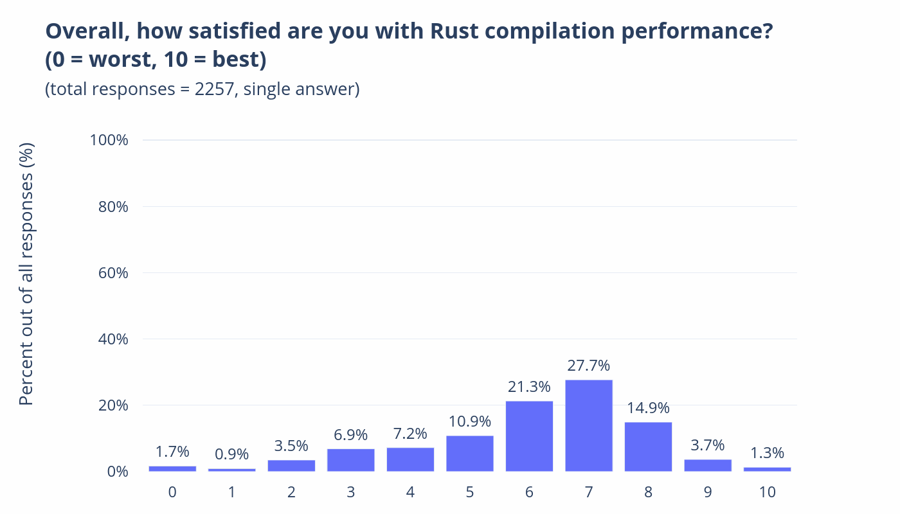
</noscript>

    

        [<a href="satisfaction.png" target="_href_" title="Download chart as PNG">PNG</a>]&nbsp;[<a href="satisfaction.svg" target="_href_" title="Download chart as SVG">SVG</a>]
    

<!-- Chart satisfaction end -->

To help us understand the overall build experience in more detail, we also analyzed all open answers (over a thousand of them) written by our respondents, to help us identify several recurring themes, which we will discuss in this post.

One thing that is clear from both the satisfaction rating and the open answers is that the build experience differs wildly across users and workflows, and it is not as clear-cut as "Rust builds are slow". We actually received many positive comments about users being happy with Rust build performance, and appreciation for it being improved vastly over the past several years to the point where it stopped being a problem.

People also liked to compare their experience with other competing technologies. For example, many people wrote that the build performance of Rust is not worse, or is even better, than what they saw with C++. On the other hand, others noted that the build performance of languages such as Go or Zig is much better than that of Rust.

While it is great to see some developers being happy with the state we have today, it is clear that many people are not so lucky, and Rust's build performance limits their productivity. Around 45% respondents who answered that they are no longer using Rust said that at least one of the reasons why they stopped were long compile times.

In our survey we received a lot of feedback pointing out real issues and challenges in several areas of build performance, which is what we will focus on in this post. 

## Important workflows

The challenges that Rust developers experience with build performance are not always as simple as the compiler itself being slow. There are many diverse workflows with competing trade-offs, and optimizing build performance for them might require completely different solutions. Some approaches for improving build performance can also be quite unintuitive. For example, stabilizing certain language features could help remove the need for certain build scripts or proc macros, and thus speed up compilation across the Rust ecosystem. You can watch [this talk][performance-talk-rustweek] from RustWeek about build performance to learn more.

It is difficult to enumerate all possible build workflows, but we at least tried to ask about workflows that we assumed are common and could limit the productivity of Rust developers the most: 

<!-- Chart limiting-workflows start -->

    
<noscript>
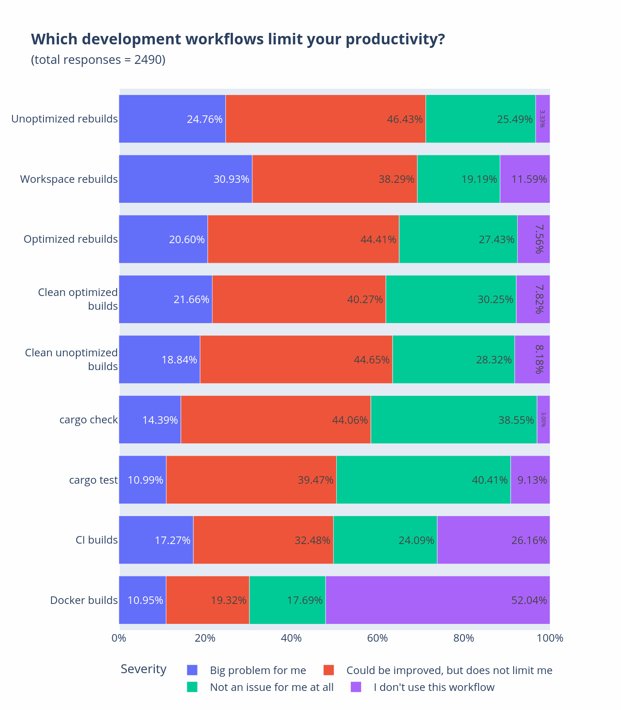
</noscript>

    

        [<a href="limiting-workflows.png" target="_href_" title="Download chart as PNG">PNG</a>]&nbsp;[<a href="limiting-workflows.svg" target="_href_" title="Download chart as SVG">SVG</a>]
    

<!-- Chart limiting-workflows end -->

We can see that all the workflows that we asked about cause significant problems to at least a fraction of the respondents, but some of them more so than others. To gain more information about the specific problems that developers face, we also asked a more detailed, follow-up question:

<!-- Chart problems start -->

    
<noscript>
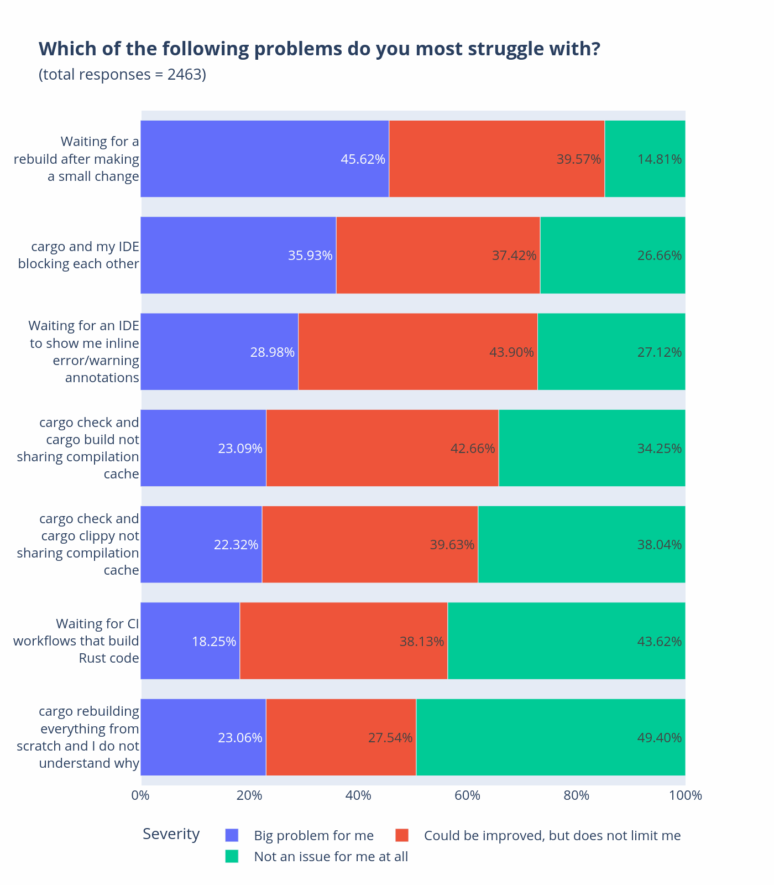
</noscript>

    

        [<a href="problems.png" target="_href_" title="Download chart as PNG">PNG</a>]&nbsp;[<a href="problems.svg" target="_href_" title="Download chart as SVG">SVG</a>]
    

<!-- Chart problems end -->

Based on the answers to these two questions and other experiences shared in the open answers, we identified three groups of workflows that we will discuss next:

- Incremental rebuilds after making a small change
- Type checking using `cargo check` or with a code editor
- Clean, from-scratch builds, including CI builds

### Incremental rebuilds

Waiting too long for an incremental rebuild after making a small source code change was by far the most common complaint in the open answers that we received, and it was also the most common problem that respondents said they struggle with. Based on our respondents' answers, this comes down to three main bottlenecks:

- **Changes in workspaces trigger unnecessary rebuilds.** If you modify a crate in a workspace that has several dependent crates and perform a rebuild, all those dependent crates will currently have to be recompiled. This can cause a lot of unnecessary work and dramatically increase the latency of rebuilds in large (or deep) workspaces. We have some ideas about how to improve this workflow, such as the ["Relink, don't rebuild"][project-goal-rdr] proposal, but these are currently in a very experimental stage.
- **The linking phase is too slow.** This was a very common complaint, and it is indeed a real issue, because unlike the rest of the compilation process, linking is always performed "from scratch". The Rust compiler usually delegates linking to an external/system linker, so its performance is not completely within our hands. However, we are attempting to switch to faster linkers by default. For example, the most popular target (`x86_64-unknown-linux-gnu`) will very soon switch to the [LLD linker][rust-lld-blog-post], which provides significant performance wins. Long-term, it is possible that some linkers (e.g. [wild]) will allow us to perform even linking incrementally.
- **Incremental rebuild of a single crate is too slow.** The performance of this workflow depends on the cleverness of the incremental engine of the Rust compiler. While it is already very sophisticated, there are some parts of the compilation process that are not incremental yet or that are not cached in an optimal way. For example, expansion of derive proc macros is not currently cached, although work is underway to [change that][cache-proc-macros].

Several users have mentioned that they would like to see Rust perform hot-patching (such as the `subsecond` system used by the Dioxus UI framework or similar approaches used e.g. by the Bevy game engine). While these hot-patching systems are very exciting and can produce truly near-instant rebuild times for specialized use-cases, it should be noted that they also come with many limitations and edge-cases, and it does not seem that a solution that would allow hot-patching to work in a robust way has been found yet.

To gauge how long is the typical rebuild latency, we asked our respondents to pick a single Rust project that they work on and which causes them to struggle with build times the most, and tell us how long they have to wait for it to be rebuilt after making a code change.

<!-- Chart rebuild-wait-time start -->

    
<noscript>
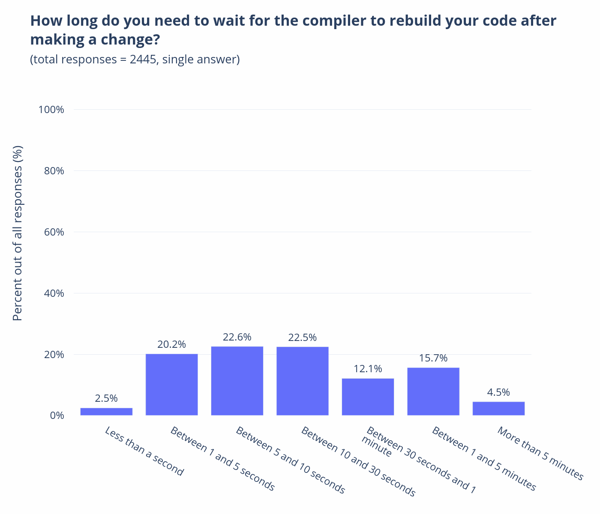
</noscript>

    

        [<a href="rebuild-wait-time.png" target="_href_" title="Download chart as PNG">PNG</a>]&nbsp;[<a href="rebuild-wait-time.svg" target="_href_" title="Download chart as SVG">SVG</a>]
    

<!-- Chart rebuild-wait-time end -->

Even though many developers do not actually experience this latency after each code change, as they consume results of type checking or inline annotations in their code editor, the fact that 55% of respondents have to wait more than ten seconds for a rebuild is far from ideal.

If we partition these results based on answers to other questions, it is clear that the rebuild times depend a lot on the size of the project:

<!-- Chart rebuild-wait-time-code-size start -->

    
<noscript>
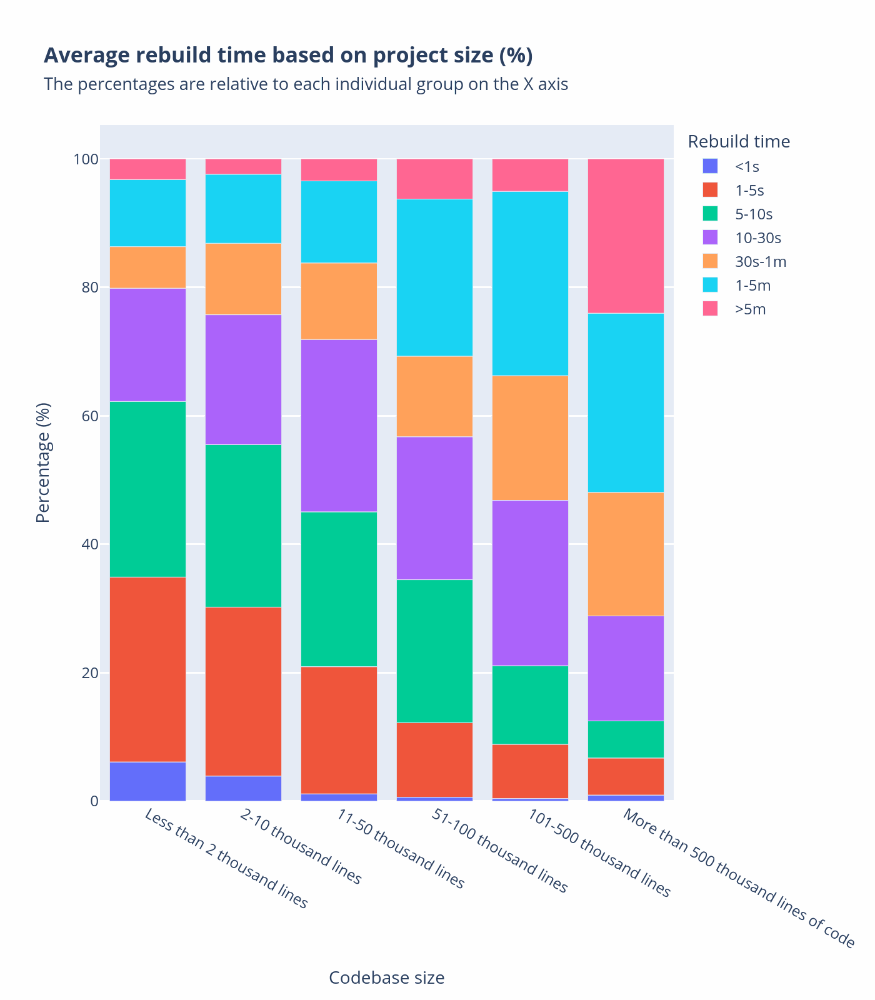
</noscript>

    

        [<a href="rebuild-wait-time-code-size.png" target="_href_" title="Download chart as PNG">PNG</a>]&nbsp;[<a href="rebuild-wait-time-code-size.svg" target="_href_" title="Download chart as SVG">SVG</a>]
    

<!-- Chart rebuild-wait-time-code-size end -->

And to a lesser factor also on the number of used dependencies:

<!-- Chart rebuild-wait-time-dep-count start -->

    
<noscript>
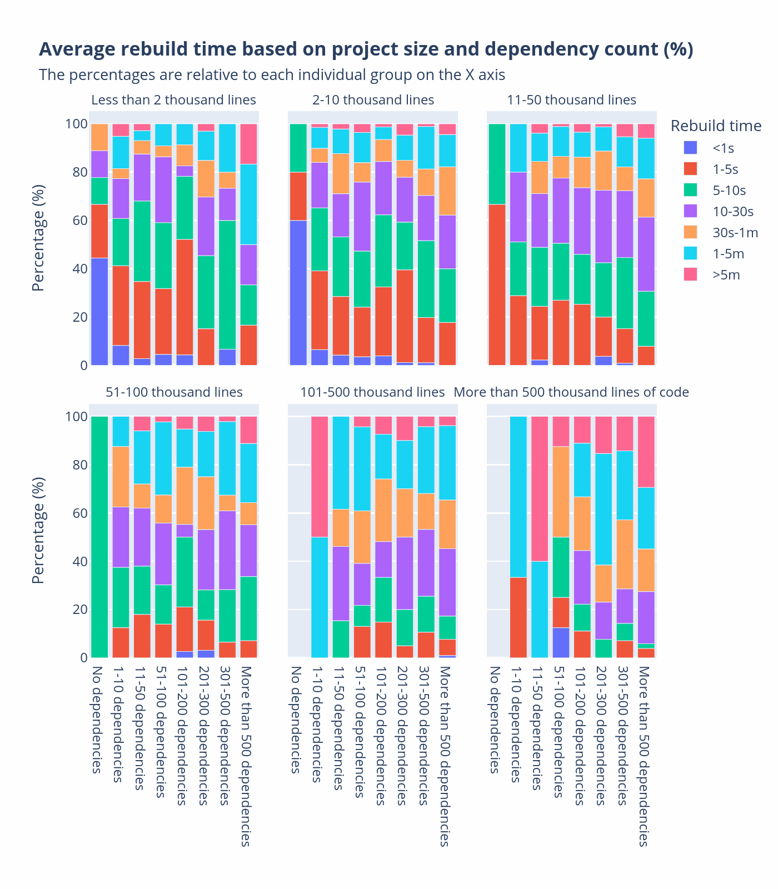
</noscript>

    

        [<a href="rebuild-wait-time-dep-count.png" target="_href_" title="Download chart as PNG">PNG</a>]&nbsp;[<a href="rebuild-wait-time-dep-count.svg" target="_href_" title="Download chart as SVG">SVG</a>]
    

<!-- Chart rebuild-wait-time-dep-count end -->

We would love to get to a point where the time needed to rebuild a Rust project is dependent primarily on the amount of performed code changes, rather than on the size of the codebase, but clearly we are not there yet.

### Type checking and IDE performance

Approximately 60% of respondents say that they use `cargo` terminal commands to type check, build or test their code, with `cargo check` being the most commonly used command performed after each code change:

<!-- Chart cargo-commands start -->

    
<noscript>
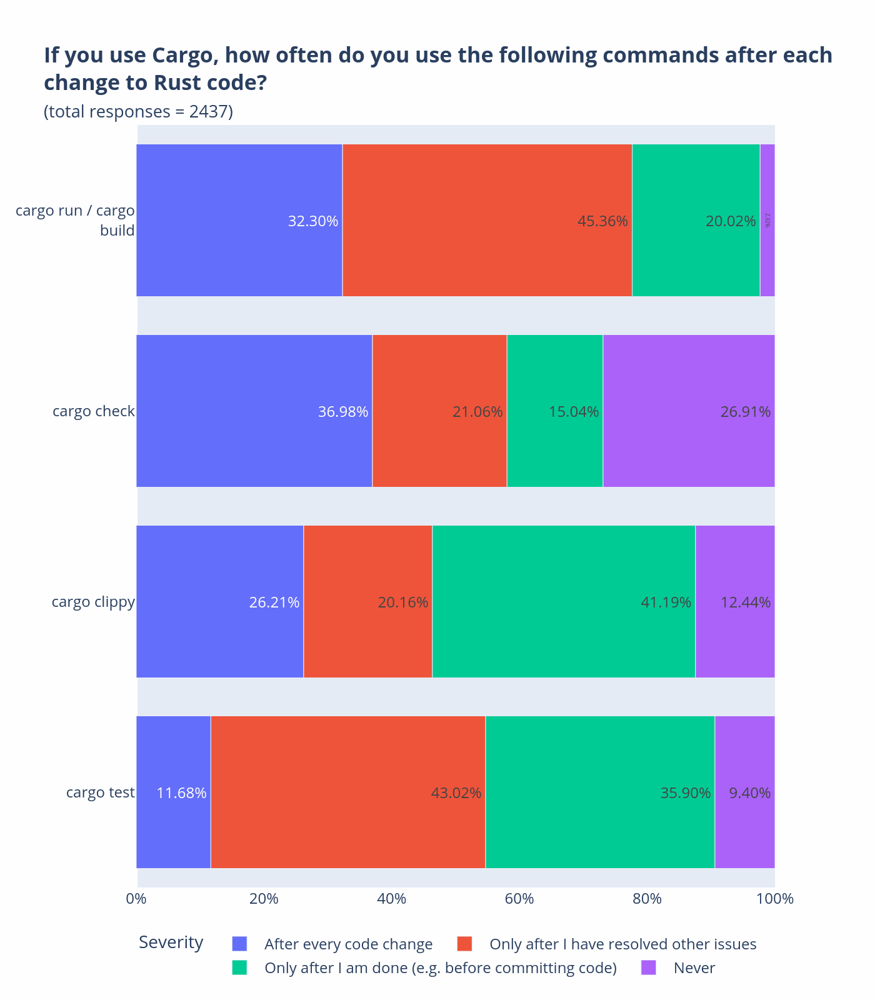
</noscript>

    

        [<a href="cargo-commands.png" target="_href_" title="Download chart as PNG">PNG</a>]&nbsp;[<a href="cargo-commands.svg" target="_href_" title="Download chart as SVG">SVG</a>]
    

<!-- Chart cargo-commands end -->

While the performance of `cargo check` does not seem to be as big of a blocker as e.g. incremental rebuilds, it also causes some pain points. One of the most common ones present in the survey responses is the fact that `cargo check` does not share the build cache with `cargo build`. This causes additional compilation to happen when you run e.g. `cargo check` several times to find all type errors, and when it succeeds, you follow up with `cargo build` to actually produce a built artifact. This workflow is an example of competing trade-offs, because sharing the build cache between these two commands by unifying them more would likely make `cargo check` itself slightly slower, which might be undesirable to some users. It is possible that we might be able to find some middle ground to improve the status quo though. You can follow updates to this work in [this issue][cargo-check-build-reuse-issue].

A related aspect is the latency of type checking in code editors and IDEs. Around 87% of respondents say that they use inline annotations in their editor as the primary mechanism of inspecting compiler errors, and around 33% of them consider waiting for these annotations to be a big blocker. In the open answers, we also received many reports of Rust Analyzer's performance and memory usage being a limiting factor.

The maintainers of Rust Analyzer are working hard on improving its performance. Its caching system is [being improved][ra-talk-rustweek] to reduce analysis latency, the distributed builds of the editor are now [optimized with PGO][ra-pgo], which provided 15-20% performance wins, and work is underway to integrate the compiler's [new trait solver][ra-new-trait-solver] into Rust Analyzer, which could eventually also result in increased performance.

More than 35% users said that they consider the IDE and Cargo [blocking one another][ra-cargo-blocking-issue] to be a big problem. There is an existing workaround for this, where you can configure Rust Analyzer to use a different target directory than Cargo, at the cost of increased disk space usage. We realized that this workaround has not been documented in a very visible way, so we added it to the [FAQ section][ra-cargo-blocking-faq] of the Rust Analyzer book.

### Clean and CI builds

Around 20% of participants responded that clean builds are a significant blocker for them. In order to improve their performance, you can try a recently introduced experimental Cargo and compiler option called [`hint-mostly-unused`][hint-mostly-unused], which can in certain situations help improve the performance of clean builds, particularly if your dependencies contain a lot of code that might not actually be used by your crate(s).

One area where clean builds might happen often is Continuous Integration (CI). 1495 respondents said that they use CI to build Rust code, and around 25% of them consider its performance to be a big blocker for them. However, almost 36% of respondents who consider CI build performace to be a big issue said that they do not use any caching in CI, which we found surprising. One explanation might be that the generated artifacts (the `target` directory) is too large for effective caching, and runs into usage limits of CI providers, which is something that we saw mentioned repeatedly in the open answers section. We have recently introduced an experimental Cargo and compiler option called [`-Zembed-metadata`][cargo-no-embed-metadata] that is designed to reduce the size of the `target` directories, and work is also underway to regularly [garbage collect][cargo-garbage-collect] them. This might help with the disk space usage issue somewhat in the future.

One additional way to significantly reduce disk usage is to reduce the amount of generated debug information, which brings us to the next section.

## Debug information

The default Cargo `dev` profile generates full debug information (debuginfo) both for workspace crates and also all dependencies. This enables stepping through code with a debugger, but it also increases disk usage of the `target` directory, and crucially it makes compilation and linking slower. This effect can be quite large, as our benchmarks show a possible improvement of [2-30% in cycle counts][perf-debug-line-tables-only] if we reduce the debuginfo level to `line-tables-only` (which only generates enough debuginfo for backtraces to work), and the improvements are [even larger][perf-debug-false] if we disable debuginfo generation completely[^lld].

[^lld]: This benchmark was already performed using the fast LLD linker. If a slower linker was used, the build time wins would likely be even larger.

However, if Rust developers debug their code after most builds, then this cost might be justified. We thus asked them how often they use a debugger to debug their Rust code:

<!-- Chart debugger start -->

    
<noscript>
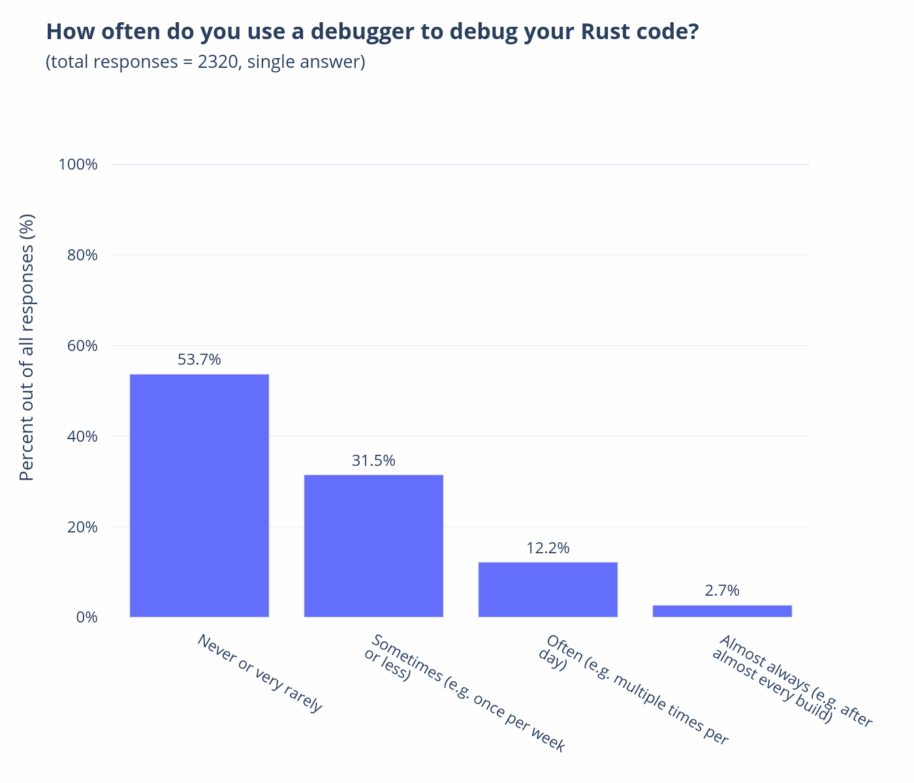
</noscript>

    

        [<a href="debugger.png" target="_href_" title="Download chart as PNG">PNG</a>]&nbsp;[<a href="debugger.svg" target="_href_" title="Download chart as SVG">SVG</a>]
    

<!-- Chart debugger end -->

Based on these results, it seems that the respondents of our survey do not actually use a debugger all that much[^why-not-debug].

[^why-not-debug]: Potentially because of the strong invariants upheld by the Rust type system, and partly also because the Rust debugging experience might not be optimal for many users, which is a feedback that we received in the [State of Rust 2024 survey][state-of-rust-2024].

However, when we asked people if they require debuginfo to be generated by default, the responses were much less clear-cut:

<!-- Chart required-debuginfo start -->

    
<noscript>
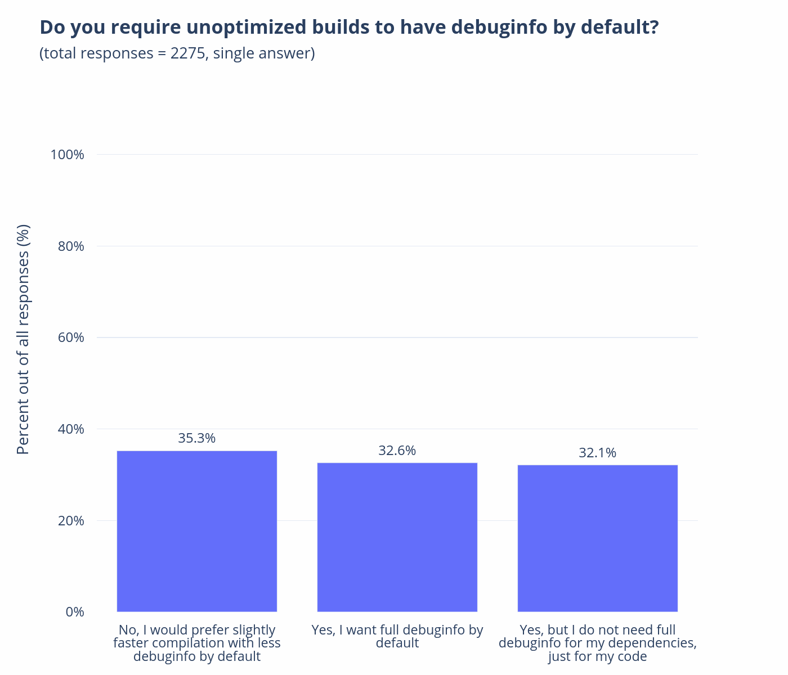
</noscript>

    

        [<a href="required-debuginfo.png" target="_href_" title="Download chart as PNG">PNG</a>]&nbsp;[<a href="required-debuginfo.svg" target="_href_" title="Download chart as SVG">SVG</a>]
    

<!-- Chart required-debuginfo end -->

This is the problem with changing defaults: it is challenging to improve the workflows of one user without regressing the workflow of another.  For completeness, here are the answers to the previous question partitioned on the answer to the "How often do you use a debugger" question:

<!-- Chart required-debuginfo-debugger start -->

    
<noscript>
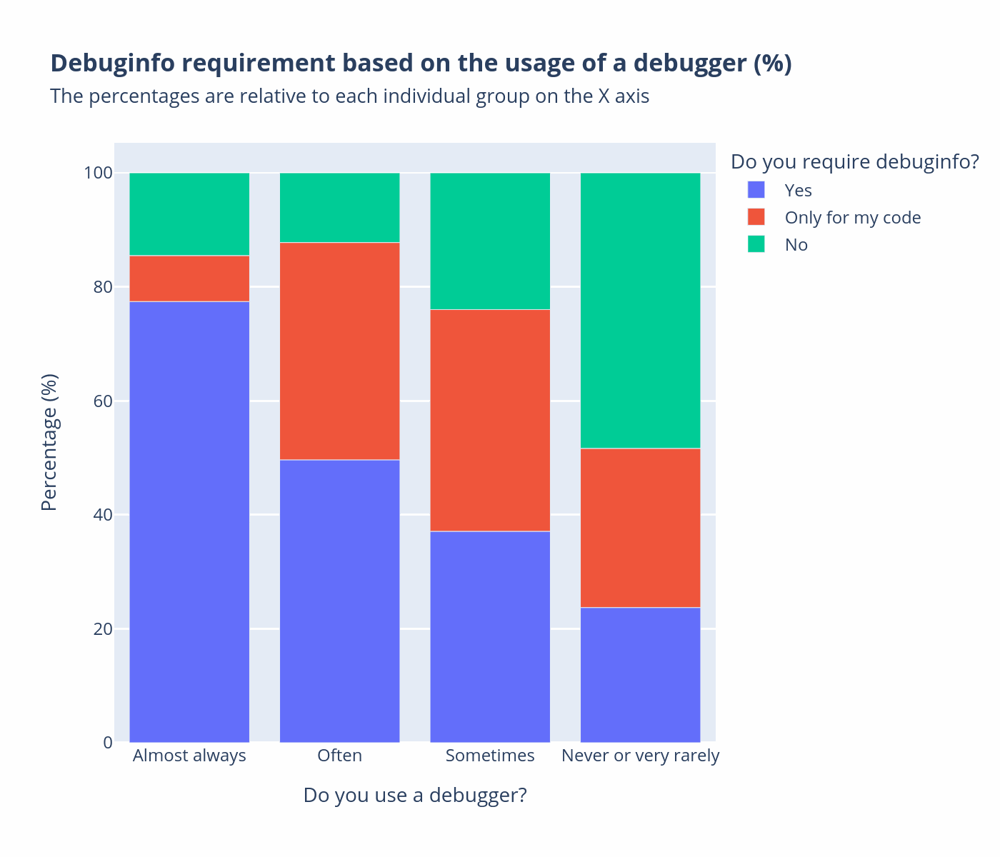
</noscript>

    

        [<a href="required-debuginfo-debugger.png" target="_href_" title="Download chart as PNG">PNG</a>]&nbsp;[<a href="required-debuginfo-debugger.svg" target="_href_" title="Download chart as SVG">SVG</a>]
    

<!-- Chart required-debuginfo-debugger end -->

It was surprising for us to see that around a quarter of respondents who (almost) never use a debugger still want to have full debuginfo generated by default.

Of course, you can always disable debuginfo manually to improve your build performance, but not everyone knows about that option, and defaults matter a lot. The Cargo team is [considering][cargo-issue-dev-debug] ways of changing the status quo, for example by reducing the level of generated debug information in the `dev` profile, and introducing a new built-in profile designed for debugging.

## Workarounds for improving build performance

Build performance of Rust is affected by many different aspects, including the configuration of the build system (usually Cargo) and the Rust compiler, but also the organization of Rust crates and used source code patterns. There are thus several approaches that can be used to improve build performance by either using different configuration options or restructuring source code. We asked our respondents if they are even aware of such possibilities, whether they have tried them and how effective they were:

<!-- Chart compile-time-improvement-mechanisms start -->

    
<noscript>
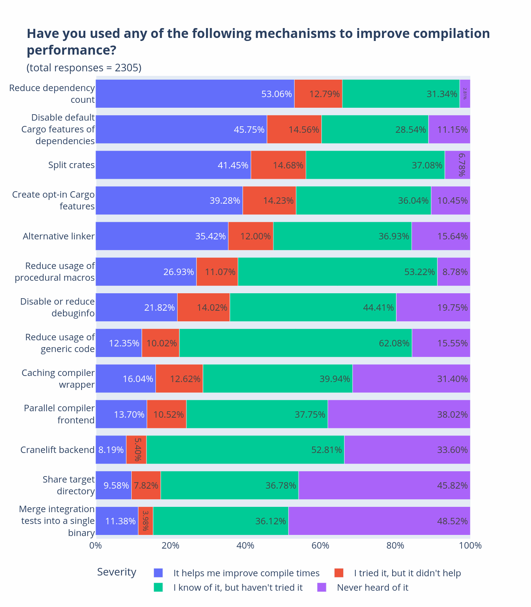
</noscript>

    

        [<a href="compile-time-improvement-mechanisms.png" target="_href_" title="Download chart as PNG">PNG</a>]&nbsp;[<a href="compile-time-improvement-mechanisms.svg" target="_href_" title="Download chart as SVG">SVG</a>]
    

<!-- Chart compile-time-improvement-mechanisms end -->

It seems that the most popular (and effective) mechanisms for improving build performance are reducing the number of dependencies and their activated features, and splitting larger crates into smaller crates. The most common way of improving build performance without making source code changes seems to be the usage of an alternative linker. It seems that especially the mold and LLD linkers are very popular:

<!-- Chart alternative-linker start -->

    
<noscript>
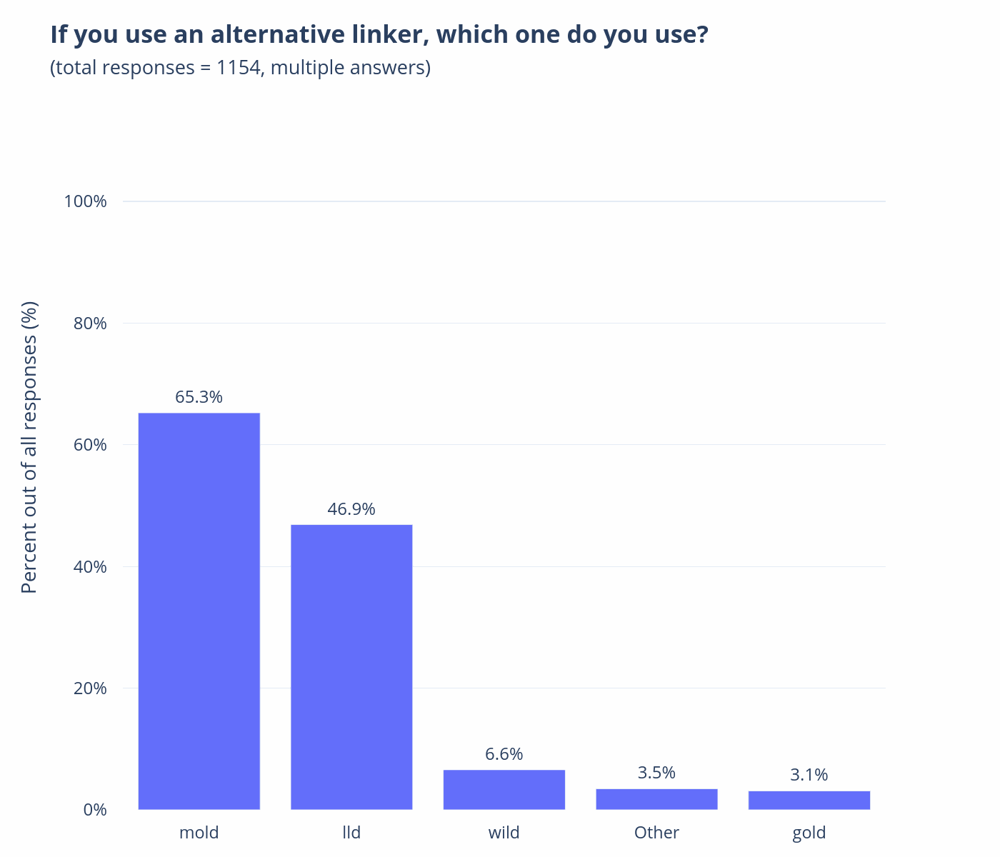
</noscript>

    

        [<a href="alternative-linker.png" target="_href_" title="Download chart as PNG">PNG</a>]&nbsp;[<a href="alternative-linker.svg" target="_href_" title="Download chart as SVG">SVG</a>]&nbsp;[<a href="alternative-linker-wordcloud.png" target="_href_" title="Download open answers as wordcloud PNG">Wordcloud of open answers</a>]
    

<!-- Chart alternative-linker end -->

We have good news here! The most popular `x86_64-unknown-linux-gnu` Linux target will start using the LLD linker in the next Rust stable release, resulting in faster link times *by default*. Over time, we will be able to evaluate how disruptive is this change to the overall Rust ecosystem, and whether we could e.g. switch to a different (even faster) linker.

### Build performance guide

We were surprised by the relatively large number of users who were unaware of some approaches for improving compilation times, in particular those that are very easy to try and typically do not require source code changes (such as reducing debuginfo or using a different linker or a codegen backend). Furthermore, almost 42% of respondents have not tried to use *any* mechanism for improving build performance whatsoever. While this is not totally unexpected, as some of these mechanisms require using the nightly toolchain or making non-trivial changes to source code, we think that one the reasons is also simply that Rust developers might not know about these mechanisms being available. In the open answers, several people also noted that they would appreciate if there was some sort of official guidance from the Rust Project about such mechanisms for improving compile times.

It should be noted that the mechanisms that we asked about are in fact workarounds that present various trade-offs, and these should always be carefully considered. Several people have expressed dissatisfaction with some of these workarounds in the open answers, as they find it unacceptable to modify their code (which could sometimes result e.g. in increased maintenance costs or worse runtime performance) just to achieve reasonable compile times. Nevertheless, these workarounds can still be incredibly useful in some cases.

The feedback that we received shows that it might be beneficial to spread awareness of these mechanisms in the Rust community more, as some of them can make a really large difference in build performance, but also to candidly explain the trade-offs that they introduce. Even though several great resources that cover this topic already exist online, we decided to create an [official guide][cargo-build-performance-guide] for optimizing build performance (currently work-in-progress), which will likely be hosted in the [Cargo book][cargo-book]. The aim of this guide is to increase the awareness of various mechanisms for improving build performance, and also provide a framework for evaluating their trade-offs.

Our long-standing goal is to make compilation so fast that similar workarounds will not be necessary anymore for the vast majority of use-cases. However, there is no free lunch, and the combination of Rust's strong type system guarantees, its compilation model and also heavy focus on runtime performance often go against very fast (re)build performance, and might require usage of at least some workarounds. We hope that this guide will help Rust developers learn about them and evaluate them for their specific use-case.

## Understanding why builds are slow

When Rust developers experience slow builds, it can be challenging to identify where exactly is the compilation process spending time, and what could be the bottleneck. It seems that only very few Rust developers leverage tools for profiling their builds:

<!-- Chart profiling-tools start -->

    
<noscript>
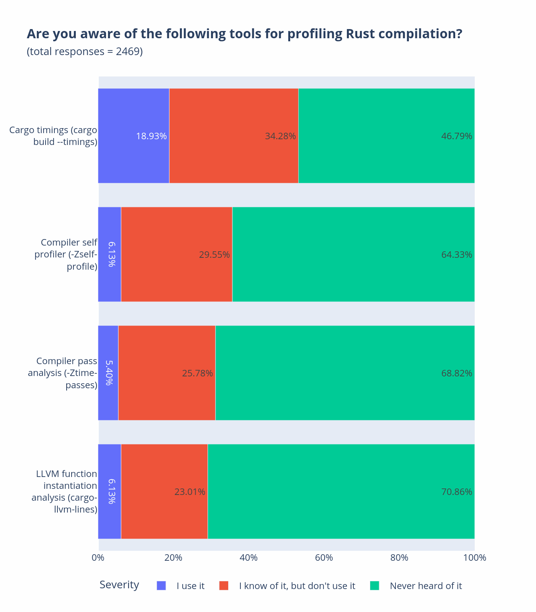
</noscript>

    

        [<a href="profiling-tools.png" target="_href_" title="Download chart as PNG">PNG</a>]&nbsp;[<a href="profiling-tools.svg" target="_href_" title="Download chart as SVG">SVG</a>]
    

<!-- Chart profiling-tools end -->

This hardly comes as a surprise. There are currently not that many ways of intuitively understanding the performance characteristics of Cargo and `rustc`. Some tools offer only a limited amount of information (e.g. `cargo build --timings`), and the output of others (e.g. `-Zself-profile`) is very hard to interpret without knowledge of the compiler internals.

To slightly improve this situation, we have recently added support for displaying [link times][cargo-linker-timings] to the `cargo build --timings` output, to provide more information about the possible bottleneck in crate compilation (note this feature has not been stabilized yet).

Long-term, it would be great to have tooling that could help Rust developers diagnose compilation bottlenecks in their crates without them having to understand how the compiler works. For example, it could help answer questions such as "Which code had to be recompiled after a given source change" or "Which (proc) macros take the longest time to expand or produce the largest output", and ideally even offer some actionable suggestions. We plan to work on such tooling, but it will take time to manifest.

One approach that could help Rust compiler contributors understand why are Rust (re)builds slow "in the wild" is the opt-in [compilation metrics collection initiative][project-goal-metrics-initiative].

## What's next

There are more interesting things in the survey results, for example how do answers to selected questions differ based on the used operating system. You can examine the full results in the [full report PDF][report].

We would like to thank once more everyone who has participated in our survey. It helped us understand which workflows are the most painful for Rust developers, and especially the open answers provided several great suggestions that we tried to act upon.

Even though the Rust compiler is getting increasingly faster every year, we understand that many Rust developers require truly significant improvements to improve their productivity, rather than "just" incremental performance wins. Our goal for the future is to finally stabilize long-standing initiatives that could improve build performance a lot, such as the [Cranelift codegen backend][project-goal-cranelift] or the [parallel compiler frontend][project-goal-parallel-frontend]. One such initiative (using a [faster linker by default][rust-lld-blog-post]) will finally land soon, but the fact that it took many years shows how difficult it is to make such large cutting changes to the compilation process.

There are other ambitious ideas for reducing (re)build times, such as [avoiding unnecessary workspace rebuilds][project-goal-rdr] or e.g. using some form of [incremental linking][wild], but these will require a lot of work and design discussions.

We know that some people are wondering why it takes so much time to achieve progress in improving the build performance of Rust. The answer is relatively simple. These changes require a lot of work, domain knowledge (that takes a relatively long time to acquire) and many discussions and code reviews, and the pool of people that have time and motivation to work on them or review these changes is very limited. Current compiler maintainers and contributors (many of whom work on the compiler as volunteers, without any funding) work very hard to keep up with maintaining the compiler and keeping it working with the high-quality bar that Rust developers expect, across many targets, platforms and operating systems. Introducing large structural changes, which are likely needed to reach massive performance improvements, would require a lot of concentrated effort and funding.

[rust-compiler-performance-survey]: https://blog.rust-lang.org/2025/06/16/rust-compiler-performance-survey-2025
[report]: https://raw.githubusercontent.com/rust-lang/surveys/main/surveys/2025/compiler-performance-survey/report/compiler-performance-2025-report.pdf
[perf-debug-line-tables-only]: https://perf.rust-lang.org/compare.html?start=0d0f4eac8b98133e5da6d3604d86a8f3b5a67844&end=71ea9a0cacc3473c7b6852c17453259f74635c62&stat=cycles%3Au&doc=false&check=false&opt=false
[perf-debug-false]: https://perf.rust-lang.org/compare.html?start=bea625f3275e3c897dc965ed97a1d19ef7831f01&end=87c3e1ecd699573f7cb4c9074b8727956bd37a74&stat=cycles%3Au&check=false&opt=false&doc=false
[cargo-issue-dev-debug]: https://github.com/rust-lang/cargo/issues/15931
[state-of-rust-2024]: https://blog.rust-lang.org/2025/02/13/2024-State-Of-Rust-Survey-results/#challenges
[cargo-build-performance-guide]: https://github.com/rust-lang/cargo/pull/15924
[cargo-book]: https://doc.rust-lang.org/cargo
[cargo-linker-timings]: https://github.com/rust-lang/cargo/pull/15923
[cargo-no-embed-metadata]: https://doc.rust-lang.org/nightly/cargo/reference/unstable.html#no-embed-metadata
[cargo-check-build-reuse-issue]: https://github.com/rust-lang/cargo/issues/3501
[cargo-garbage-collect]: https://github.com/rust-lang/cargo/issues/13136
[cache-proc-macros]: https://github.com/rust-lang/rust/pull/145354
[rust-lld-blog-post]: https://blog.rust-lang.org/2025/09/01/rust-lld-on-1.90.0-stable
[project-goal-rdr]: https://rust-lang.github.io/rust-project-goals/2025h2/relink-dont-rebuild.html
[project-goal-cranelift]: https://rust-lang.github.io/rust-project-goals/2025h2/production-ready-cranelift.html
[project-goal-parallel-frontend]: https://rust-lang.github.io/rust-project-goals/2025h2/parallel-front-end.html
[project-goal-metrics-initiative]: https://rust-lang.github.io/rust-project-goals/2025h1/metrics-initiative.html
[wild]: https://github.com/davidlattimore/wild
[hint-mostly-unused]: https://blog.rust-lang.org/inside-rust/2025/07/15/call-for-testing-hint-mostly-unused
[performance-talk-rustweek]: https://www.youtube.com/watch?v=-jy4HaNEJCo
[ra-talk-rustweek]: https://www.youtube.com/watch?v=tn6qwhMNBJo
[ra-pgo]: https://github.com/rust-lang/rust-analyzer/pull/19582
[ra-new-trait-solver]: https://github.com/rust-lang/rust-analyzer/pull/20329
[ra-cargo-blocking-issue]: https://github.com/rust-lang/cargo/issues/4282
[ra-cargo-blocking-faq]: https://rust-analyzer.github.io/book/faq.html#rust-analyzer-and-cargo-compete-over-the-build-lock

<!-- Chart scripts -->

