+++
path = "2026/08/31/rust-debugging-survey-2026-results"
title = "Rust debugging survey 2026 results"
authors = ["Sam Kellam"]

[extra]
team = "the compiler team"
team_url = "https://www.rust-lang.org/governance/teams/compiler#team-compiler"
+++

One of the biggest challenges Rust developers report in our
[annual surveys][state-of-rust-2025] is a subpar debugging experience. So, back
in February, we ran our first [Rust Debugging Survey][rust-debugging-survey],
in the hopes of identifying how Rust developers are using debuggers and what
problems they are facing when doing so. We received over 2,300 responses, and
we'd like to thank everyone who took the time to participate in the survey!

In this report, we'll go over some of the results of the survey. If you'd like,
you can also check out [the complete results of the survey][report].

If you'd like to skip ahead to any particular section, you can do so with this
index:

- [Who Uses Debuggers?](#who-uses-debuggers)
- [How Are Debuggers Used?](#how-are-debuggers-used)
- [Challenges](#challenges)
- [Debugger Visualizers](#debugger-visualizers)
- [Closing Remarks](#closing-remarks)

## Who Uses Debuggers?

The first step to making sense of the survey results is understanding who took
the survey. We asked respondents to rate their Rust expertise, from "Never used
it" to "Advanced". Over 80% reported themselves as "Advanced" or "Intermediate",
split roughly evenly between the two:

<!-- Chart how-would-you-rate-your-rust-expertise start -->

    
<noscript>
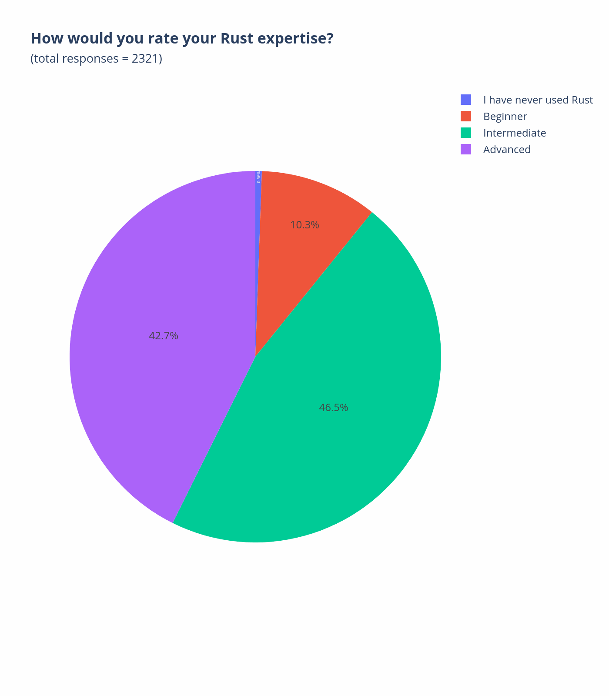
</noscript>

    

        [<a href="how-would-you-rate-your-rust-expertise.png" target="_href_" title="Download chart as PNG">PNG</a>]&nbsp;[<a href="how-would-you-rate-your-rust-expertise.svg" target="_href_" title="Download chart as SVG">SVG</a>]
    

<!-- Chart how-would-you-rate-your-rust-expertise end -->

We also asked respondents if they currently use or have used debuggers in Rust.
Over 46% said they currently do, with the remaining responses split between
"have in the past" and "never have". That means that over half of respondents do
not currently use a debugger for Rust!

<!-- Chart do-you-use-debuggers-in-rust start -->

    
<noscript>
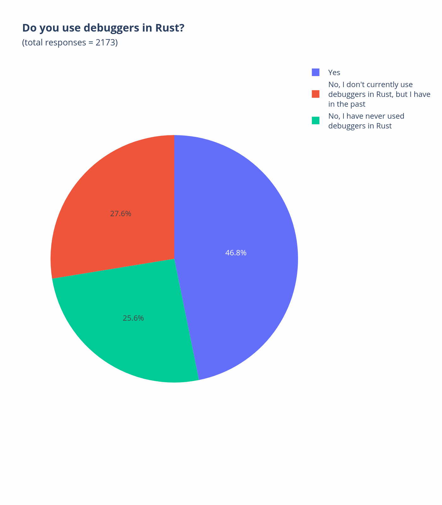
</noscript>

    

        [<a href="do-you-use-debuggers-in-rust.png" target="_href_" title="Download chart as PNG">PNG</a>]&nbsp;[<a href="do-you-use-debuggers-in-rust.svg" target="_href_" title="Download chart as SVG">SVG</a>]
    

<!-- Chart do-you-use-debuggers-in-rust end -->

Categorized by expertise, the responses reveal that roughly half of "beginners"
have never used debuggers in Rust! On the other hand, nearly half of "advanced
users" currently do use debuggers in Rust:

<!-- Chart do-you-use-debuggers-in-rust-per-expertise start -->

    
<noscript>
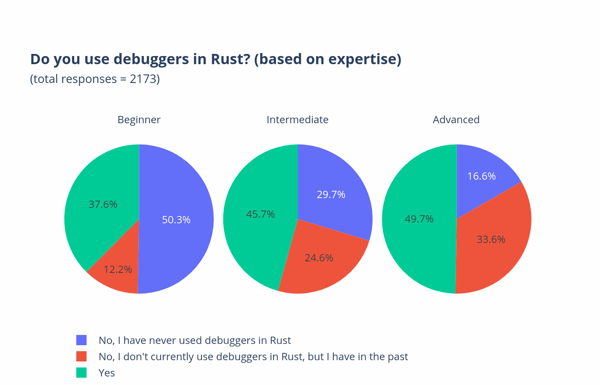
</noscript>

    

        [<a href="do-you-use-debuggers-in-rust-per-expertise.png" target="_href_" title="Download chart as PNG">PNG</a>]&nbsp;[<a href="do-you-use-debuggers-in-rust-per-expertise.svg" target="_href_" title="Download chart as SVG">SVG</a>]
    

<!-- Chart do-you-use-debuggers-in-rust-per-expertise end -->

For respondents who indicated they had previously used Rust but no longer did,
we asked if challenges with debugging support were why they stopped. For nearly
3%, the answer was "yes", with an additional 24% reporting debugging issues as
being partially responsible (though mind the small response count; most
respondents were active users of Rust):

<!-- Chart were-issues-with-debugging-support-the-primary-reason-why-you-stopped-using-rust start -->

    
<noscript>
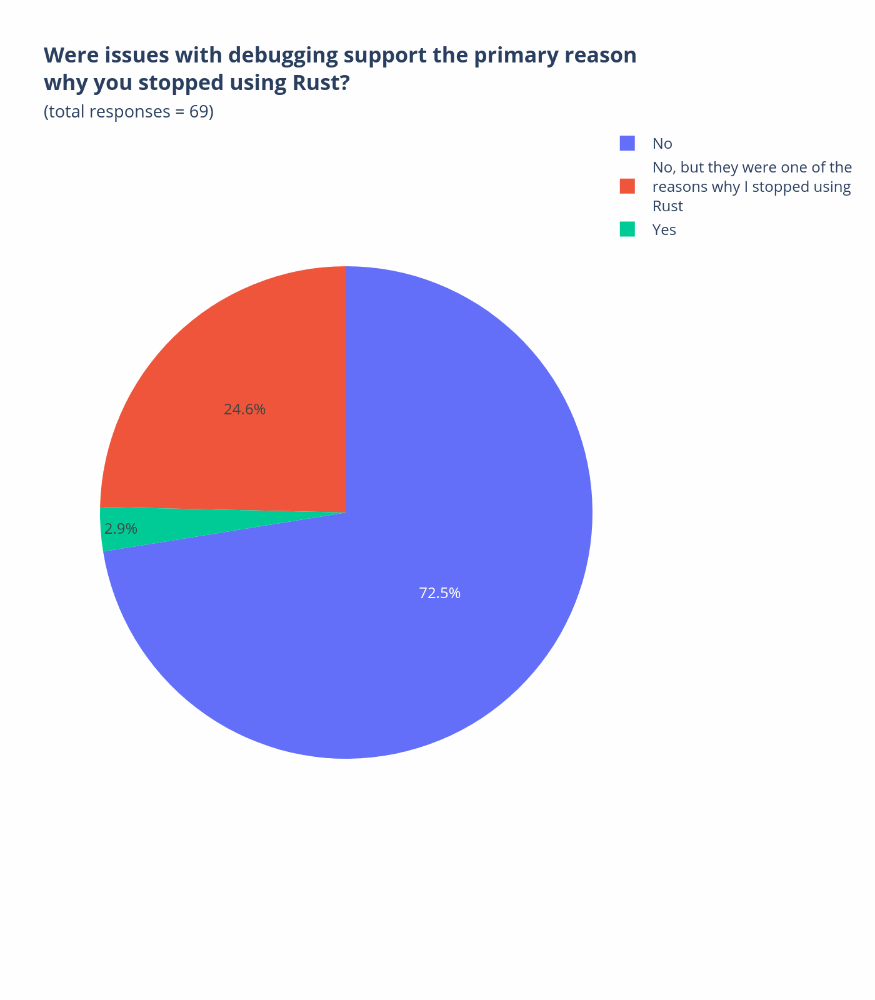
</noscript>

    

        [<a href="were-issues-with-debugging-support-the-primary-reason-why-you-stopped-using-rust.png" target="_href_" title="Download chart as PNG">PNG</a>]&nbsp;[<a href="were-issues-with-debugging-support-the-primary-reason-why-you-stopped-using-rust.svg" target="_href_" title="Download chart as SVG">SVG</a>]
    

<!-- Chart were-issues-with-debugging-support-the-primary-reason-why-you-stopped-using-rust end -->

## How Are Debuggers Used?

Knowing what debuggers developers are using and how is another important part of
understanding the challenges they face. To this end, we asked respondents how
they were debugging their programs. Unsurprisingly, most developers make use of
print debugging and the `dbg!` macro. Excluding those, using `lldb` inside an
IDE was the most popular choice, followed by `gdb` on the command line:

<!-- Chart what-tools-and-workflows-do-you-use-to-debug-rust-programs start -->

    
<noscript>
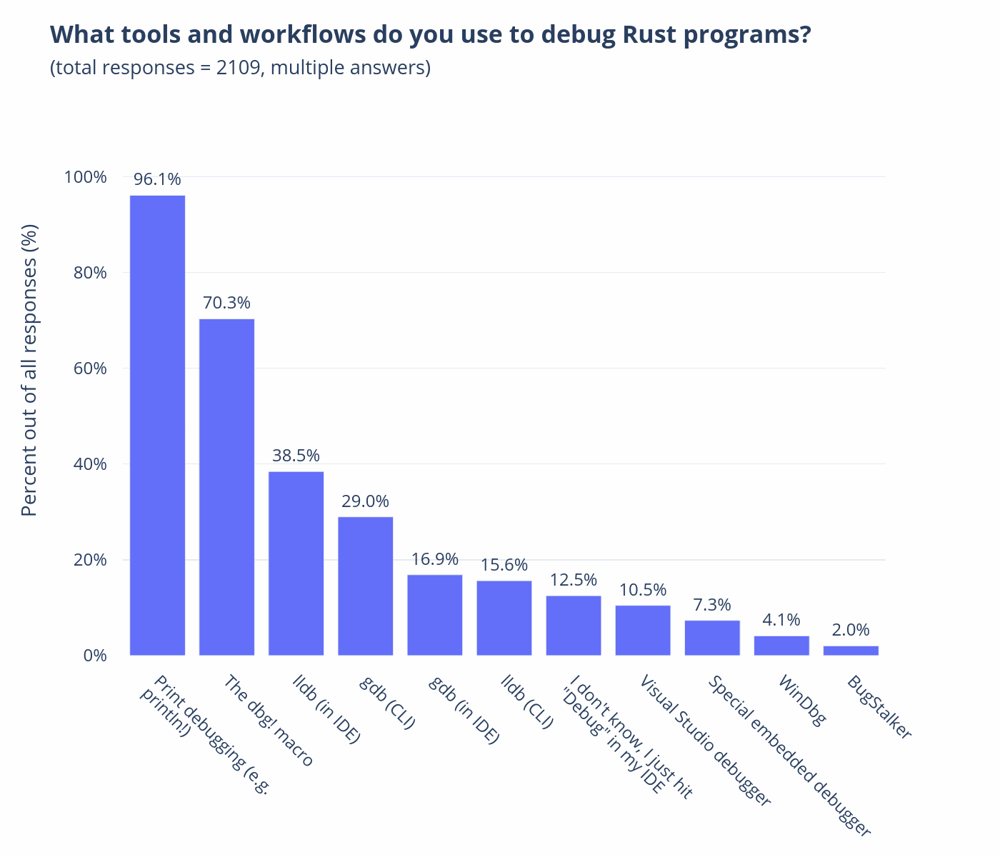
</noscript>

    

        [<a href="what-tools-and-workflows-do-you-use-to-debug-rust-programs.png" target="_href_" title="Download chart as PNG">PNG</a>]&nbsp;[<a href="what-tools-and-workflows-do-you-use-to-debug-rust-programs.svg" target="_href_" title="Download chart as SVG">SVG</a>]
    

<!-- Chart what-tools-and-workflows-do-you-use-to-debug-rust-programs end -->

We can get a more detailed breakdown of these results if we include the
operating system on which the respondents use a given debugging approach. We
examine this from two different angles. The first angle being, "On operating
system X, what percent of responses are using debugger Y?". Print debugging and
the `dbg!` macro are consistently the top two yet again, but looking beyond
that, things get more interesting. On Linux, using `gdb` on the command line was
the most popular choice by a thin margin, beating `lldb` in an IDE by only 0.4%.
On Windows, Windows Subsystem for Linux (WSL), and macOS, `lldb` in an IDE was
the top pick by at least 6%, making it a very popular choice in general. On
Windows, the three least popular choices were the command line debuggers (`gdb`
CLI, `lldb` CLI, and BugStalker), and on both Windows and macOS the third most
popular pick was, "I don't know". Those who were debugging on operating systems
not listed (Other) most frequently used some kind of special embedded debugger
or `gdb`:

<!-- Chart what-tools-and-workflows-do-you-use-to-debug-rust-programs-per-os-1 start -->

    
<noscript>
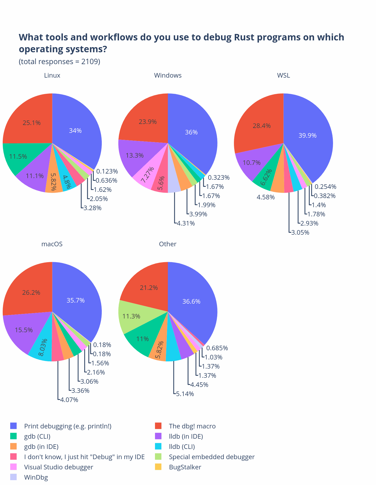
</noscript>

    

        [<a href="what-tools-and-workflows-do-you-use-to-debug-rust-programs-per-os-1.png" target="_href_" title="Download chart as PNG">PNG</a>]&nbsp;[<a href="what-tools-and-workflows-do-you-use-to-debug-rust-programs-per-os-1.svg" target="_href_" title="Download chart as SVG">SVG</a>]
    

<!-- Chart what-tools-and-workflows-do-you-use-to-debug-rust-programs-per-os-1 end -->

The other angle we can look at these responses from is, "For users of debugger
X, what percent of responses are using it on operating system Y?". For most
debuggers, Linux makes up the largest portion of uses, ranging from about 45% to
about 77%, followed by Windows, then macOS. The most notable exceptions are
WinDbg and the Visual Studio debugger, which are primarily used on Windows, and
`lldb`, which is used more on macOS than Windows in an IDE and on the command
line:

<!-- Chart what-tools-and-workflows-do-you-use-to-debug-rust-programs-per-os-2 start -->

    
<noscript>
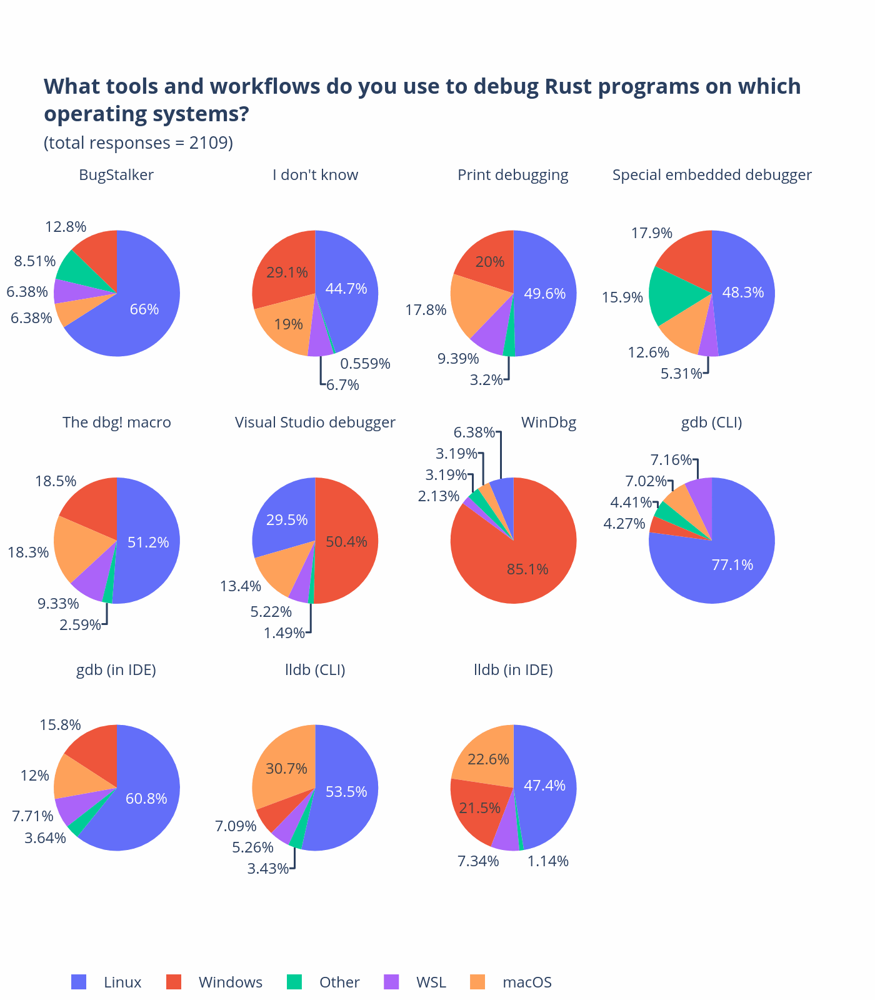
</noscript>

    

        [<a href="what-tools-and-workflows-do-you-use-to-debug-rust-programs-per-os-2.png" target="_href_" title="Download chart as PNG">PNG</a>]&nbsp;[<a href="what-tools-and-workflows-do-you-use-to-debug-rust-programs-per-os-2.svg" target="_href_" title="Download chart as SVG">SVG</a>]
    

<!-- Chart what-tools-and-workflows-do-you-use-to-debug-rust-programs-per-os-2 end -->

To the 6 respondents who use WinDbg on Linux: we wish you luck!

As for how people actually use their debugger of choice, the aggregate results
are not particularly surprising. Roughly 87% of users are using debuggers for
stepping line-by-line through programs and a little over half of users are using
debuggers to obtain stack traces from hung/crashed processes. Only a quarter of
the respondents use a debugger to debug async code. That might be partially
caused by the async Rust debugging experience being clumsy and incomplete, or it
could just be that users aren't writing much async code:

<!-- Chart what-are-you-using-debuggers-for start -->

    
<noscript>
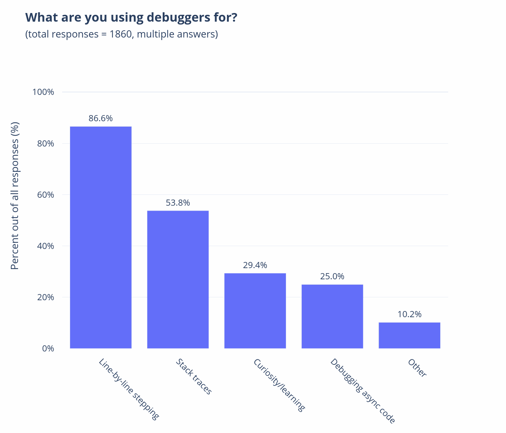
</noscript>

    

        [<a href="what-are-you-using-debuggers-for.png" target="_href_" title="Download chart as PNG">PNG</a>]&nbsp;[<a href="what-are-you-using-debuggers-for.svg" target="_href_" title="Download chart as SVG">SVG</a>]&nbsp;[<a href="what-are-you-using-debuggers-for-wordcloud.png" target="_href_" title="Download open answers as wordcloud PNG">Wordcloud of open answers</a>]
    

<!-- Chart what-are-you-using-debuggers-for end -->

If we break these results down by expertise, we can learn a bit more about usage
patterns. As users become more experienced with Rust, their use of debuggers for
learning purposes decreases, and they get more stack traces from crashed
processes:

<!-- Chart what-are-you-using-debuggers-for-per-expertise start -->

    
<noscript>
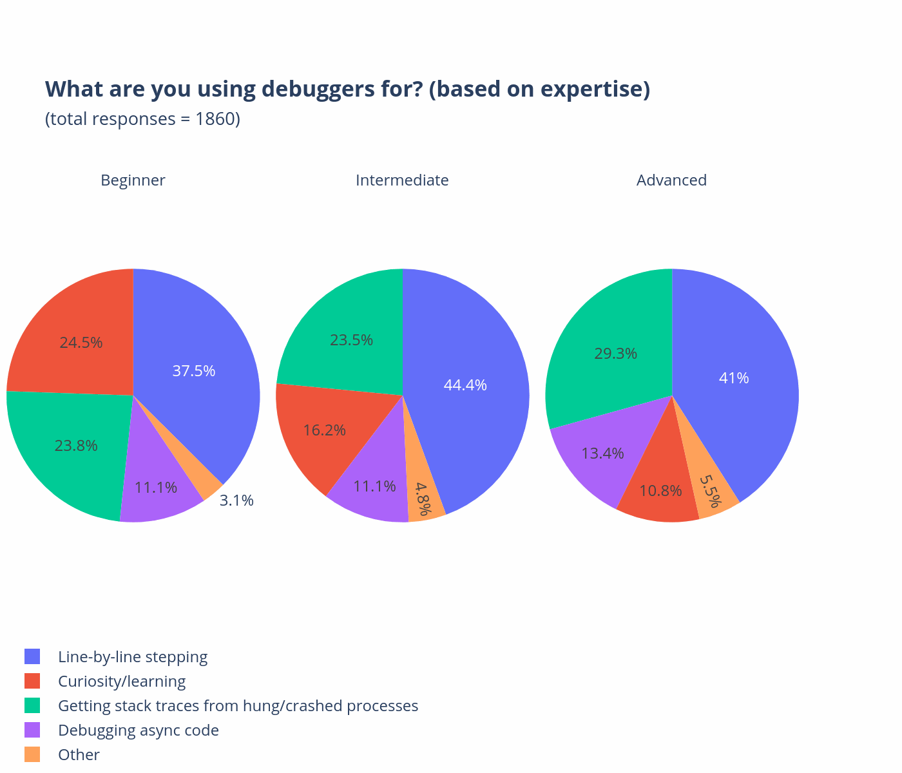
</noscript>

    

        [<a href="what-are-you-using-debuggers-for-per-expertise.png" target="_href_" title="Download chart as PNG">PNG</a>]&nbsp;[<a href="what-are-you-using-debuggers-for-per-expertise.svg" target="_href_" title="Download chart as SVG">SVG</a>]
    

<!-- Chart what-are-you-using-debuggers-for-per-expertise end -->

The final bit of insight into how Rustaceans use debuggers is if they are
debugging programs that use Rust alongside other programming languages. For 44%
of respondents, the answer is "yes", which is a pretty high number!

<!-- Chart do-you-debug-programs-that-combine-rust-with-other-languages start -->

    
<noscript>
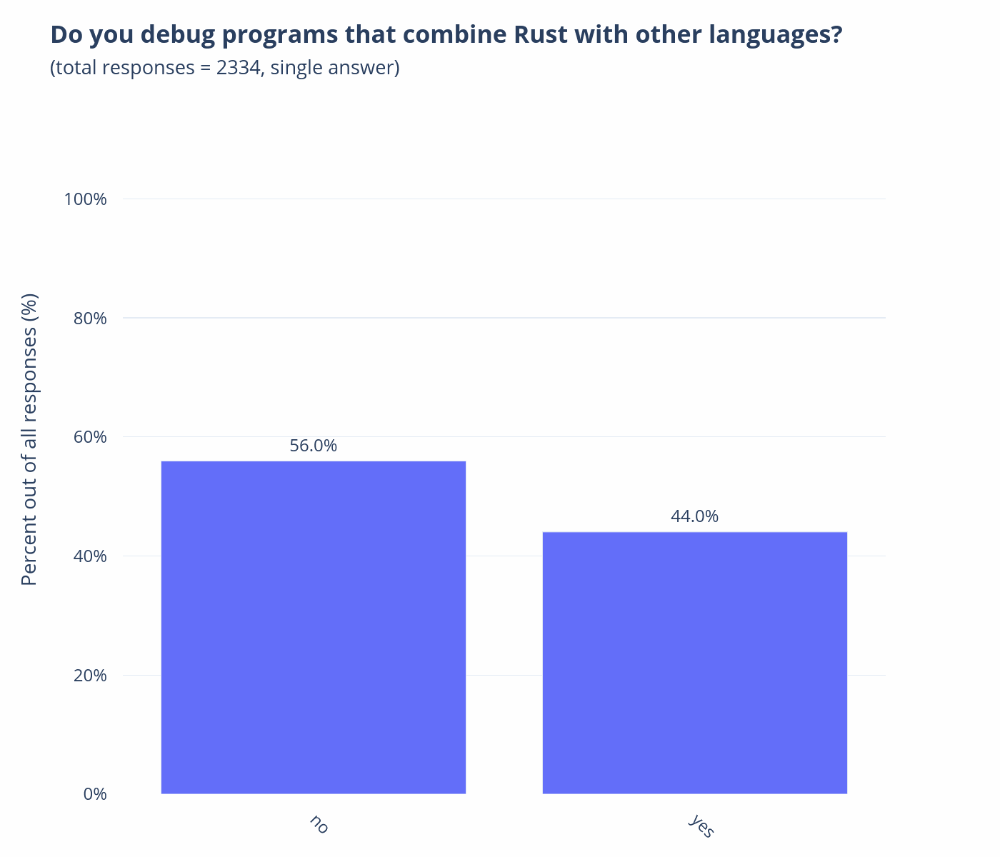
</noscript>

    

        [<a href="do-you-debug-programs-that-combine-rust-with-other-languages.png" target="_href_" title="Download chart as PNG">PNG</a>]&nbsp;[<a href="do-you-debug-programs-that-combine-rust-with-other-languages.svg" target="_href_" title="Download chart as SVG">SVG</a>]
    

<!-- Chart do-you-debug-programs-that-combine-rust-with-other-languages end -->

As for which languages those are, C dominates the scene at a little over 70%,
followed by C++ at about 43% and Python at about 20%:

<!-- Chart do-you-debug-programs-that-combine-rust-with-any-of-the-following-languages start -->

    
<noscript>
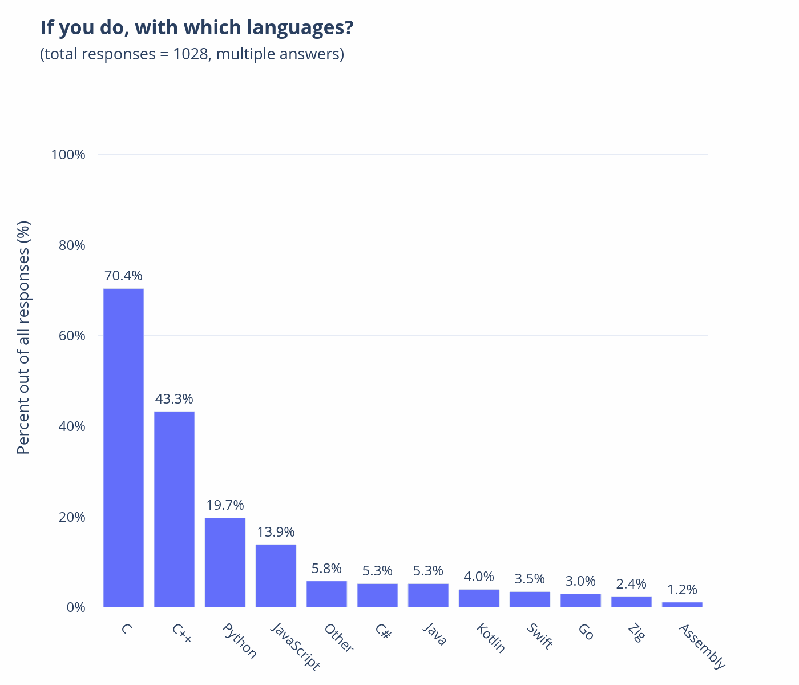
</noscript>

    

        [<a href="do-you-debug-programs-that-combine-rust-with-any-of-the-following-languages.png" target="_href_" title="Download chart as PNG">PNG</a>]&nbsp;[<a href="do-you-debug-programs-that-combine-rust-with-any-of-the-following-languages.svg" target="_href_" title="Download chart as SVG">SVG</a>]&nbsp;[<a href="do-you-debug-programs-that-combine-rust-with-any-of-the-following-languages-wordcloud.png" target="_href_" title="Download open answers as wordcloud PNG">Wordcloud of open answers</a>]
    

<!-- Chart do-you-debug-programs-that-combine-rust-with-any-of-the-following-languages end -->

## Challenges

Instead of diving right into asking, "what problems do you face when using
debuggers?", or something to that effect, we first asked respondents why they
decide against using debuggers whenever they do, including for reasons that
aren't necessarily "problems with debuggers".

The most commonly reported reason was that it was easier or faster to use logs
or print debugging to solve problems, reported by a little over 81% of
respondents. This could partially be explained by the open responses, which
featured complaints that debuggers were too difficult to set up and/or use
(especially on Windows, when dealing with Web Assembly, or in embedded
contexts) and sentiment suggesting that small and/or simple problems just don't
really need a debugger. It does leave one wondering if the user experience could
be made convenient enough to dethrone print debugging, but it seems hard to beat
something so intuitive. This is followed by roughly 37% of respondents who write
code that Just Works. Fair enough. After that, about 26% of respondents
indicated that they've decided not to use debuggers in situations where the
language features they were working with had poor support. This is slightly more
than issues with standard library types, at about 22%, which is slightly more
than issues with external library types, at about 20%:

<!-- Chart when-you-dont-use-a-debugger-why-dont-you start -->

    
<noscript>
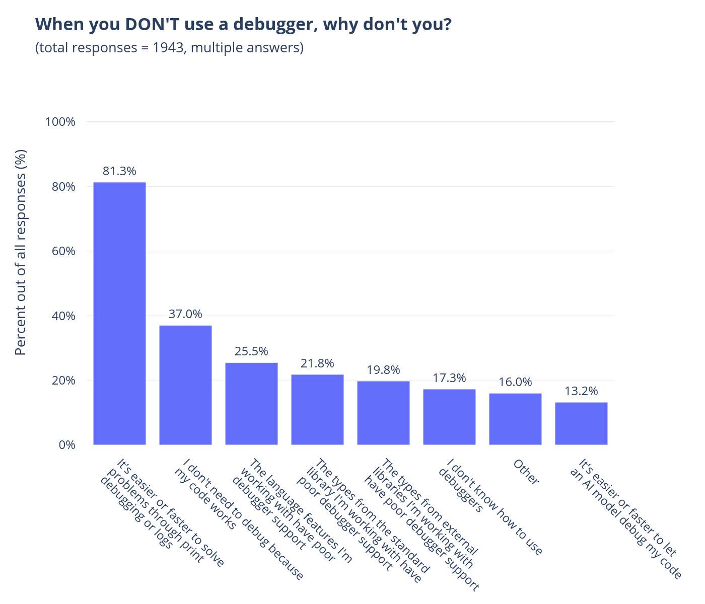
</noscript>

    

        [<a href="when-you-dont-use-a-debugger-why-dont-you.png" target="_href_" title="Download chart as PNG">PNG</a>]&nbsp;[<a href="when-you-dont-use-a-debugger-why-dont-you.svg" target="_href_" title="Download chart as SVG">SVG</a>]&nbsp;[<a href="when-you-dont-use-a-debugger-why-dont-you-wordcloud.png" target="_href_" title="Download open answers as wordcloud PNG">Wordcloud of open answers</a>]
    

<!-- Chart when-you-dont-use-a-debugger-why-dont-you end -->

As stepping through code was anticipated to be one of the most common uses for
debuggers, we directly asked respondents if they faced any issues when doing so.
A little over 51% of respondents said they did! Of those who reported that they
experienced issues stepping through code, we asked when they were experiencing
issues. Async code was the most common case reported at slightly over 28%,
followed by code involving macros at about 23%. The least common case reported
was code involving function pointers, at almost 6%:

<!-- Chart when-do-you-experience-issues-with-trying-to-step-through-code-with-your-debugger start -->

    
<noscript>
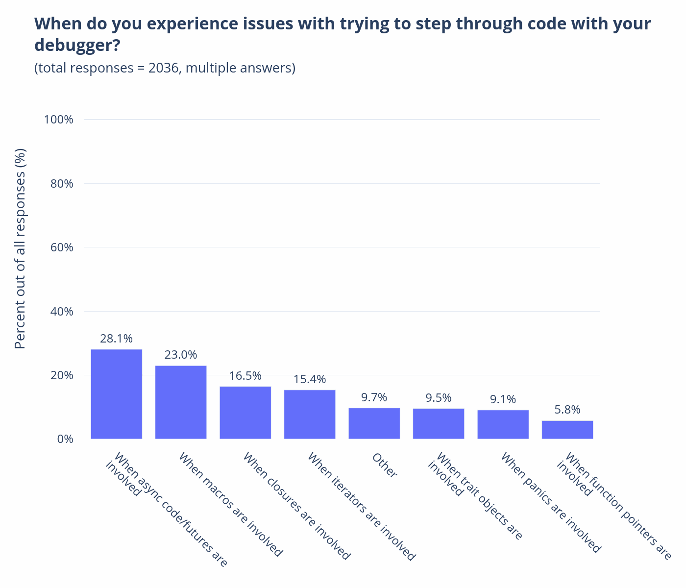
</noscript>

    

        [<a href="when-do-you-experience-issues-with-trying-to-step-through-code-with-your-debugger.png" target="_href_" title="Download chart as PNG">PNG</a>]&nbsp;[<a href="when-do-you-experience-issues-with-trying-to-step-through-code-with-your-debugger.svg" target="_href_" title="Download chart as SVG">SVG</a>]&nbsp;[<a href="when-do-you-experience-issues-with-trying-to-step-through-code-with-your-debugger-wordcloud.png" target="_href_" title="Download open answers as wordcloud PNG">Wordcloud of open answers</a>]
    

<!-- Chart when-do-you-experience-issues-with-trying-to-step-through-code-with-your-debugger end -->

We also directly asked respondents which types in the standard library were hard
to work with, if any. This was an open-response question, and reading through
the responses, some particularly common complaints were with `enum`s and
collections, particularly `std::collections::HashMap` and `std::vec::Vec`. This
is also visible in the wordcloud in the full report.

As the survey was being created, we interviewed a few community members and did
some brainstorming to think of a handful of pain points people might experience
when using debuggers with Rust. We asked respondents to indicate which, if any,
they have encountered. At slightly over 74%, poor representation of values was
the most common pain point by a decent margin, followed by being unable to print
variables at just over 55%:

<!-- Chart which-of-these-pain-points-have-you-experienced-using-a-debugger-with-rust start -->

    
<noscript>
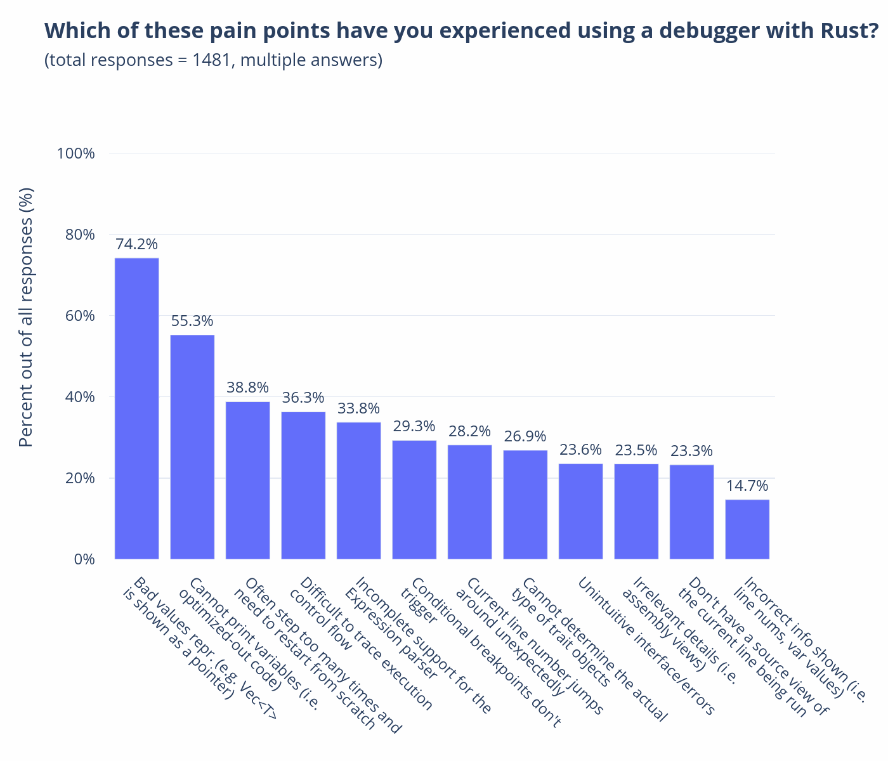
</noscript>

    

        [<a href="which-of-these-pain-points-have-you-experienced-using-a-debugger-with-rust.png" target="_href_" title="Download chart as PNG">PNG</a>]&nbsp;[<a href="which-of-these-pain-points-have-you-experienced-using-a-debugger-with-rust.svg" target="_href_" title="Download chart as SVG">SVG</a>]
    

<!-- Chart which-of-these-pain-points-have-you-experienced-using-a-debugger-with-rust end -->

## Debugger Visualizers

We asked respondents to indicate if they were library authors, and if so, if
they were aware of and using the `debugger_visualizer` attribute. Nearly 62% of
respondents indicated that they were library authors who were not aware of this
attribute:

<!-- Chart if-you-are-a-library-author-are-you-aware-of-and-using-the-debugger-visualizer-attribute start -->

    
<noscript>
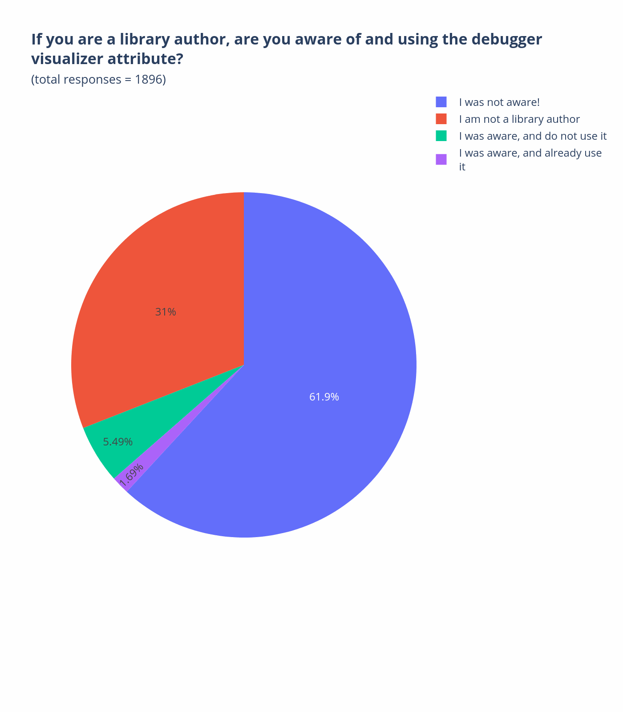
</noscript>

    

        [<a href="if-you-are-a-library-author-are-you-aware-of-and-using-the-debugger-visualizer-attribute.png" target="_href_" title="Download chart as PNG">PNG</a>]&nbsp;[<a href="if-you-are-a-library-author-are-you-aware-of-and-using-the-debugger-visualizer-attribute.svg" target="_href_" title="Download chart as SVG">SVG</a>]
    

<!-- Chart if-you-are-a-library-author-are-you-aware-of-and-using-the-debugger-visualizer-attribute end -->

For those who indicated that they were library authors who knew about the
attribute but did not use it, we also asked why. This represented a much smaller
fraction of respondents, so keep that in mind! That said, half of these library
authors indicated that they didn't have the time to maintain visualizer
attributes, and just under half indicated they didn't know how to write
visualizer scripts:

<!-- Chart why-dont-you-use-the-debugger-visualizer-attribute start -->

    
<noscript>
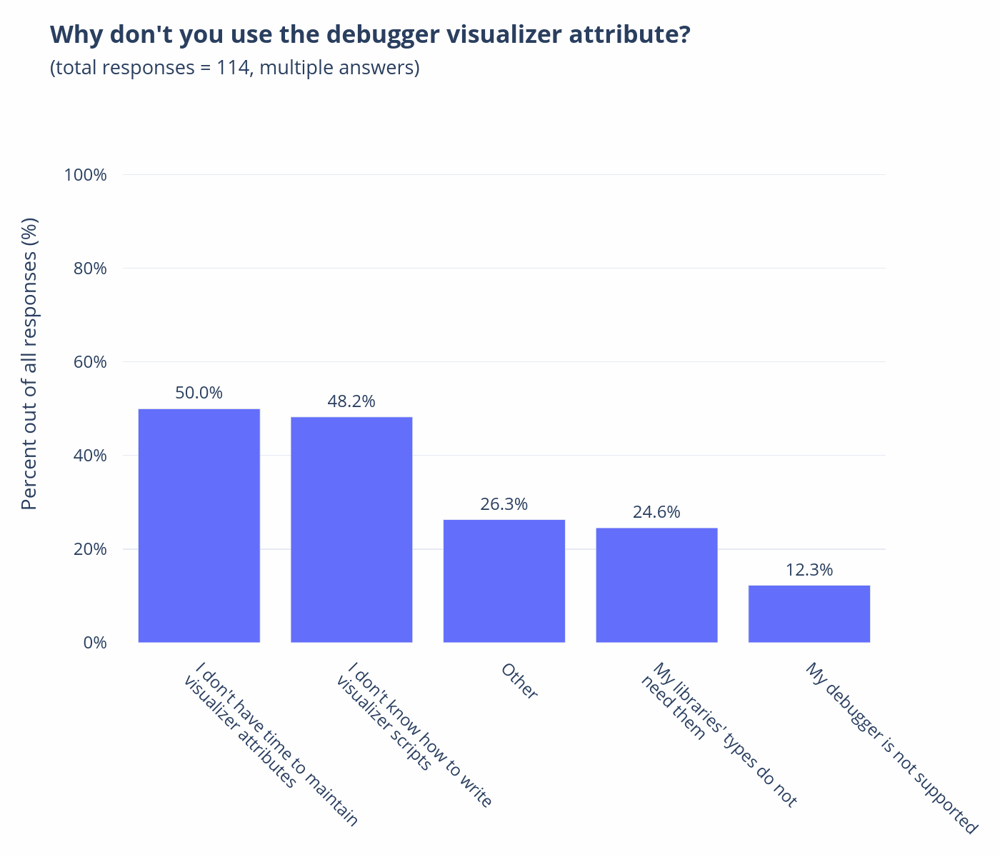
</noscript>

    

        [<a href="why-dont-you-use-the-debugger-visualizer-attribute.png" target="_href_" title="Download chart as PNG">PNG</a>]&nbsp;[<a href="why-dont-you-use-the-debugger-visualizer-attribute.svg" target="_href_" title="Download chart as SVG">SVG</a>]&nbsp;[<a href="why-dont-you-use-the-debugger-visualizer-attribute-wordcloud.png" target="_href_" title="Download open answers as wordcloud PNG">Wordcloud of open answers</a>]
    

<!-- Chart why-dont-you-use-the-debugger-visualizer-attribute end -->

For those of you who have been reading this section asking yourself what the
`debugger_visualizer` attribute is, you can read up on it in
[The Rust Reference: Debugger Attributes][debugger-attributes]. The quick
explanation is that the `debugger_visualizer` attribute can be applied to
modules or the crate root to embed files in the debug information which improve
the display of values with certain debuggers. The two currently supported file
types are Natvis files, used by Microsoft debuggers such as WinDbg, and GDB
"pretty printers", which are structured Python scripts used by GDB.

## Closing Remarks

Thanks to your participation in this survey, we've gained some great insights
about how Rustaceans are using debuggers and what issues they are facing. For
example, knowing that such a high number of users are dealing with poor
representation of values pairs well with knowing which standard library types
are causing issues, knowing that many library authors haven't heard of the
`debugger_visualizer` attribute, and knowing that many of those who have but
don't use it either don't know how or don't have time to maintain visualizer
scripts.

One notable way the debugger experience is currently being improved is through
the [ongoing Google Summer of Code project] improving how we test debug info and
visualizer scripts, making it easier to maintain and improve our own visualizer
scripts and general compatibility with visualizer scripts without silent
breakage or regressions.

<!-- TODO: Citation needed; am I accurately representing the GSoC project? -->

Once again, we'd like to thank everyone who took the time to participate in the
survey!

[state-of-rust-2025]: https://blog.rust-lang.org/2026/03/02/2025-State-Of-Rust-Survey-results/#challenges-and-wishes-about-rust
[rust-debugging-survey]: https://blog.rust-lang.org/2026/02/23/rust-debugging-survey-2026/
[report]: https://raw.githubusercontent.com/rust-lang/surveys/main/surveys/2026/debugging/report/debugging-survey-2026-report.pdf
[debugger-attributes]: https://doc.rust-lang.org/reference/attributes/debugger.html
[ongoing Google Summer of Code project]: https://summerofcode.withgoogle.com/programs/2026/projects/gzkF5BG0
<!-- TODO: Is this the best link to use for the GSoC project? -->
<!-- Chart scripts -->

